# Reservation list

The **Reservation List** application allows you to create/edit/delete reservations, as well as import them from an Excel file and export them to an Excel/CSV file (optionally with the option of immediate printing upon export).

The list also contains 3 buttons for approving/rejecting/resetting the reservation, see section [Approval of reservations](#approval-of-reservations). In the left menu you can also go to [Reservation statistics](../reservations-stat/README.md).

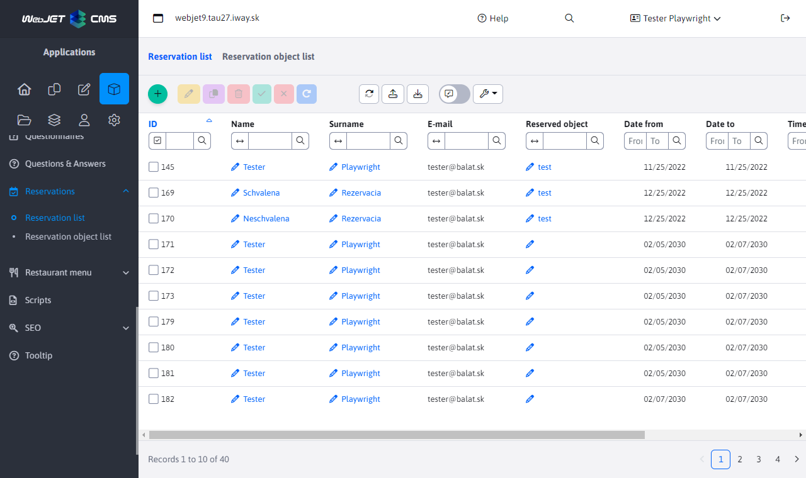

The booking editor contains 4 tabs, the functions of which are described below.

## Basic

The **Basic** tab, as the name suggests, contains basic information about the reservation. The important thing is the list with the selection of the reservation object to which the reservation applies.

Hourly reservations | All-day reservations
:----------------------------------------:|:---------------------------------------:

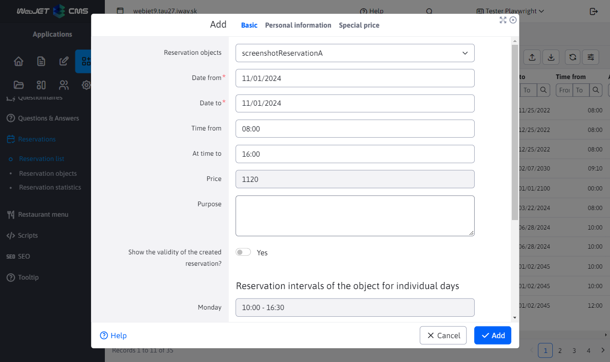

 | 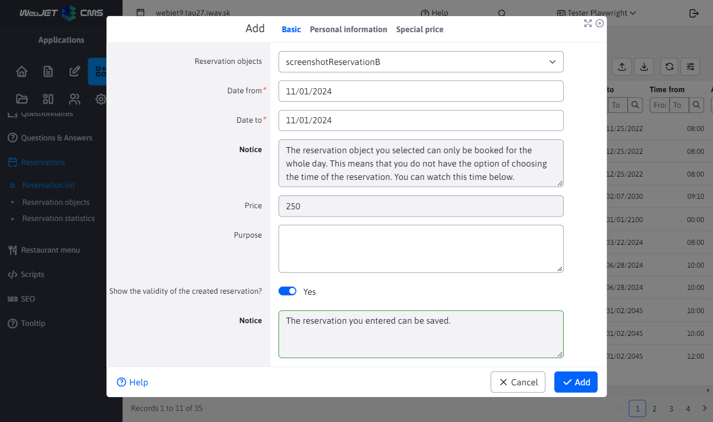

The composition of the card will vary depending on whether the selected reservation object is a full-day object or not. For more information, see [List of reservation objects](../reservation-objects/README.md).

**All-day reservations**

In this mode, you book an object for the whole day. The best example is booking a hotel room. You need to enter the date range of the reservation and the arrival/departure time.

!>**Note:** if a booking object can only be booked for a full day, the last day in the date range is not counted because the customer is leaving on that day. Therefore, the booking range for full day bookings must be at least 2 days.

**Hourly reservations**

There is one important thing to note with this type of reservation. If you select the days from 01.01.2022 to 03.01.2022 from 08:00 to 16:00, this does not mean that the reservation starts on 01.01.2022 at 08:00 and lasts until 03.01.2022 16:00 and everything in that range is reserved. But that is not the case. With these selected values, in practice this means that you reserve this **reservation object from 08:00 to 16:00 for each day separately**. The reason is simple, this way you can reserve an object at a certain time for multiple days without having to reserve the entire interval. If the reservation interval for a given object is set from 05:00 to 20:00, then only the specified time interval is reserved for individual days and the rest of the interval is not reserved, even if the reservation lasts, for example, 3 days.

At the bottom of the card you can see an overview of the booking intervals of the property for each day of the week. These times are set according to the currently selected booking property. This is a help when creating/editing a booking if you don't remember exactly when a specific booking property can be booked for a specific day of the week. This overview is displayed **only for hourly bookings**.

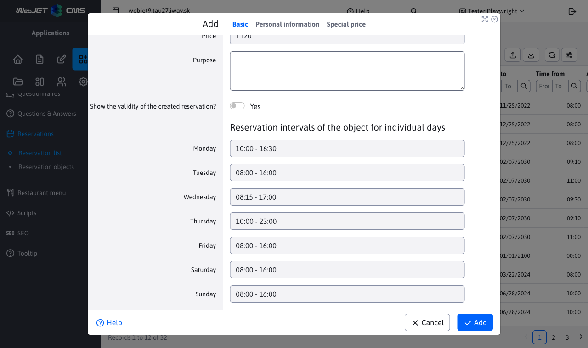

The **Warning** field displays information about the validity of the reservation being created. This means whether a reservation for the selected object can be created within the given scope or not. More detailed information about the possible states in this field is explained in the [Validation of reservations](#validation-of-reservations) section. If the reservation is valid, the border of the text field will change to green, and if the reservation is not valid, it will change to red.

**Reservation price** shows the current price of the reservation being created. The price depends on the selected reservation object, reservation interval, and any special prices set for the given reservation object.

!>**Note:** A user discount is then automatically applied to this booking price. This percentage discount is set for specific [user groups](../../../../admin/users/user-groups.md). If a user belongs to multiple **user groups** that have a percentage discount set, the largest one will be used. If the discount is ```0%```, the booking amount does not change. If the discount is ```100%```, the booking is free.

!>**Note:** the current prices and discounts apply, i.e. the price that was calculated when you made the reservation. This means that if you have a reservation scheduled for, for example, a month from now and during that time the price of the reservation object increases, or the user's discount changes, the reservation price **will not change**. **However**, if you edit your created reservation, the current prices and discounts will be used, which may change the original price, which you will not be able to get back.

The reservation status and reservation price are updated every time the date, time, or reservation object is changed.

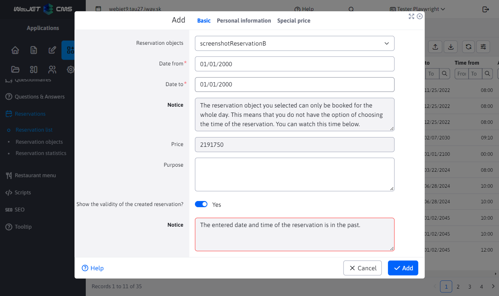

## Personal data

In the **Personal data** tab, you can set the details of the reservation requester. Most of the data is automatically set from the logged-in person's profile, but these values ​​can also be changed or not entered at all.

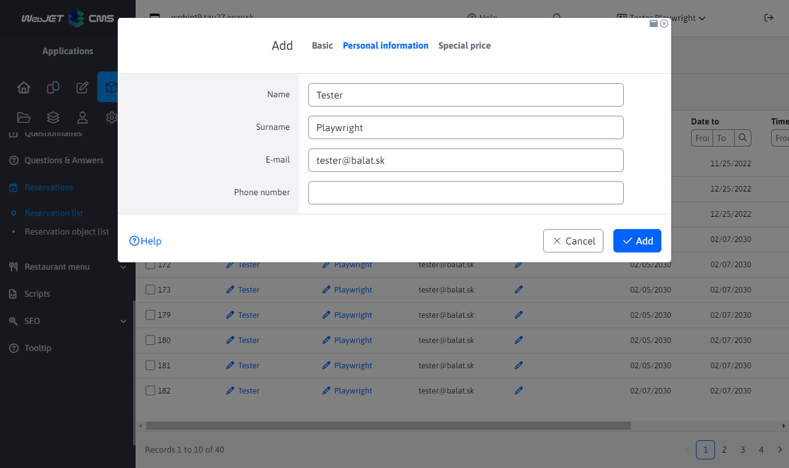

## Special price

The **Special Price** tab contains a nested table with data about the special price of the reservation object for a specific period. The records in the table are set according to the currently selected reservation object from the [Basic](../reservations/README.md#basic) tab and can only be exported, but cannot be added, edited or deleted (they are for informational purposes only).

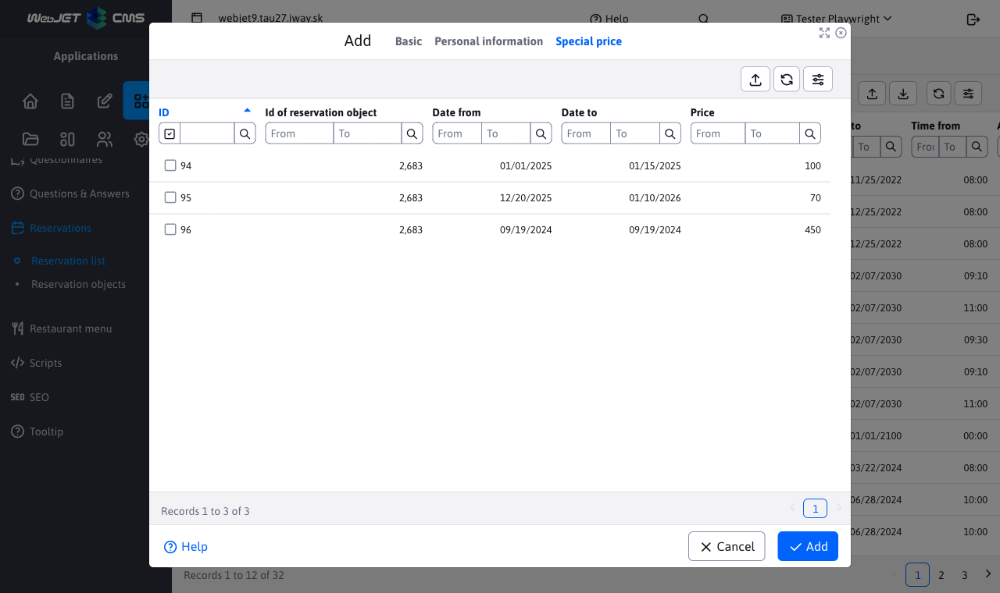

## Approval

The **Approval** tab is used to change the status of a reservation. This tab is only displayed under specific conditions.

Conditions for displaying the card:

- record editing, the card will only be displayed when editing a reservation record
- approval required, the booking object that the reservation is trying to book must have the parameter **Approval Required** and must have an approver email specified
- approver, the card can only be displayed to the person who has permission to approve the reservation. This means that if the email of the logged in user matches the email of the approver entered in the reservation system and the previous points have been met, the card will be displayed to the user

Once displayed, the card contains 3 buttons to change the booking status. These actions will be better explained in the **Approval of bookings** section.


## Reservation validation

Reservation validation logic is an important part of the **Reservation List** application, which checks whether the reservation being created or edited meets all the rules and conditions. Validation is automatically triggered when trying to save a new reservation or edit an existing one. If the reservation is valid (meets all the requirements), the creation/edit action will be successful, otherwise an error will occur and the user will be notified with either a specific or general error message.

The reservation cannot be saved/edited until it meets all validation rules.

### Date range

The from date must be less than or equal to the to date (if the dates are the same, only that one day will be reserved).

!>**Note:** in the case of **full-day reservations**, the range must be **at least 2 days**, as the last day of the range is the departure day, and is not counted towards the reservation as such.

### Time range

Time range validation varies by booking type.

**All-day reservations**

For all-day reservations, the time component is not validated, as **Arrival time** / **Departure time** are not on the same day and it is up to you to decide.

!>**Note:** we strongly recommend that the **Arrival Time** is greater than the **Departure Time**, otherwise the room will not be bookable by a new customer on the day of the old customer's departure.

**Hourly reservations**

**Time from** must be significantly less than **Time to**, because you must reserve at least 1 minute. At the same time, it is checked whether this time range is greater than or at least equal to the specified value "Minimum reservation length (in minutes)" set for the given booking object.

### Past range

You cannot book a day/days in the past. If you are trying to make a reservation for today, the time slot cannot be in the past.

!>**Note:** You can save a reservation at your own risk even if the selected range is in the past. Just select the **Allow creation in the past** option in the **Basic** tab.

### Valid reservation range

This check is performed only for **hourly reservations**. It checks whether the specified time range is within the reservation interval of the object. This check is performed for each reserved day separately. For example, if you are trying to reserve an object between 08:00-09:00 for the next 3 days, and even one of these days has a different reservation interval, the reservation is not valid. Of course, special reservation intervals for individual days of the week are also taken into account, more information in the section [times by days](../reservation-objects/README.md#times-by-days).

### Maximum number of reservations at the same time

In this case, it is checked whether after adding a reservation, more reservations will not overlap at the same time than is allowed by the parameter **Maximum number of reservations at the same time** of the given object. Reservations are considered overlapping if their time intervals overlap by at least one minute (intervals do not overlap if the start of one is the end of the other in the same minute).

**All-day reservations**

For these reservations, we recommended that the **Arrival time** be significantly greater than the departure time. For example, if the arrival time is always 14:00 and the departure time is always 10:00, then after the old customer leaves at 10:00, there is still time to clean the room (or otherwise prepare it) for the new customer who will check in at 14:00. Such reservations do not overlap and it is possible to book the room on the day when another customer is checking out. In reality, it looks like the reservations overlap, but this is not the case (since the old customer leaves before the new customer arrives).

**Hourly reservations**

For example, if you have 4 reservations, and their time intervals are ```08:00-11:00 / 08:00-09:00 / 09:00-10:00 / 10:00-11:00```, we see that the reservation at time ```08:00-11:00``` overlaps with 3 different reservations, but never more than 2 at a time, because the other 3 reservations do not overlap with each other.

The check will take all reservations for the property on the same day and test whether this limit will not be exceeded after adding our reservation. This is tested for each day separately and if even one day exceeds the maximum number of reservations at the same time, the reservation will be marked as invalid.

!>**Note:** **only approved** reservations above a given reservation object are used when checking for intersections.

!>**Note:** You can save your reservation at your own risk even if you are overbooked, meaning you exceed the maximum number of reservations. Simply select the **Allow overbooking** option in the **Basic** tab.

## Reservation approval

Changing the reservation status is possible either using the editor, more precisely in the [Approval](../reservations/README.md#approval) tab, which is only displayed under certain specific conditions, or using the buttons to change the reservation status.

Just like in the **Approval** tab, the buttons offer 3 different states:

- , **Approval** of the reservation (The reservation has been approved)
- , **Reject** reservation (Reservation rejected)
- , **Reset status** of the reservation (Reservation is pending approval)

### Approval required

A reservation needs to be approved if the booking object has an approver set up and the person creating/editing the reservation is not an approver. The logged-in person is NOT an approver if their email does not match the approved email set up in the booking object.

In this case, a request for approval of the reservation will be sent to the approver's email. Such a request contains basic information about the reservation as well as a direct link to this reservation.

### Automatic approval

The reservation does not need to be approved if the booking object does not have an approver set up, or if the booking object has an approver set up and the person currently logged in is the approver. The logged in person IS the approver if their email matches the approved email set up in the booking object.

### Creating a reservation

When you try to make a reservation, a validation process will run in the background. If successful, the reservation will be saved and its status will be set according to the situation:

- if the reservation does NOT NEED to be approved, such a reservation will be approved automatically and will receive the status **Reservation approved**.
- if the reservation MUST be approved, it will be automatically saved with the status **Reservation awaiting approval** and an approval request will be sent to the approver's email. The approver can decide whether to approve the reservation, reject it, or make no changes. However, if the reservation status changes, a message will be sent to the reservation requester's email with information about the status change (this requester's email was automatically pre-set when creating the reservation in the [Personal data] tab (../reservations/README.md#personal-data)).

### Edit reservation

When you try to edit a reservation, a validation process will run in the background. If successful, the reservation will be saved and its status will be set according to the situation:

- if the reservation DOES NOT NEED to be approved, such an edited reservation will be saved and automatically approved, giving it the status **Reservation approved**.
- if the reservation MUST be approved, its previous status is reset to **Reservation awaiting approval** (regardless of whether it was approved or rejected) and a message is sent to the approver's email again with a request for approval. The approver can again decide whether to approve, reject, or make no changes to the reservation. However, if the reservation status changes, a message is sent to the reservation requester's email again with information about the status change.

### Change reservation status

As mentioned above, you can try to change the reservation status using a card or buttons. In the case of a card, it is treated in such a way that only the person who has the right to do so can see it. In the case of buttons, it is so that everyone can see them.

Every time you try to change your reservation, a confirmation of the action will be displayed.

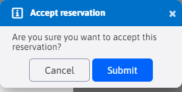

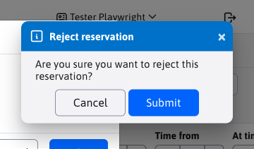

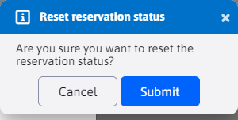

If you decide to cancel the action, nothing will happen. If you decide to run the action anyway, our right to this reservation will be verified in the background. If it turns out that we do not have the right, an error message will be displayed and the reservation status will not change.

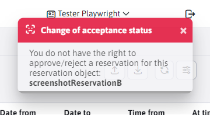

If we have the right to change, it will further depend on what state you are trying to set:

**RESERVATION APPROVAL**, regardless of the original reservation status, a validation will be run in the background to decide what happens to the reservation

- if validation was successful, the reservation is approved, a confirmation message is displayed and an email is sent to the applicant
- if validation was unsuccessful, the reservation will be automatically rejected, an error message will be displayed with the reason for the rejection and an email will be sent to the applicant

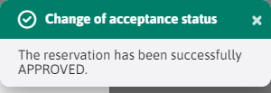

**REJECTION OF RESERVATION**, regardless of the original status of the reservation, the reservation will simply be rejected, a confirmation message will be returned and an email will be sent to the requester.

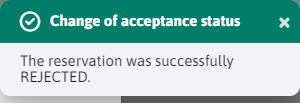

**RESETTING THE BOOKING STATUS**, regardless of the original booking status, the booking status will simply be reset, a confirmation message will be returned and a message will be sent to the requester.

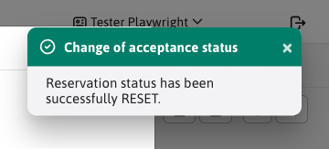

Emails sent to the requester when the reservation status is changed contain basic information about the reservation, its new status, and the name of the approver who changed the status of this reservation.

## Deleting reservations

Deleting reservations depends on the reservation object on which the reservation was created. The reservation object may have a password set, which will change the process of deleting the reservation - the password was set in the [Advanced] tab (../reservation-objects/README.md#advanced).

If a password is NOT set, reservations above this reservation object can be deleted.

If a password IS set, you will be prompted to enter that password.

- If you are deleting multiple reservations for the same object (which has a password), you will only be prompted to enter this password once (you do not have to enter it twice for each reservation).
- If you are deleting multiple reservations that are above multiple objects with a set password, you may be prompted to enter multiple passwords (again, without duplicates).

In the displayed password request, you will be informed for which reservation object you must enter a password. If you enter multiple passwords and decide not to enter one or more of them (you cancel the password entry action), the overall reservation deletion action will not be affected. An unentered password is automatically considered bad and therefore reservations and objects with this password will not be deleted.

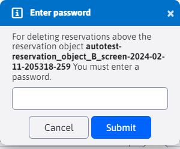

After entering all the necessary passwords, a prompt to delete the reservations will appear. Using the displayed window, you can cancel the entire action or confirm your decision.

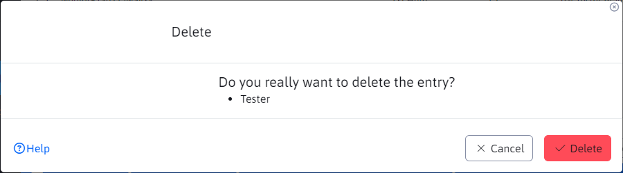

If one or more passwords were incorrect, a message is returned for each reservation that could not be deleted because of this. The message contains information about which reservation object password was entered incorrectly and which reservation could not be deleted because of this.

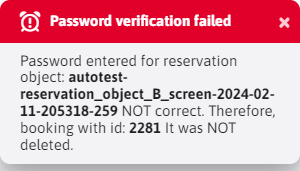