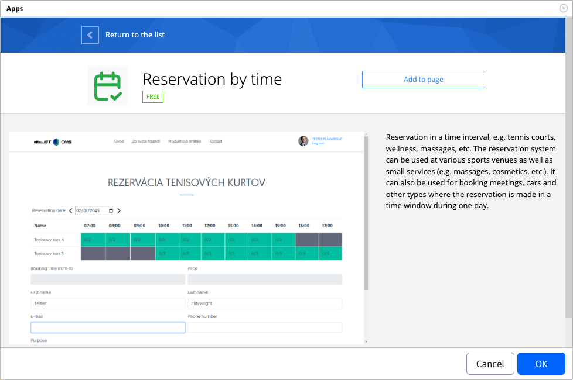
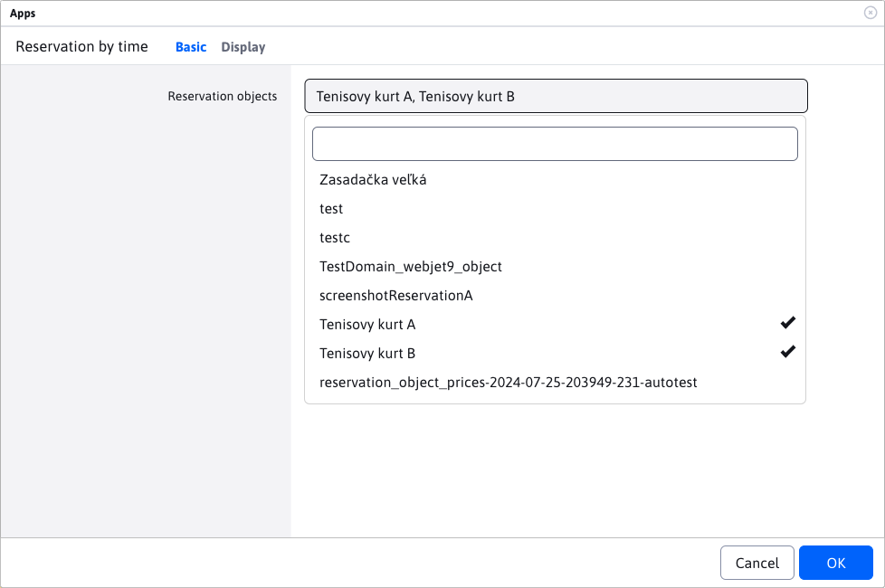
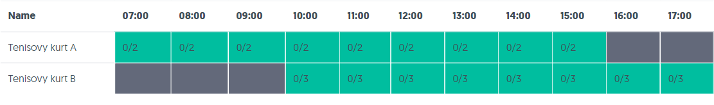
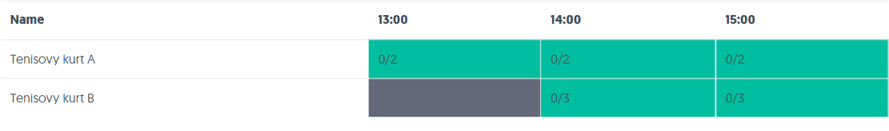
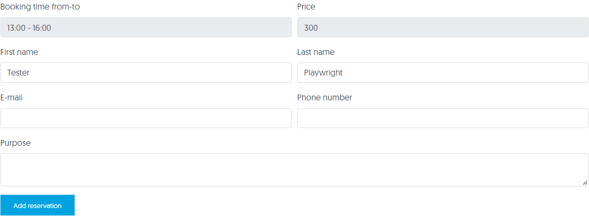
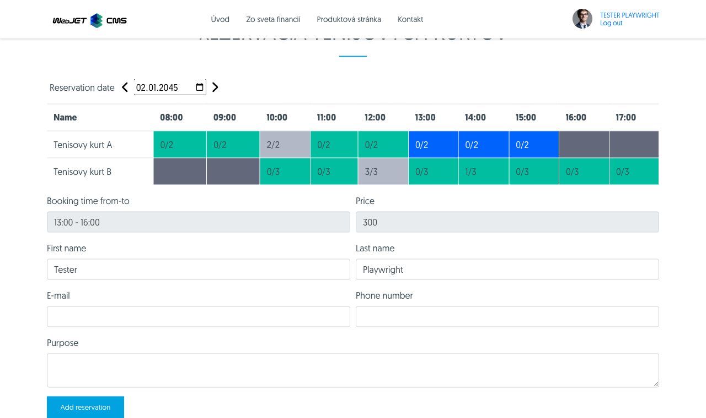

# Time Reservation app

Application **Reservation of time** allows you to book selected reservation objects for a specific time interval.

## Using the app

You can add the app to your site via the app store



or directly as code to the page

```html
!INCLUDE(sk.iway.iwcm.components.reservation.TimeBookApp, reservationObjectIds=&quot;2560+2561&quot;, device=&quot;&quot;, cacheMinutes=&quot;&quot;)!
```

In the code you can notice the parameter `reservationObjectIds`. This is a list of allowed reservation objects that will be bookable in the application. You can set them when editing the application using the multi selection box, or add them directly to the parameter `reservationObjectIds`.



**Notice**: only reservation objects that **they are NOT set as a reservation for the whole day**. Because these objects cannot be booked based on time, but only on date. Non-conforming booking objects are not displayed in the multi-selection field.

**Notice**: manually adding the ID of the non-compliant reservation object to the parameter `reservationObjectIds`, or change the status of an already used booking object in the app to "booking for the whole day", **causes the application to misbehave**.
## Application construction

The application consists of 3 main parts:
- choice of booking date
- table of booking objects and times
- booking form


### Date selection

By selecting the date, you specify the day you want to make the reservation. When you first start, the current day is preset, which you can change with the date filter. The arrows next to the date filter allow you to scroll back or forward a day.


### Table of reservation objects

Each row in the table represents one reservation object. The individual cells of the table represent the availability at each hour of the day.



The structure of the table can vary considerably depending on the day of the week selected. As each booking object can have a different booking time slot set for each day of the week [more info](../reservation-objects/README.md#časy-podľa-dní).



Individual cells in the table have a specific status.

**Unavailable** cell means that the reservation of the object for this hour and day of the week is out of the allowed range.


**Full** cell means that the maximum number of bookings for this booking object and hour in the day has been reached. As we can also see, the cell can contain text like "2/2", which means that there are already 2 reservations out of 2.

**Attention**, the situation may occur that this cell will have a status e.g. "1/2" or "0/2". This situation occurs when a particular hour or a whole day is already in the past. So even if the maximum number of bookings has not been reached, it is not possible to add a new one.


**Free** cell basically means that it is possible to request a reservation for the property at this hour (and on this day).


This cell means that it is selected. the cell is selected by clicking on it (if you click on it again it is deselected). **Attention**, only available cells can be selected ergo those that are **Available**.

### Booking form

This is a simple form with basic information for booking a property.

These required fields are automatically pre-populated if you are a logged in user, but of course they can be changed. If you are accessing as a non-logged-in user, you must enter them as mandatory:
- Name
- Last name
- E-mail
The "Booking period from-to" and "Booking price" fields cannot be changed and are for information purposes only. They automatically change the value according to the selected cells in the table (according to the selected booking range for the booking object). If no cell is selected, the fields will be blank.

**Attention**, the button to add a reservation will only appear if a cell in the table is selected.



## Adding a reservation

To add a reservation, you must first select a time range in the table. However, adding a reservation has the following rules:
- **You can book only 1 reservation object at a time**. So if you select the range from 13:00 to 15:00 in the row for objectA and then try to select the range for booking objectB, the originally selected range is automatically deselected.
- **You can select only 1 continuous range**. You cannot select the range 13:00-15:00 and 16:00-17:00 at the same time, even if it is the same object. If you try to do this the first selected range is automatically deselected.
- **The selected range cannot be interrupted by unavailable time**. If you try to select the 13:00-17:00 range but the 15:00-16:00 range of the object is already fully booked, the selected range will be automatically deselected.
- **Required fields**. The First Name/First Name/Email fields are required to add a reservation.
If you have met the above conditions, have selected the correct range and filled in the required fields, you can request to add the reservation.



If the booking has been successfully created, you will receive a message that the booking has been successfully created and a confirmation will be sent to the email address you entered.

If the reservation object **does not need approval**, the booking will be automatically approved and you will receive the following message. The availability of each time slot in the table is then adjusted.


If the reservation object **need approval**, the reservation will be in pending status. The availability of each time slot in the table will not change as ONLY approved bookings are counted. The approver can approve or reject your booking, you will be notified by email.


