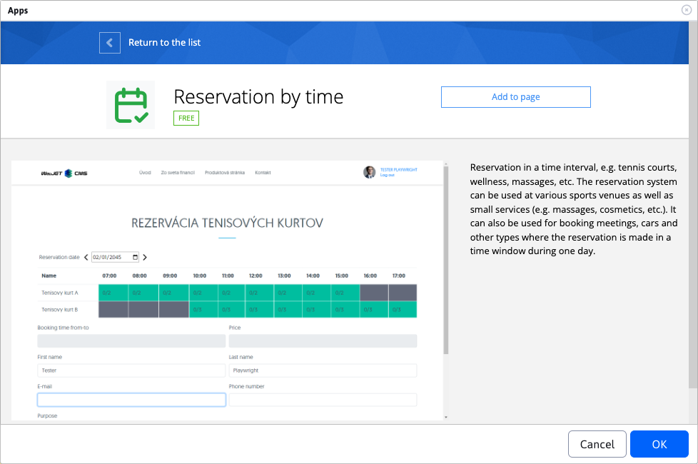
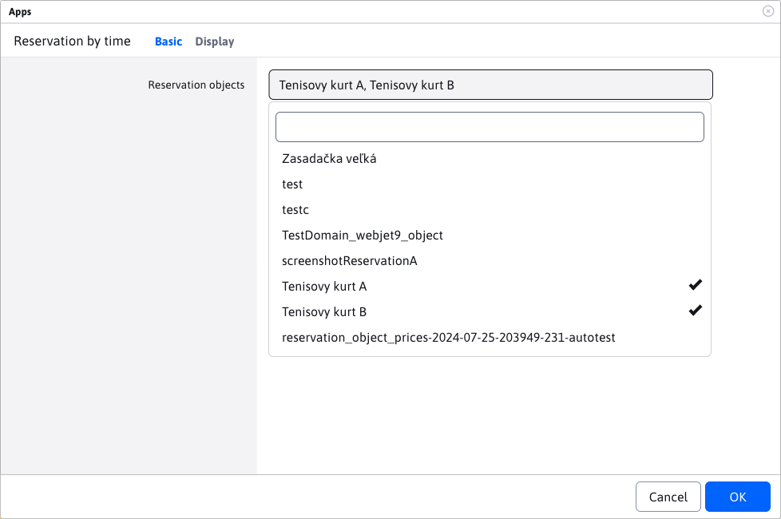
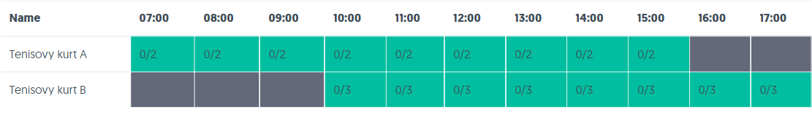
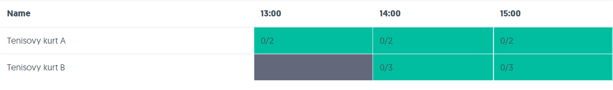
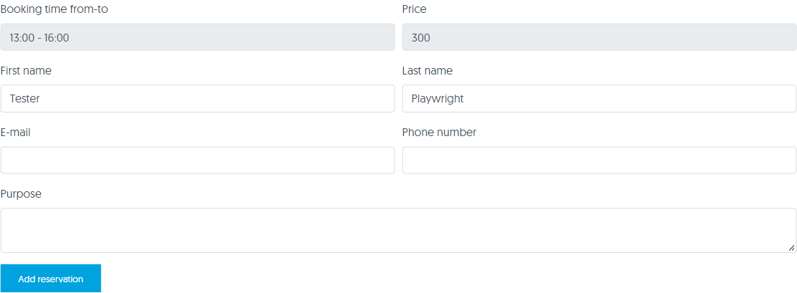
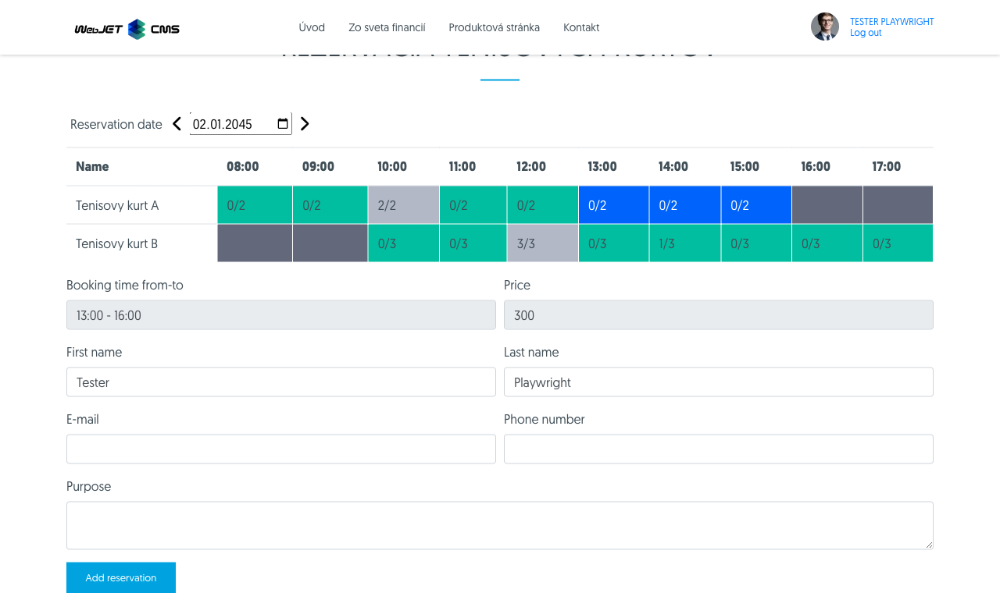

# Time Reservation Application

The **Time Reservation** application allows you to reserve selected reservation objects for a certain time interval.

## Using the app

You can add an app to your site through the app store



or directly as code into the page

```html
!INCLUDE(sk.iway.iwcm.components.reservation.TimeBookApp, reservationObjectIds=&quot;2560+2561&quot;, device=&quot;&quot;, cacheMinutes=&quot;&quot;)!
```

You can notice the parameter ``reservationObjectIds`` in the code. This is a list of allowed booking objects that will be bookable in the application. You can set them when editing the application using the multi-select field, or add them directly to the parameter ``reservationObjectIds``.



!>**Warning**: Only booking objects that **ARE NOT set as full day booking** are supported. Because these objects cannot be booked based on time, only date. Incompatible booking objects are not displayed in the multi-select field.

!>**Warning**: manually adding the ID of a non-compliant booking object to the ``reservationObjectIds`` parameter, or changing the status of an already used booking object in the application to "full-day booking", **will cause incorrect application behavior**.

## Application construction

The application consists of 3 main parts:

- select reservation date
- table of reservation objects and times
- booking form


### Date selection

By selecting a date, you determine which day you want to make the reservation for. When you first start, the current day is preset, which you can change using the date filter. The arrows next to the date filter allow you to move back or forward one day.


### Reservation object table

Each row in the table represents one booking object. Individual cells in the table represent availability at individual hours of a given day.



The table structure may vary considerably depending on the selected day of the week. As each reservation object may have a different reservation time interval set for each day of the week [more information](../reservation-objects/README.md#times-by-day).



Individual cells in the table have a specific status.

**Unavailable** cell means that the property's reservation for this hour and day of the week is outside the allowed range.


A **Full** cell means that the maximum number of reservations for this booking object and hour of the day has been reached. As we can see, the cell may contain text like "2/2", which means that there are already 2 reservations out of 2.


!>**Warning:** It may happen that this cell will have a status of e.g. "1/2" or "0/2". Such a situation occurs when a specific hour or a whole day is already in the past. So even if the maximum number of reservations has not been reached, it is not possible to add a new one.

A **Free** cell basically means that it is possible to request a reservation for the property at this time (and this day).


This cell means it is selected. The cell is selected by clicking on it (clicking on it again will deselect it).

!>**Warning:** only available cells can be selected, i.e. those that are **free**.

### Reservation form

This is a simple form with basic information about booking an object.

These required fields are automatically pre-filled if you are a logged in user, but of course they can be changed. If you are accessing as a non-logged in user, you must enter them:

- Name
- Last name
- Email

The fields **Booking period from-to** and **Booking price** cannot be changed and are for informational purposes only. They will automatically change the value according to the selected cells in the table (according to the selected booking range for the booking object). If no cell is selected, the fields will be empty.

**Attention**, the user discount is then automatically applied to this booking price. This percentage discount is set for specific [user groups](../../../../admin/users/user-groups.md). If the user belongs to multiple **user groups** that have a percentage discount set, the largest one will be used. If the discount has the value ```0%```, the booking amount does not change. If the discount has the value ```100%```, the booking is free.

!>**Note:** the button for adding a reservation will only appear if a cell in the table is selected.



## Adding a reservation

To add a reservation, you must first select a time range in the table. However, adding a reservation has the following rules:

- **You can only book 1 booking object at a time**. So if you select the range from 13:00 to 15:00 in the row for objectA and then try to select the range for booking objectB, the original selected range will automatically be completely deselected.
- **You can only select 1 contiguous range**. You cannot select the range 13:00-15:00 and 16:00-17:00 at the same time, even if it is the same object. If you try to do so, the first selected range will be automatically canceled.
- **The selected range cannot be interrupted by an unavailable time**. If you try to select the range 13:00-17:00 but the range 15:00-16:00 of the given object is already fully booked, the selected range will be automatically canceled.
- **Required fields**. The First Name/Last Name/Email fields are required to add a reservation.

If you have met the above conditions, have selected the correct range and filled in the required fields, you can request to add a reservation.



If the reservation was successfully created, you will receive a notification that the reservation was successfully created and a confirmation will be sent to the email you provided.

If the booking object **does not require approval**, the booking will be automatically approved and you will receive the following message. The availability of individual time slots in the table will then be adjusted.


If the booking object **needs approval**, the booking will be in a pending state. The availability of individual time slots in the table will not change, as ONLY approved bookings are counted. The approver can approve or reject your booking, of which you will be informed by email.

