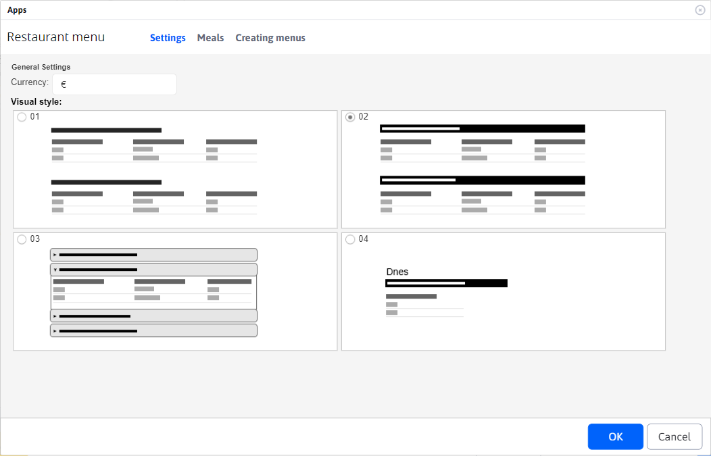
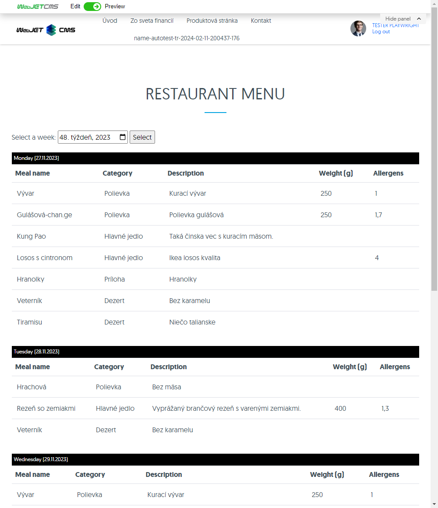
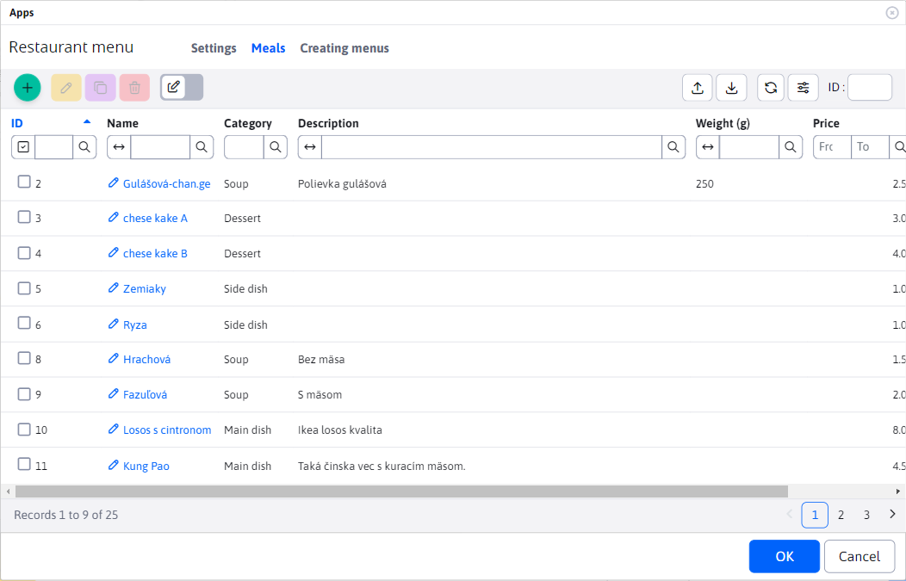
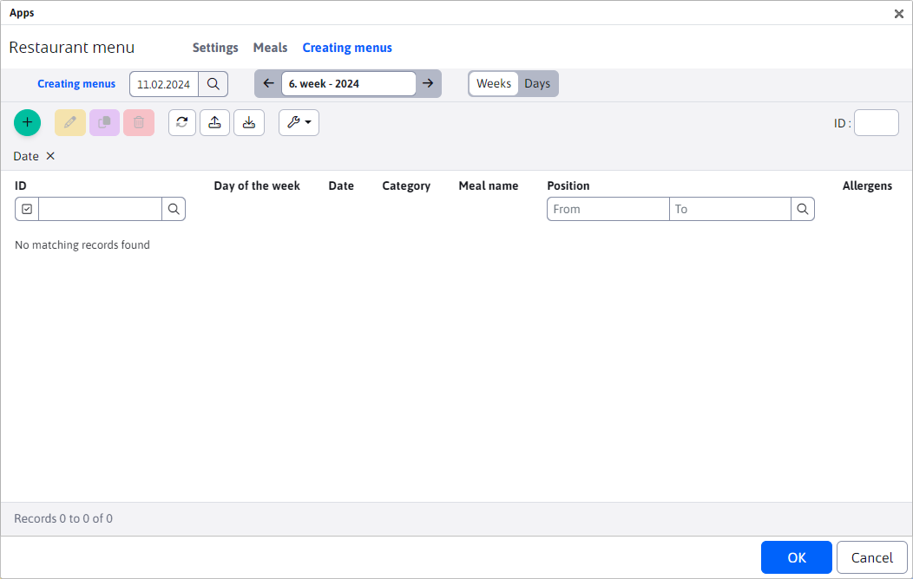

# Restaurant menu

The Restaurant Menu application allows you to define dishes, create menus using dishes, and then display the menu in various styles. You can add the Restaurant Menu application to your website via the application selector, or directly by code into the body of the website.
Example: ```!INCLUDE(/components/restaurant_menu/menu.jsp, style=02, mena=&euro;)!```



The application dialog window consists of tabs:
- Settings
- Meals
- Menu creation

## Settings

In the Settings tab, you can choose the style in which the created restaurant menu will be displayed on the website. As you can see in the previous image, there are 4 different display types available. Type 01, 02 and 03 display the entire menu (the entire week). Type 04 displays only the menu for the current day.

For example, let's see what a generated restaurant menu type 02 looks like on a website.



## Meals

The Meals tab offers a nested data table for managing the list of supported meals. Full documentation for that table can be found here [Meals](./meals.md).



## Menu creation

The Menu Creation tab offers a nested data table for creating and managing menus for a specific day/week. Full documentation for that table can be found here [Menu Creation](./menu.md).

