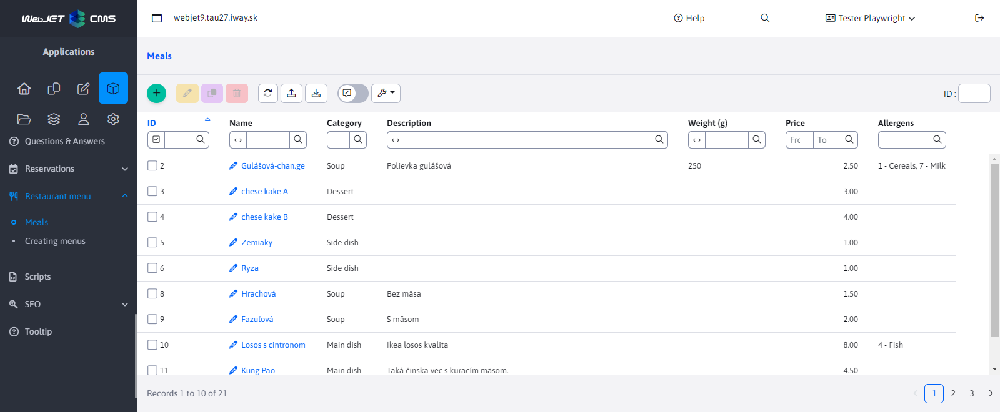
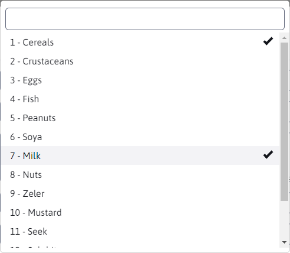

# Dishes

Part of **Dishes** falls under the Restaurant Menu section. It allows you to define the dishes that are used when creating a restaurant menu. It is possible to add/edit/duplicate/delete dishes as well as import and export them.

When creating a new dish, the following parameters are in the editor:
- Name - the name of the new dish (the only required parameter)
- Category - food category with a choice of options Soup / Main dish / Side dish / Dessert
- Description
- Weight (g)
- Price
- Allergens - allergens contained in this food. This parameter is of type MULTISELECT, which means that you can select more or no value (there are several values to choose from).

Allergens are selected from a selection menu in which several options can be selected. There are 14 allergens (the number can be set in the configuration variable `restaurantMenu.alergensCount`) and are defined in translation keys with the prefix `components.restaurant_menu.alergen`:

