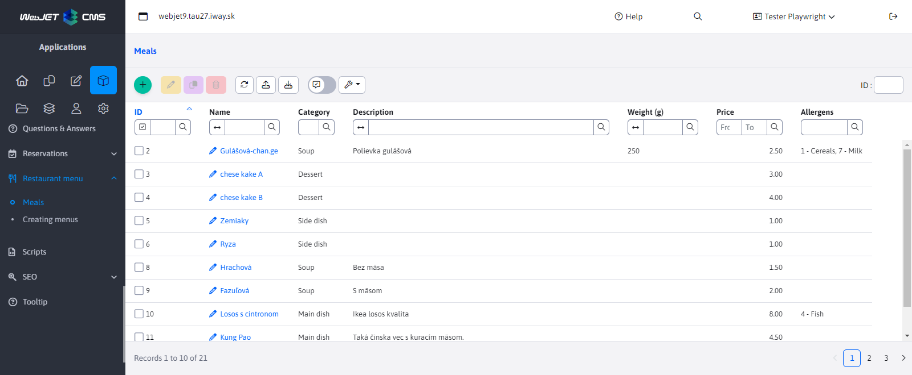
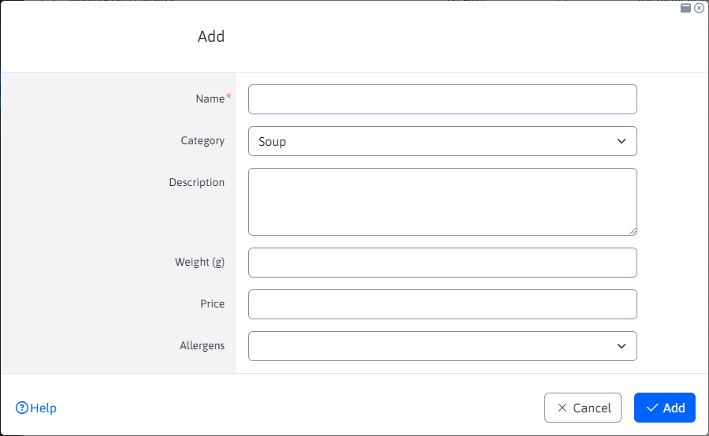
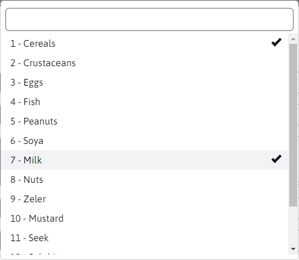

# Meals

The **Dishes** section falls under the Restaurant Menu section. It allows you to define dishes that are used when creating a restaurant menu. It is possible to add/edit/duplicate/delete dishes as well as import and export them.

When creating a new dish, the editor has the following parameters:
- Name - name of the new dish (only required parameter)
- Category - food category with a choice of options Soup / Main course / Side dish / Dessert
- Description
- Weight (g)
- Price
- Allergens - allergens contained in this food. This parameter is of type MULTISELECT, which means that you can select more than one value or no value (there are several values ​​to choose from).

You select allergens from a drop-down menu where you can select multiple options. There are 14 allergens (the number can be set in the configuration variable `restaurantMenu.alergensCount`) and they are defined in translation keys with the prefix `components.restaurant_menu.alergen`:

