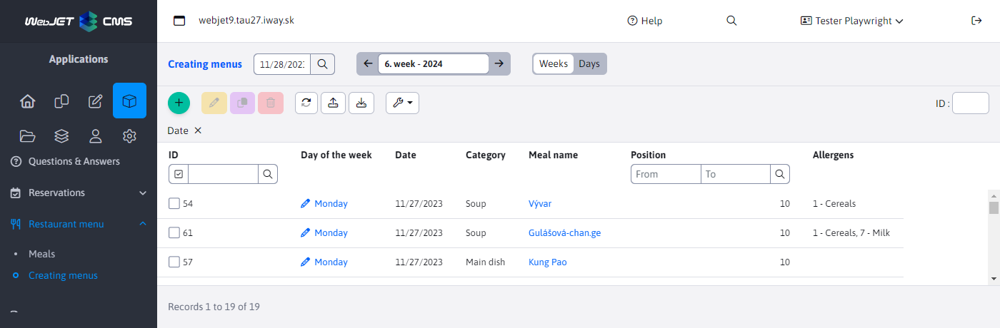
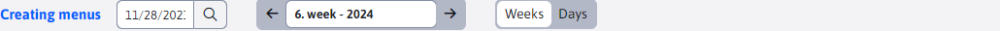
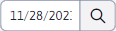
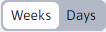
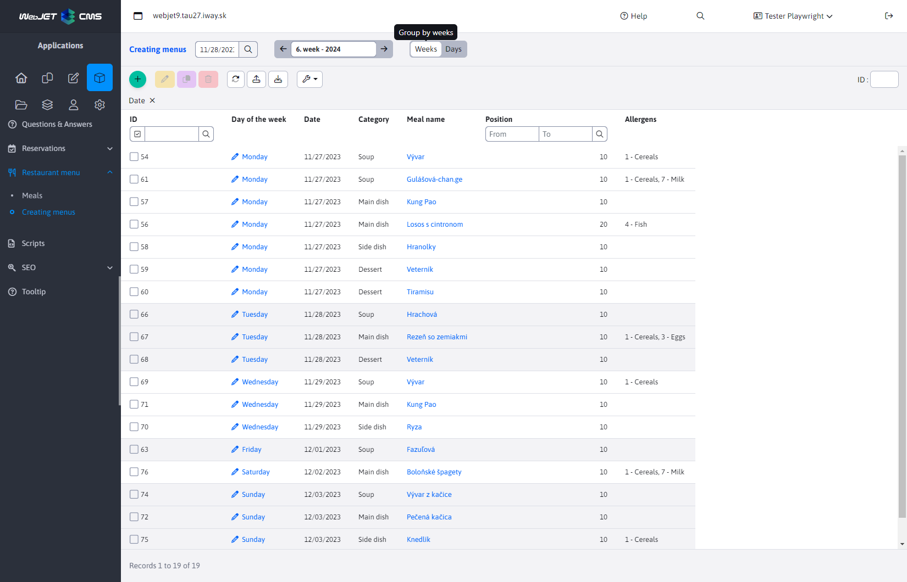
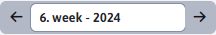

# Creating menus

Part of **Creating menus** falls under the Restaurant Menu section. It allows you to issue menus by assigning dishes to specific days. Of course it provides the possibility to add/edit/duplicate/delete these assignments as well as import and export them.

The meal is represented by default by the Category and Meal Name columns. The remaining columns representing the meal can be added in the datatable settings. The value in the Meal Name column is itself a link that, when clicked, will redirect you to the Meals table and automatically open the selected meal's editor ([Dishes](./meals.md)).

The entries in this table are strictly filtered:
- by date (day of the week)
- according to the selected category (1-Soup, 2-Main course, 3-Sides and 4-Desserts)
- then according to the selected position

This sorting system is good to see in the picture in the section [Display mode](../restaurant-menu/menu.md#display-mode), while displaying records from the whole week.

## Creating a new record

Parameters:
- Category, a list to select a food category (preset category Soups)
- The name of the food, a list that dynamically populates according to the currently selected food category. The list contains all defined dishes under the selected category (the first dish in the returned list is automatically selected)
- The date to which the food is assigned is automatically populated according to the date filter value ( [Date filter](../restaurant-menu/menu.md#date-filter) ) and cannot be changed
- Position, when creating a new record (only when creating), its value is pre-set as the highest priority for the combination of that day and the selected food category + 10. This means that, for example, if for the day 23.11.2023 and the food category Soups, the highest priority is 20, it will set the value to 30. When the meal category is changed, the value is automatically pre-set again.

## Controls

The table contains special controls, allowing easier work with dates and display mode:

### Date filter

Date filter  is used to limit the records displayed to a specific day only. Automatic is set to the current day (**Warning:** its last current value is not saved when leaving the page).

### Display mode

Display mode  allows you to change the range in which records are displayed. Provides a choice of displaying by days and weeks.

The preset is **display by day**, which you could already see in the opening picture of the table above. In this view, records are filtered for one specific day only.

If you choose **view by weeks**, records for the whole week (7 days) will be filtered. The week is always taken as the range from Monday to Sunday.

Change the week by changing the value **Date filter**. The filter will automatically derive the whole week from the selected date and all values in this time period will be displayed.

Example: if you select the date 28.11.2023 (Tuesday) then in the mode Weeks the range will be set automatically from Monday 27.11.2023 (inclusive) to Sunday 03.12.2023 (inclusive). No matter which day you select in this range, the filtered records will always be the same as long as these dates are in the same week. You can only change the week itself by selecting a date that falls in a different week (e.g. 04.12.2023).

Of course, it doesn't matter whose week goes through another month or year. As we can see from the following image, we will see the records from the whole week and automatically display the column **Day of the week** to better determine under which day the records belong. Also, the records are colour-coded when moving from one day to another.

The originally set date in the filter is not changed (of course you can change it) and when switching to the mode **display by day** will display the records of the day whose date is currently set.

### Date status

The date status is primarily used to display the currently selected day of the week.

In fashion **display by day** shows what day of the week is currently selected and what week of the year it is

In fashion **view by weeks** shows what week of the year it is and what year

You can see in the preceding images that this date status also includes arrows on the right and left. These arrows are used to easily scroll through the calendar:
- the arrow on the left is a shift to the past
- the arrow on the right is a shift into the future

In fashion **display by day** you are only moving up one day, in the fashion **view by weeks** you move up a full week (7 days). With this shift, the date filter is automatically set so you can see which day/week is currently set.
