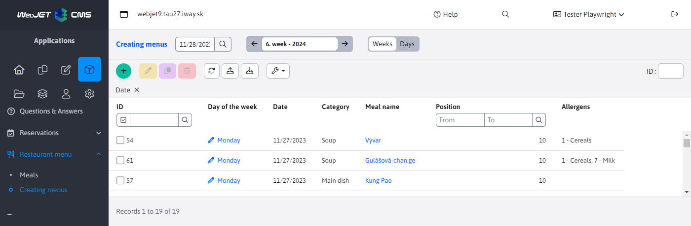
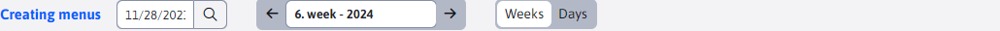
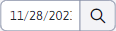
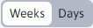
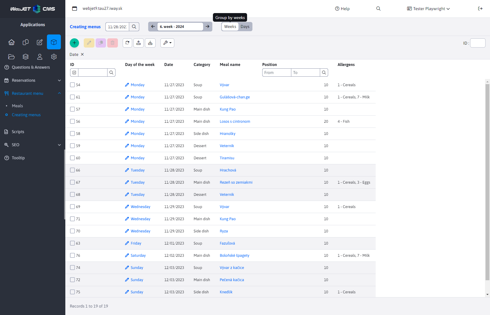
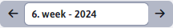

# Menu creation

The **Menu Creation** section falls under the Restaurant Menu section. It allows you to create a menu by assigning meals to specific days. Of course, it provides the ability to add/edit/duplicate/delete these assignments as well as import and export them.

A meal is represented by the Category and Meal Name columns by default. The remaining columns representing a meal can be added in the datatable settings. The value in the Meal Name column itself is a link that, when clicked, will redirect you to the Meals table and automatically open the editor for the selected meal ([Meals](./meals.md)).

The records in this table are strictly filtered:
- by date (day of the week)
- according to the selected category (1-Soups, 2-Main courses, 3-Side dishes and 4-Desserts)
- then according to the selected position

This sorting system is best seen in the image in the [Display mode] section (../restaurant-menu/menu.md#display-mode), when viewing entries from the entire week.

## Creating a new record

Parameters:
- Category, list for selecting a food category (default category Soups)
- Meal name, a list that dynamically populates based on the currently selected meal category. The list contains all defined meals under the selected category (the first meal in the returned list is automatically selected)
- The date to which the meal is assigned is automatically filled in according to the value of the date filter ( [Date filter](../restaurant-menu/menu.md#date-filter) ) and cannot be changed.
- Position, when creating a new record (only when creating), its value is preset as the highest priority for the combination of the given day and the selected food category + 10. This means that, for example, if for the day 23.11.2023 and the food category Soups the highest priority is 20, then the value is set to 30. When changing the food category, the value is automatically preset again.

## Controls

The table contains special controls that make it easier to work with dates and display modes:

### Date filter

The date filter  is used to limit the displayed records to a specific day only. The automatic one is set to the current day (**Warning:** its last current value is not saved when you leave the page).

### Display mode

The  view mode allows you to change the range in which records are displayed. It provides a choice of day and week views.

The default is **view by day**, which you could already see in the opening image of the table above. This view filters records for only one specific day.

If you select **view by week**, records for the entire week (7 days) will be filtered. A week is always considered to be the range from Monday to Sunday.

You can change the week by changing the value of the **Date filter**. The filter will automatically derive the entire week from the selected date and all values ​​in that time range will be displayed.

Example: if you select the date 28.11.2023 (Tuesday), then in Weeks mode the range will automatically be set from Monday 27.11.2023 (inclusive) to Sunday 03.12.2023 (inclusive). It does not matter which day in this range you select, the filtered records will always be the same as long as these dates are in the same week. You can change the week itself only by selecting a date that falls in a different week (e.g. 04.12.2023).

Of course, it doesn't matter whose week runs through another month or year.
As you can see in the image below, the entire week's entries are displayed, and the **Day of the Week** column is automatically displayed to help you determine which day the entries belong to. The entries are also color-coded when moving from one day to another.

The originally set date in the filter does not change (of course you can change it) and when switching to **view by day** mode, records of the day whose date is currently set will be displayed.

### Date status

The date status is primarily used to display the currently selected day of the week.

In **day view** mode, it displays information about what day of the week is currently selected and what week of the year it is. 

In **weekly view** mode, it displays information about what week of the year it is and what year it is.

In the previous images, you can see that this date status also includes left and right arrows. These arrows are used to easily scroll through the calendar:
- left arrow is a move to the past
- the arrow to the right is a move to the future

In **day view** mode, you only move one day, in **week view** mode, you move a whole week (7 days). With this move, the date filter is also automatically set so that you have an overview of which day/week is currently set.