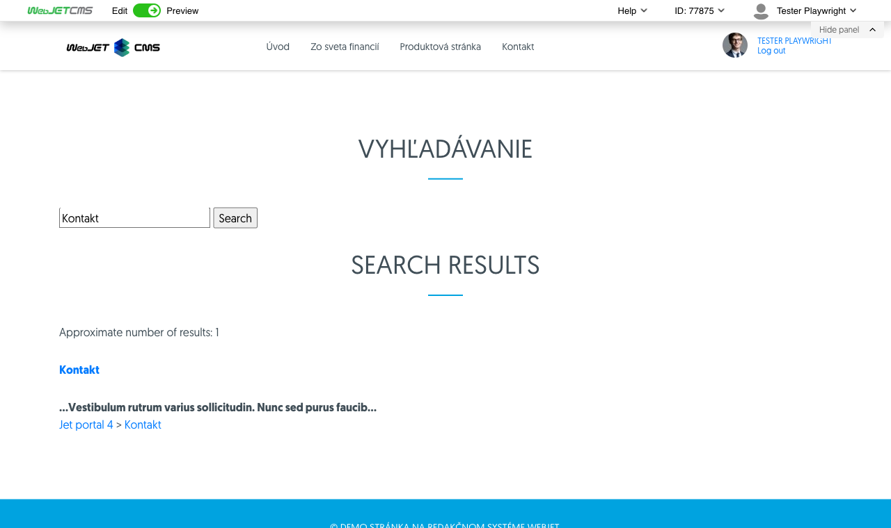

# Search

Offer your visitors the possibility of fast and accurate search directly on your site. Include a search form and search results display that allows you to set the directory, number of entries per page, and how they are arranged. Leverage the power of database search or use Lucene/Elastic Search to search with inflection as well. Text searches of doc(x), xls(x), ppt(x), pdf, xml and txt files are also supported.

## Application settings

In the settings you can set:
- Directory
- Number of links per page
- Check for duplication
- Organize by (Priority, Title, Change Date )
- Insert (form, results, total)

## View application

