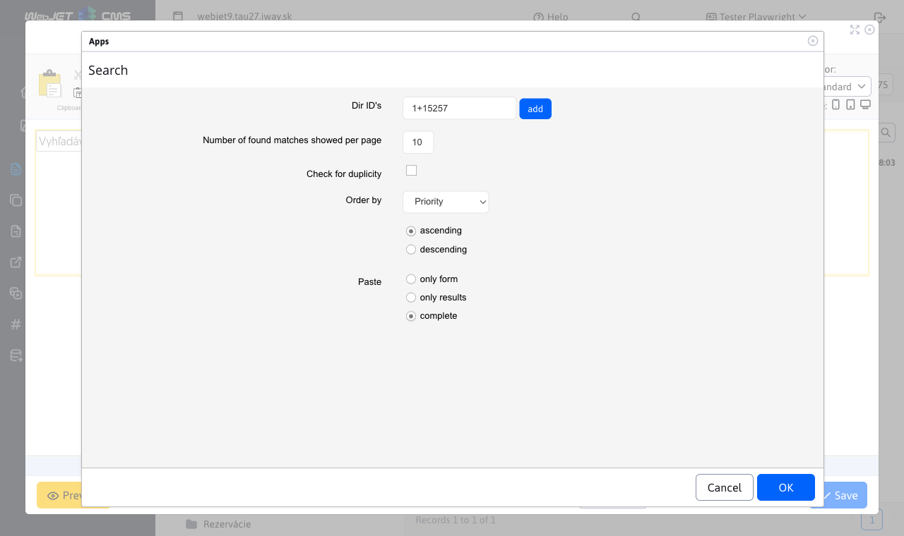
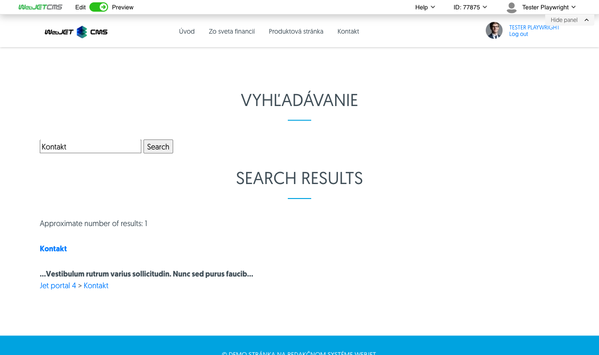

# Search

Offer visitors the ability to search quickly and accurately right on your site. Insert a search form and search results display that allows you to set the directory, number of records per page, and how to organize them. Harness the power of database search or use Lucene/Elastic Search for inflected searches. Text searches of `doc(x), xls(x), ppt(x), pdf, xml a txt` files are also supported.

## Application settings

In the settings you can set:

- Search type - Database, Lucene, semantic, or hybrid search can be used for a specific embedded application. The value **By configuration** will use the global configuration variable `searchType`.
- Add RAG answer - turns on displaying AI answers above search results if the `ragAnswerAllowed` variable is globally enabled and semantic or hybrid search is used.
- Directory - ID of website folders for searching, also searches in subfolders
- Number of links per page - number of entries per search page
- Check for duplicates - if a website is located in multiple folders, duplicate checking is enabled. This increases the load on the server.
- Sort by - Priority, Name, Date Modified
- Insert - form, results, together - sets the type of inserted part, if you want to have a separate search field, e.g. in the header, insert the form separately and the search results separately. When setting the value Form, you need to enter the ID of the page with the search results.

### Setting up file searches

If you want to search in files as well, you need to [set up file indexing](../../files/fbrowser/folder-settings/README.md#indexing) in the Explorer section and on the given file folder and run initial indexing.

### Setting the search type

The system supports the following search types:

- **Database search** – a standard type of search using a database server.
  - Used by default if no other type is set. It can be explicitly set to the value `searchType` by the configuration variable `db`.
- **Lucene** – search using the [Lucene](https://lucene.apache.org/) library, which also forms the basis of the Elastic Search system.
  - Set the configuration variable `luceneAsDefaultSearch` to the value `true`, or the variable `searchType` to the value `lucene`.
  - Start initial indexing via `/components/search/lucene_console.jsp`.
- **Semantic search** – search using pgvector.
  - Set the variable `searchType` to the value `semantic`, or select the type directly in the application. Enable semantic search by setting the variable `ragSemanticSearchEnabled` to `true`.
  - Read more in the [Semantic Search](../semantic-search/README.md) section.
- **Hybrid search** – combines semantic search with fulltext over indexed parts of the text.
  - Set the variable `searchType` to the value `hybrid`, or select the type directly in the application. Both `ragSemanticSearchEnabled=true` and `ragHybridSearchEnabled=true` must be enabled.
  - Read more in the [Semantic Search](../semantic-search/README.md) section.

!>**Warning:** The configuration variable `luceneAsDefaultSearch` has a higher priority than the variable `searchType`. So if `luceneAsDefaultSearch=true` is set, Lucene will be used regardless of the value set for the variable `searchType`.

A RAG answer is not a separate type of search. It is an addition to semantic or hybrid search that generates a short answer from the context found and displays it before the list of results.

### Comparison of search types

| | Database (`db`) | Lucene | Semantic (`semantic`) | Hybrid (`hybrid`) |
| --- | --- | --- | --- | --- |
| Technology | SQL LIKE / FULLTEXT | `Apache Lucene` | `OpenAI embeddings` + `pgvector` | `pgvector` + fulltext above chunks |
| Match | Keywords | Keywords + inflection | Semantic meaning | Semantic meaning and exact words |
| Results without word matches | No | Partially | Yes | Yes |
| Suitable for short queries | Limited | Yes | Partially | Yes |
| Requirements | Primary DB | Lucene index | `PostgreSQL` + `pgvector` + `OpenAI` | `PostgreSQL` + `pgvector` + `OpenAI` |
| Price | Free | Free | OpenAI API (paid) | OpenAI API (paid) |

## View the application

