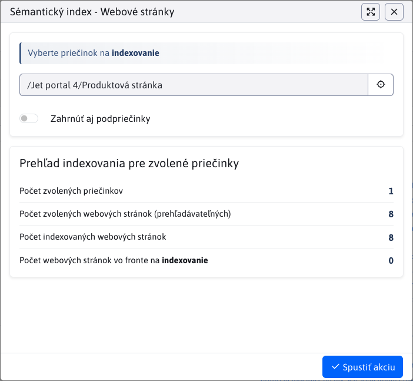

# Semantic index

The semantic index converts page content into vector representations (`embedding`) using the OpenAI API and stores them in a vector database. This enables efficient semantic search.

For more accurate results, the content is divided into smaller parts – **chunks**. Each chunk is indexed separately, which allows the system to match queries to specific parts of the text rather than the entire page at once.

You can find vector management in the **Settings → Semantic Index** section.

Currently, **website** indexing is supported. Additional types may be added in the future.

!>**Warning:** Indexing **does not happen immediately**. Each request (add, modify, delete) is placed in a **queue** and processed at regular intervals using a cron job.

To view the list of indexed objects, you must have the Semantic Index right.

## Website indexing

The pure text of the page is indexed - the title, header and body without HTML tags. The content is divided into chunks, which are shown in the table below.

Each chunk contains the following columns:

- **Entity ID** – Website ID
- **Part index** – order of `chunk` within the page (0, 1, 2, ...)
- **Part text** – text for which the embedding was generated (the embedding itself is not displayed)
- **Model** – OpenAI model used, e.g. `text-embedding-3-small`
- **Dimensions** – number of dimensions of the vector, e.g. `1536`
- **Language** – language version of the page
- **Status** – processing status:
  - **COMPLETED** – successfully processed
  - **ERROR** – an error occurred
  - **PENDING** – waiting for processing
- **Error message** – error description if processing failed
- **Creation Date** – processing time (not adding to queue)

## Filtering

The following filters are available in the table header:

- **Select folder** – displays chunks only for pages from the given folder (within the current domain)
- **Show also from subfolders** – includes pages from subfolders in the results

!>**Warning:** If you select **Root Folder** without enabling **Show also from subfolders**, you will not get any results. The root folder is virtual and does not contain pages directly.

## Redirect from Websites

In the **Websites** section, you can click the button next to the selected folder. <button class="btn btn-sm buttons-selected btn-outline-secondary"><i class="ti ti-database-search"></i></button> in the folder header. This will open the **Semantic Index** section with the filter automatically set for that folder.

### Automatic indexing

The system automatically queues a page when:

- **created or edited** – the page is indexed (or updated) without manual intervention
- **deleted or moved to the trash** – all related blocks are removed from the database
- **restore from trash** – the page is being re-indexed

### Manual indexing

Click the button <button class="btn btn-sm btn-success" type="button"><i class="ti ti-database-plus"></i></button> to open the indexing dialog.

The dialog will display an overview of the pages in the selected folder – total number, number already indexed, and number in the queue. The folder will be set according to the active filter. After confirmation, all pages will be placed in the queue. If the page already has a current embedding, it will not be indexed again.

You start the action with the button <button class="btn btn-primary"><i class="ti ti-check"></i>Start the action</button> .

### Manually remove indexing

Click the button <button class="btn btn-sm btn-danger" type="button"><i class="ti ti-database-minus"></i></button> to open the delete indexes dialog.

The dialog will display the same overview as for indexing. After confirmation, all pages will be queued for deletion of all chunks for pages in the selected folder.

You start the action with the button <button class="btn btn-primary"><i class="ti ti-check"></i>Start the action</button> .

## Implementation details

A technical description of the indexing process can be found in the [developer documentation](../../../custom-apps/apps/rag/semantic-search/README.md).