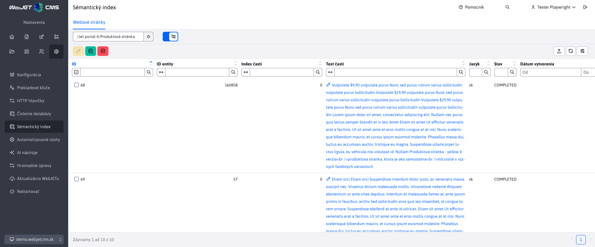
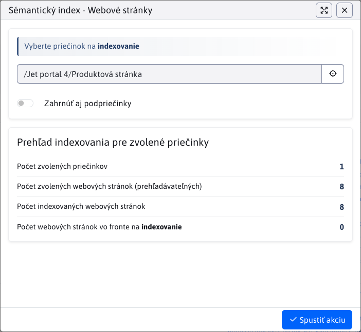

# Semantic index

The semantic index converts the content of the pages into vector representations (`embedding`) using the configured AI provider and stores them in a vector database. It is used for semantic search, hybrid search, and for generating RAG answers in search.

For more accurate results, the content is divided into smaller parts - **chunks**. Each chunk is indexed separately, which allows the system to match queries to specific parts of the text rather than the entire page at once.

You can find vector management in the **Settings → Semantic Index** section.

Currently, **website** indexing is supported. Additional types may be added in the future.

!>**Warning:** Indexing **does not happen immediately**. Each request (add, modify, delete) is placed in a **queue** and processed at regular intervals using a cron job.

To view the list of indexed objects, you must have the Semantic Index right.

## Website indexing

The plain text of the page without HTML tags is indexed. Only web pages that are enabled for search are included in the indexing. The content is divided into chunks, which are shown in the table below.

Each chunk contains the following columns:

- **Entity ID** - Website ID.
- **Chapter index** - the order of the chunk within the page (0, 1, 2, ...).
- **Part text** - the text for which the embedding was generated. The embedding itself is not displayed in the table.
- **Embedding provider** - the provider used to create the vector, e.g. `openai` or `gemini`.
- **Embedding model** - the embedding model used, e.g. `text-embedding-3-small` or `gemini-embedding-001`.
- **Dimensions** - number of dimensions of the vector, e.g. `1536`.
- **Language** - language version of the page.
- **Status** - processing status:
  - **COMPLETED** - successfully processed.
  - **ERROR** - an error occurred.
  - **PENDING** - waiting for processing.
- **Error message** - error description if processing failed.
- **Creation Date** - processing time, not queue addition time.

Additionally, the database stores `group_id` and the columns `root_group_l1`, `root_group_l2`, `root_group_l3`. These values ​​are used to quickly limit semantic and hybrid searches to folders selected in the **Search** application.

After loading the page, an informational notification will appear with the current provider and model used for indexing. The settings are loaded from the system AI assistant `RAG-EMB-INDEX`, which you can edit in the **Settings → AI assistants** section.

If the system assistant does not yet exist, it will be created automatically based on the configuration variables `ragEmbeddingProvider` and `ragEmbeddingModel`. Once it is created, the values ​​set in the assistant take precedence over the configuration variables.

!>**Warning:** After changing the provider or model, run the index again. Indexes created by different provider and model combinations are stored separately and can coexist for the same page. The `RAG-EMB-SEARCH` search assistant must use the same provider and model identifier as the index it is to search.

The queue item does not contain a provider or model; these values ​​are read from the `RAG-EMB-INDEX` assistant only during processing. If the queue in progress is to complete the original index, let it fully process before changing the assistant.

## Splitting text into chunks

The chunk size is set by configuration variables:

- `ragEmbeddingChunkSize` - ​​maximum size of one part of the text in characters, default `1000`.
- `ragEmbeddingChunkOverlap` - ​​number of characters of overlap between adjacent parts, default `200`.

When splitting text, the system tries to preserve the natural context. The end of the chunk is selected in the following order:

1. end of paragraph,
2. end of line,
3. end of sentence or similar punctuation,
4. space between words,
5. hard division by maximum size.

Overlay is used to preserve context between adjacent chunks. In a RAG response, adjacent chunks of a single page can be re-merged, removing duplicate text created by the overlay.

!>**Warning:** The older configuration variables `ragChunkSize` and `ragChunkOverlap` are no longer used. Please re-run indexing after changing chunk sizes or migrating from older settings.

## Filtering

The following filters are available in the table header:

- **Select folder** - displays chunks only for pages from a given folder within the current domain.
- **Show also from subfolders** - includes pages from subfolders in the results.
- **Embedding Provider** and **Embedding Model** - restrict the table to a specific combination of the stored index.

!>**Warning:** If you select **Root Folder** without enabling **Show also from subfolders**, you will not get any results. The root folder is virtual and does not contain pages directly.

## Redirect from Websites

In the **Websites** section, you can click the button next to the selected folder. <button class="btn btn-sm buttons-selected btn-outline-secondary"><i class="ti ti-database-search"></i></button> in the folder header. This will open the **Semantic Index** section with the filter automatically set for that folder.

### Automatic indexing

The system automatically queues a page when:

- **created or edited** - the page is indexed or updated without manual intervention,
- **deleted or moved to the trash** - all related chunks are removed from the database,
- **restore from trash** - the page is being re-indexed.

### Manual indexing

Click the button <button class="btn btn-sm btn-success" type="button"><i class="ti ti-database-plus"></i></button> to open the indexing dialog.

The dialog will display an overview of the pages in the selected folder - total number, number already indexed, and number in queue. Only pages that have an index for the current provider and assistant model `RAG-EMB-INDEX` are considered indexed. An index created by another provider or model is therefore not taken into account in this count.

The folder and the **Show also from subfolders** option are taken from the active filter. After confirmation, all searchable pages from the selected range are queued. If the chunk text has not changed, the system will try to use an existing embedding with the same provider and model according to its hash value. Reindexing will only replace the index for the current provider and model combination; other indexes for the same page will be preserved.

You start the action with the button <button class="btn btn-primary"><i class="ti ti-check"></i>Start the action</button> .

### Manually remove indexing

Click the button <button class="btn btn-sm btn-danger" type="button"><i class="ti ti-database-minus"></i></button> to open the delete indexes dialog.

The dialog will take the folder and the **Show also from subfolders** option and display the same overview as for indexing, but the number of indexed pages includes all providers and models. After confirmation, the pages will be queued for removal of all chunks for pages of the selected range, regardless of provider and model.

You start the action with the button <button class="btn btn-primary"><i class="ti ti-check"></i>Start the action</button> .

## Indexing errors

If an error occurs while indexing a page, the system saves a record with the status **ERROR** and a short error message. The error is also written to the administrator log in the **Search** category (`SEARCH`). If processing of an item fails at the queue level, the item remains in the queue and the system attempts to process it the next time the cron job runs.

!>**Warning:** Changing the configuration variable `ragEmbeddingDimensions` will delete the entire semantic index for all providers and models because the database column `vector(N)` has a common dimension. After the change, all content must be re-indexed.

## Implementation details

A technical description of the indexing process can be found in the [developer documentation](../../../custom-apps/apps/rag/semantic-search/README.md).
