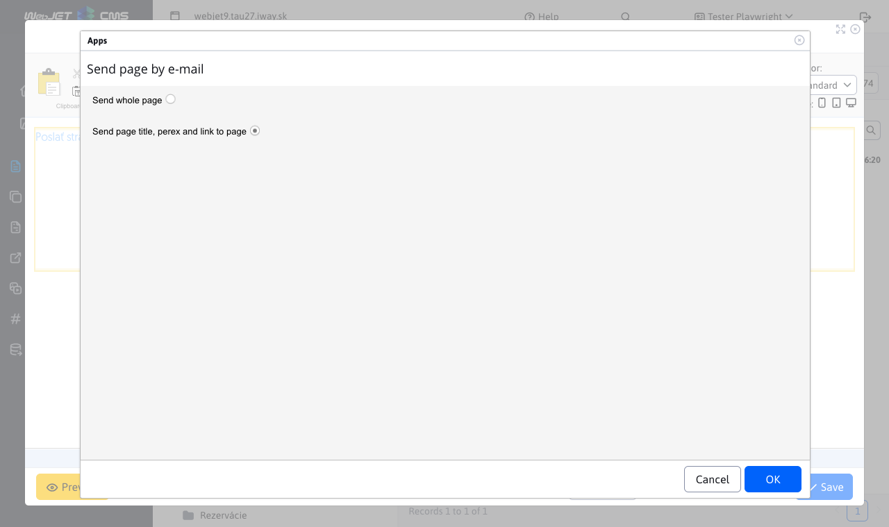
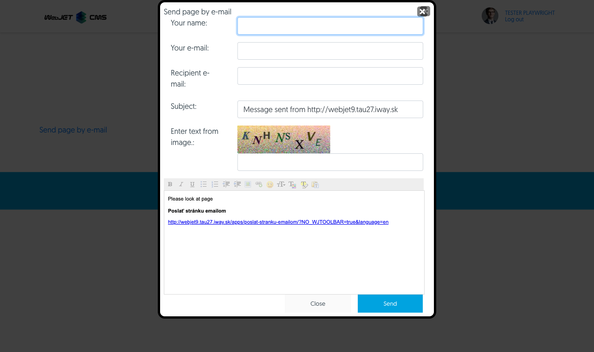

# Send page by email

Inserts an application into the page that allows you to send a link to the current page along with the completed text to an email address. If a visitor finds interesting information on your site, they can forward it to their email or to the email of a friend they want to share the page with.

## Application settings

In the settings, you can select from the following options:
- Send full page by e-mail
- Send by email the page title, perex and link to the page

## View application

For the user, the fields are:
- Your name
- Your e-mail
- E-mail of the recipient
- Subject
- Enter the text from the image
- Report

All fields except the message are required

