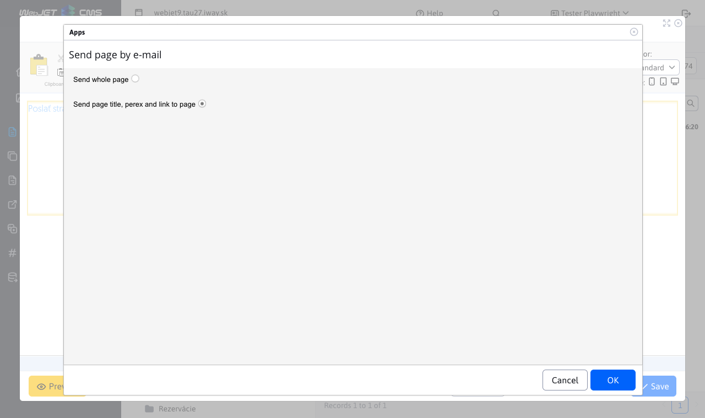
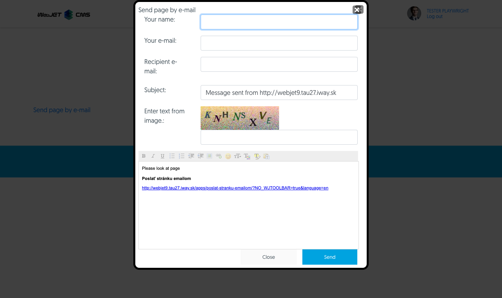

# Email this page

It embeds an application into the page that allows you to send a link to the current page along with the added text to an email address. If a visitor finds interesting information on your website, they can forward it to their email, or to the email of a friend with whom they want to share the page.

## Application settings

In the settings you can choose from the following options:

- Email the entire page
- Send the page title, URL and link to the page by email

## View the application

For the user, the fields are:

- Your name
- Your email
- Recipient's email
- Subject
- Enter text from image
- Report

All fields except the message are required.

