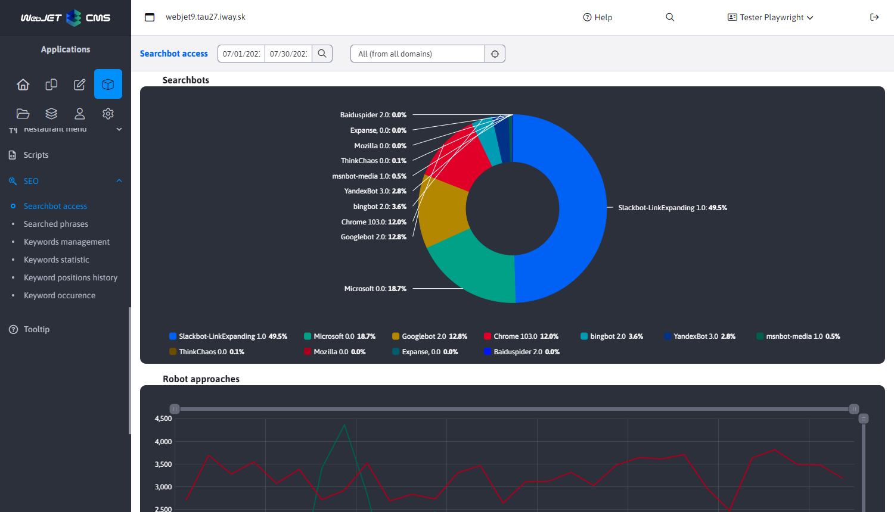
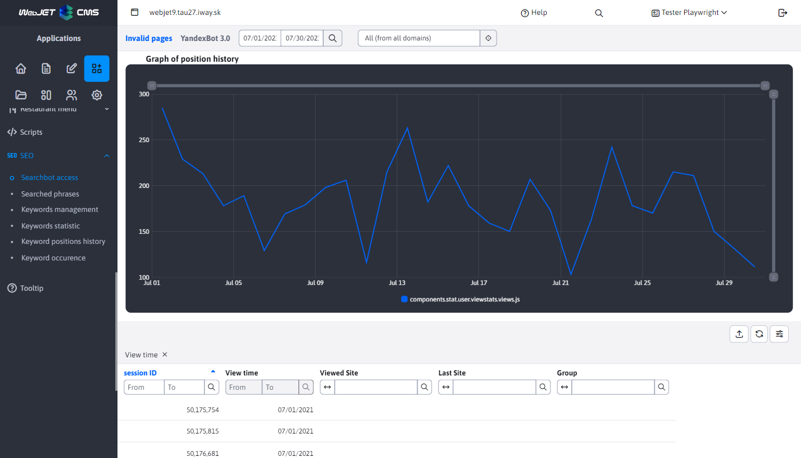
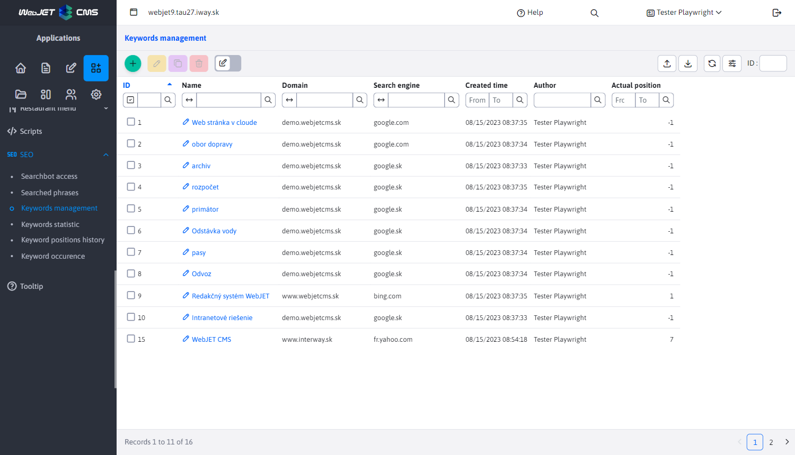
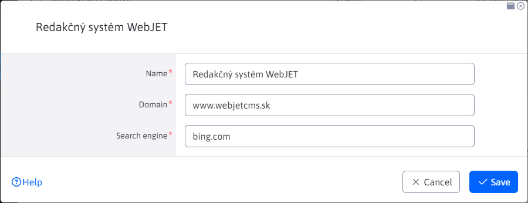
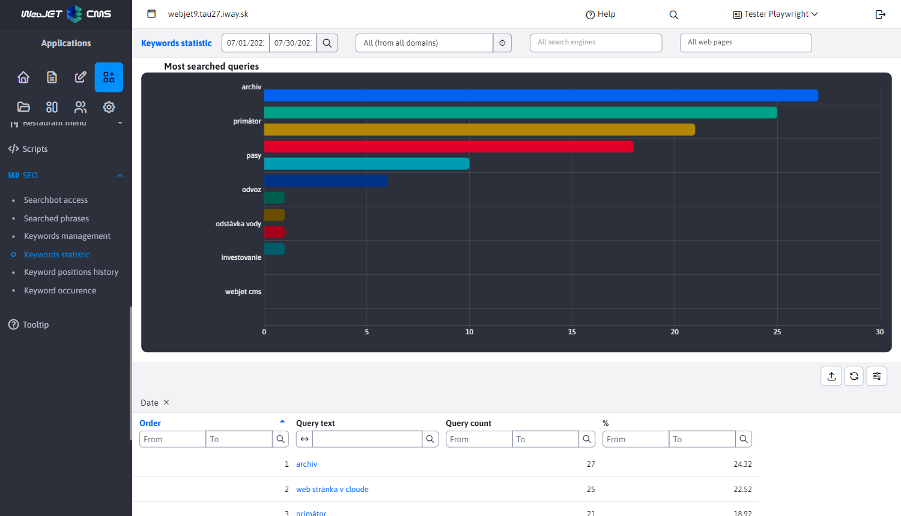
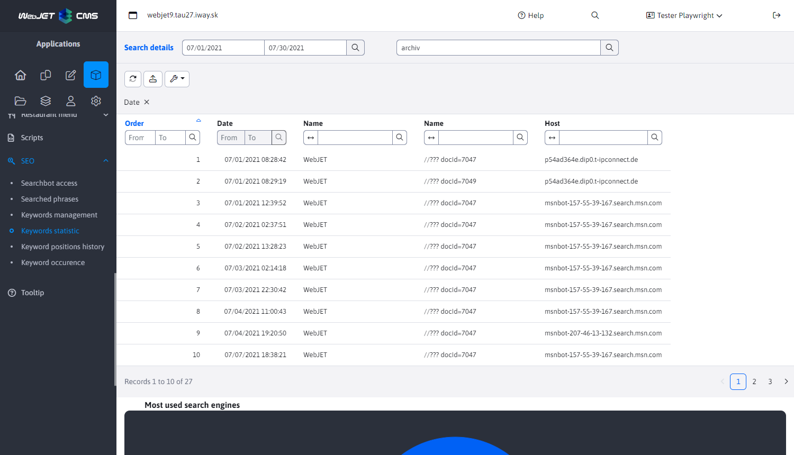
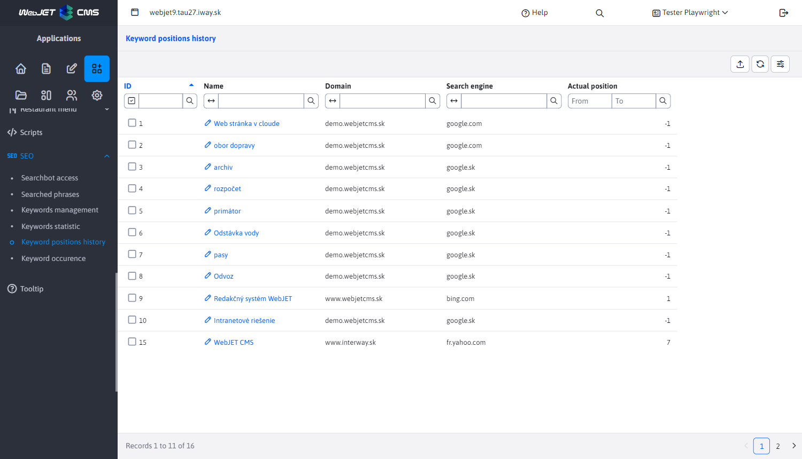
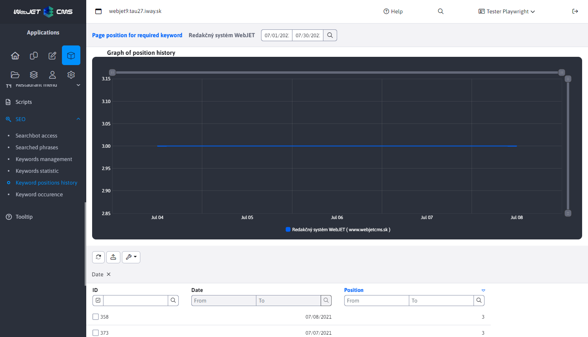
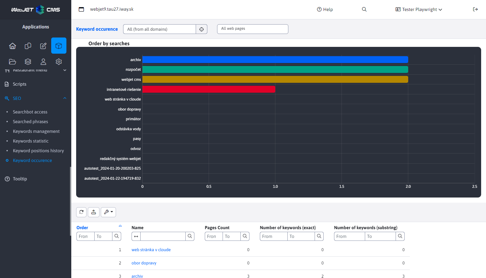
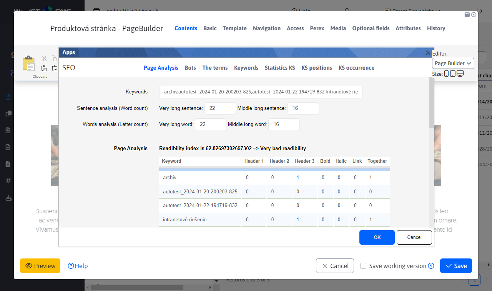

# SEO

The SEO application is a support tool for search engine optimization. It is available in the Applications section in the left menu as an SEO item.

The SEO section uses an external filter, which is described in more detail here [External filter](../stat/external-filter.md)

## Approaches of search robots

This section displays the statistics of search engine accesses to the website. You can see their activity and the date of the last access.

Also included is a table whose column `Názov servera` redirects us to the statistics detail of a particular search engine.

## Search terms

This section displays the statistics of search terms searched on search engines when navigating to your page. It gives information what words visitors are searching for on search engines and what page they came to your site for that word.

For more information please click here [Search engines](../stat/README.md#vyhľadávače)

## Keyword management

This section allows you to define and manage important keywords for which you can determine search engine rankings and determine the keyword density of your website.

Support is provided for creating/editing/deleting/duplicating keywords, as well as importing and exporting them.

When creating, editing and duplicating, all values must be entered.

## Keyword statistics

This section displays the search statistics of the defined keywords, showing the percentage and total counts and the distribution of the keyword among the search engines.

The contained datatable contains a column `Názov výrazu`, which redirects us to the statistics detail of a specific keyword after clicking.

## Development of keyword positions

This section displays position statistics and the evolution of keyword positions over time. The current position of each keyword on `Google`, `Yahoo` or `Bing` is updated once a day. On which search engine the word position is verified depends on the domain set.

The contained datatable contains a column `Názov`, which redirects us to the details of the development of the position of a particular keyword.

Getting positions using the service [SerpApi](https://serpapi.com) on which you need to register and obtain an API key. The following conf. variables are used:
- `seo.serpApiKey` - API key from the service `SerpApi`.
- `seo.serpApiGoogleMaxResult` - maximum number of records to check results (default 10).

## Occurrence of keywords

This section shows the number of occurrences of the defined keywords on the website/webpage. This allows you to determine the density of keywords on the web site / page.

## Page analysis

When editing a page, you can embed the SEO application into the page. Technically, it is not inserted into the page, but it will display a keyword analysis of the currently displayed web page.

The application analyzes the readability of the text, uses the technique of analysis `Gunning fog index`. Estimates the number of years of education needed to understand the text. In practice:
- 6 means excellent legibility.
- 8 to 10 are magazine and newspaper articles, short stories, easy to read and understand.
- 11 to 14 are already reaching more specialist articles. Scientific papers usually reach the level of 15 to 20 and already require full concentration from the reader.
- Above 20, only texts where the writer completely ignores the reader.
The table shows the occurrence of the defined keywords in the text of the current web page. You can edit the list of keywords in the Keywords field (separate individual words/phrases with a comma) and click OK to refresh the table.

