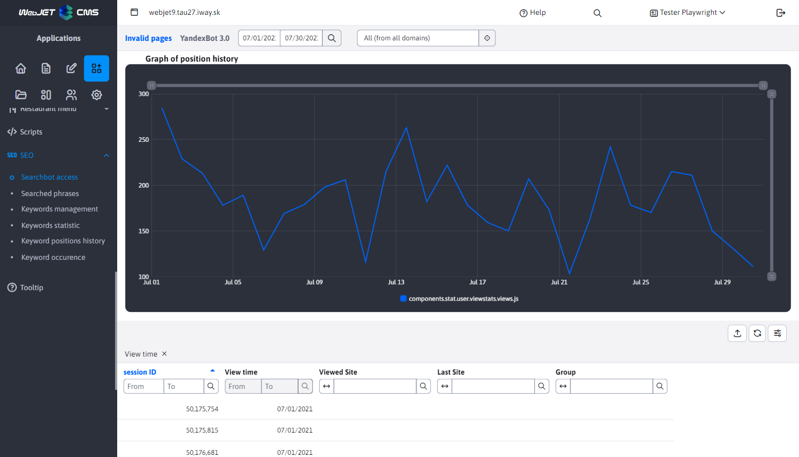
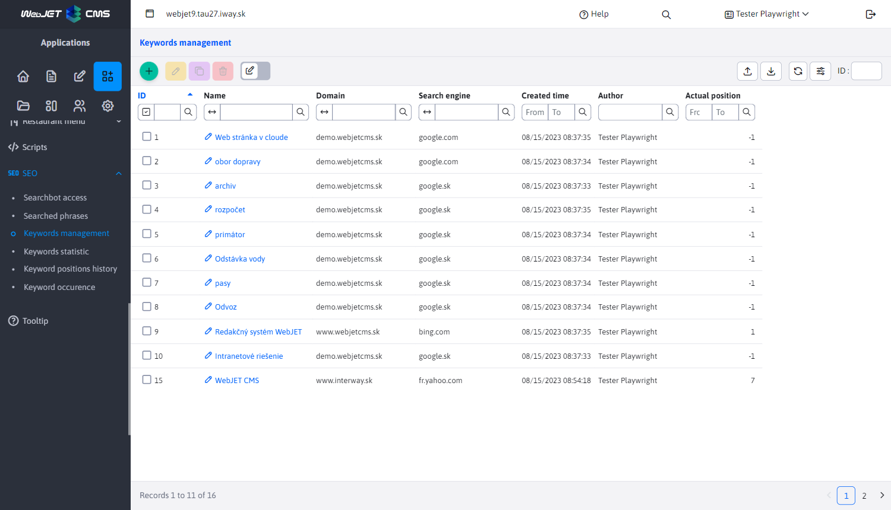
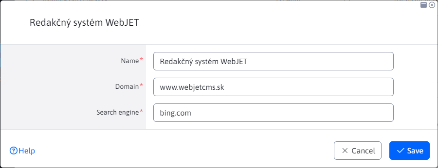
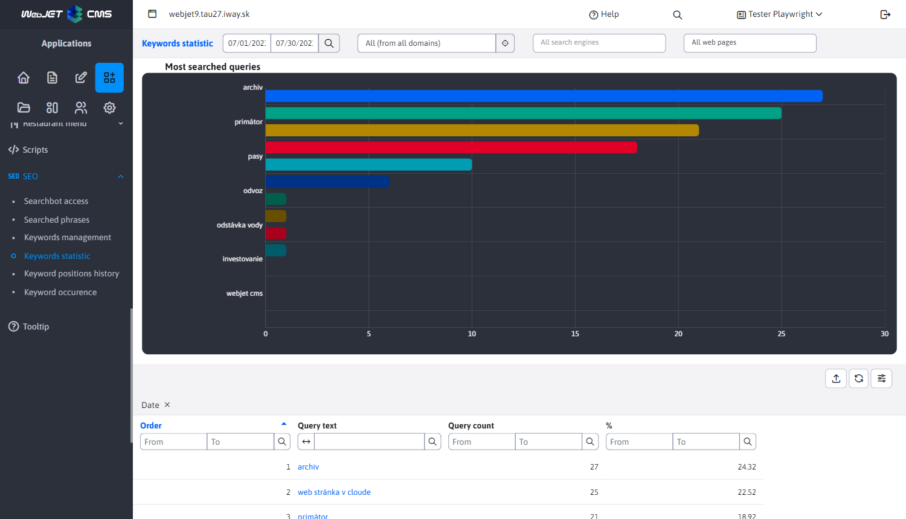
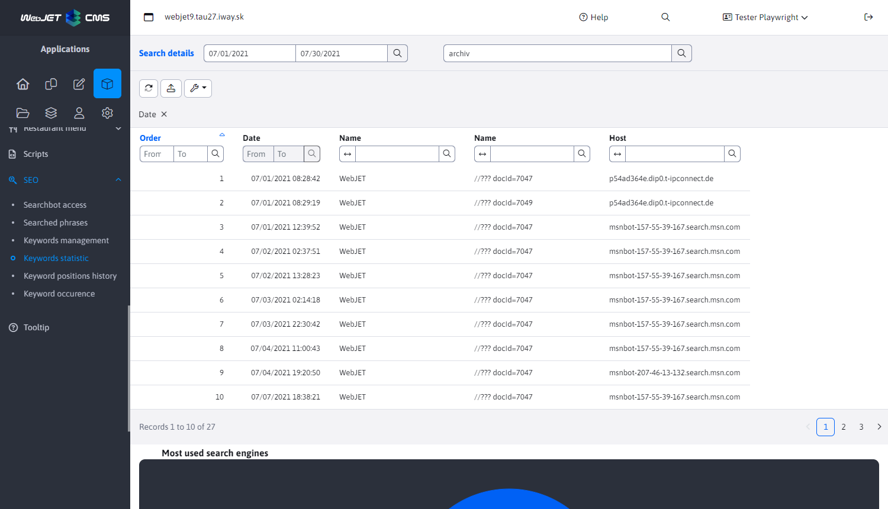
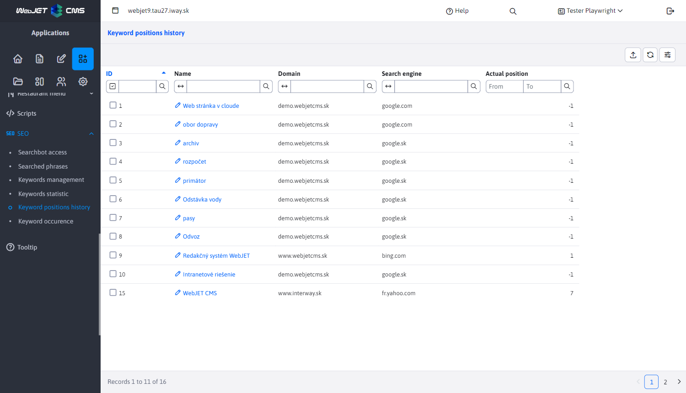
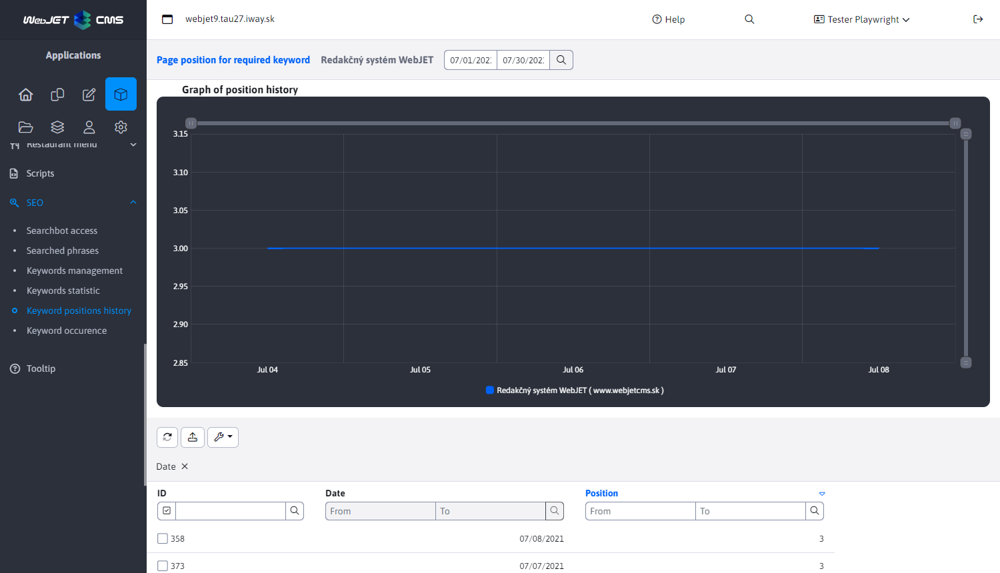
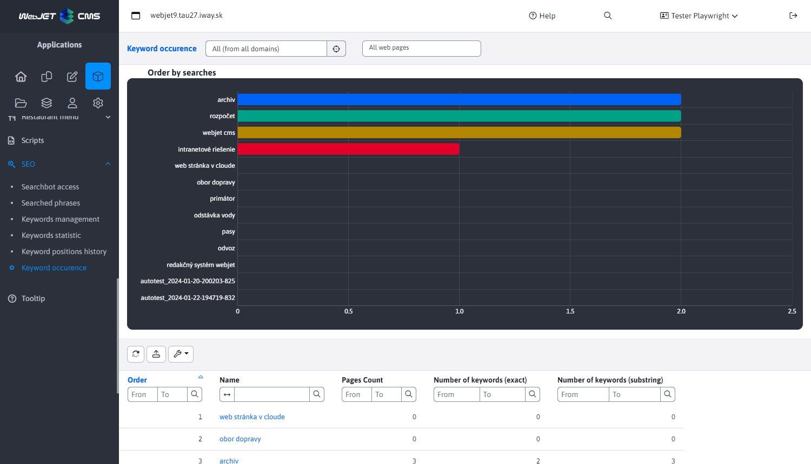
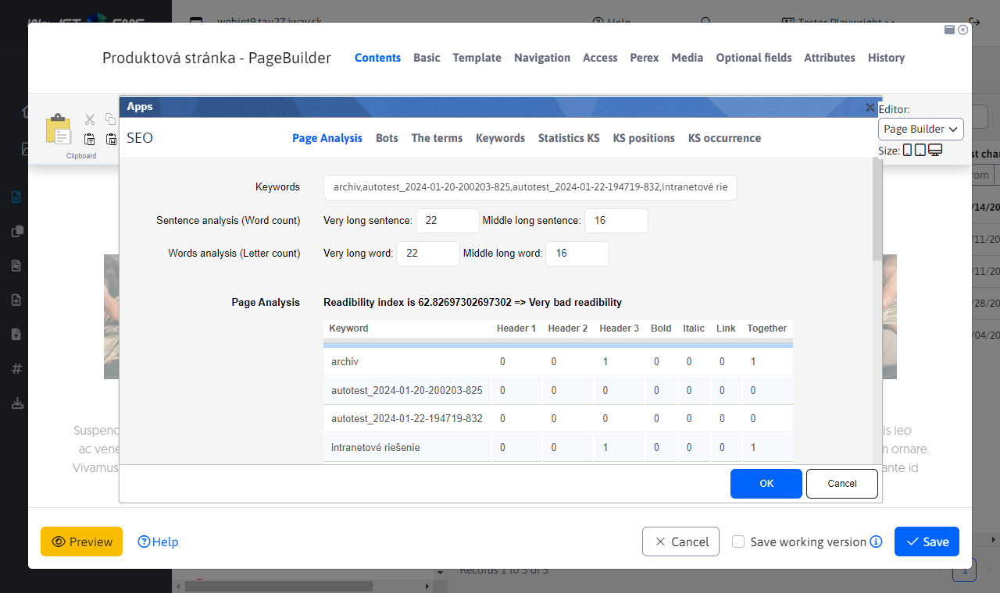

# Search Engine Optimization (SEO)

The Search Engine Optimization (SEO) application is a support tool for optimizing your website for search engines. It is available in the Reports section in the left menu as the Search Engines item.

The SEO section uses an external filter, which is described in more detail here [External filter](../stat/external-filter.md)

## Search engine crawler approaches

This section shows statistics on search engine bots accessing your website. You can see their activity and the date of their last access.

There is also a table, the **Server Name** column of which, when clicked, redirects us to the detailed statistics of a specific search robot.

## Search terms

This section shows statistics on search terms used on search engines when navigating to your site. It gives information about what words visitors search for on search engines and which page they reached with that word.

For more information, see [Search Engines](../stat/README.md#search engines)

## Keyword management

This section allows you to define and manage important keywords for which you can check search engine rankings and find out the keyword density on your website.

Support is provided for creating/editing/deleting/duplicate keywords, as well as importing and exporting them.

When creating, editing, and duplicating, all values ​​must be entered.

## Keyword statistics

This section displays search statistics for defined keywords, showing percentage and total numbers and the distribution of the keyword among individual search engines.

The included data table contains a column **Term Name**, which, when clicked, redirects us to the statistics details for a specific keyword.

## Keyword position development

This section shows position statistics and the development of keyword positions over time. The current position of individual keywords on `Google`, `Yahoo` or `Bing` is updated once a day. The search engine on which the position of a word is verified depends on the configured domain.

The included data table contains a **Name** column, which, when clicked, redirects us to a detailed view of the position development of a specific keyword.

Obtaining positions uses the [SerpApi](https://serpapi.com) service, where you need to register and obtain an API key. The following conf. variables are used:

- `seo.serpApiKey` - ​​API key from the `SerpApi` service.
- `seo.serpApiGoogleMaxResult` - ​​maximum number of records to check results (default 10).

## Keyword occurrence

This section displays the number of occurrences of defined keywords on a website/page. This allows you to determine the keyword density on a website/page.

## Page analysis

When editing a page, you can embed an SEO application into the page. Technically, it won't be embedded into the page, but it will display a keyword analysis of the currently viewed web page.

The application analyzes the readability of the text, using the `Gunning fog index` analysis technique. It estimates the number of years of education needed to understand the text. From practice:

- 6 means excellent readability.
- 8 to 10 are magazine and newspaper articles, short stories, easy to read and understand.
- More professional articles reach 11 to 14. Scientific papers usually reach a level of 15 to 20 and require full concentration from the reader.
- only texts in which the writer completely ignores the reader have over 20.

The table displays the occurrence of defined keywords in the text of the current web page. You can edit the list of keywords in the Keywords field (separate individual words/phrases with a comma) and click OK to refresh the table.

