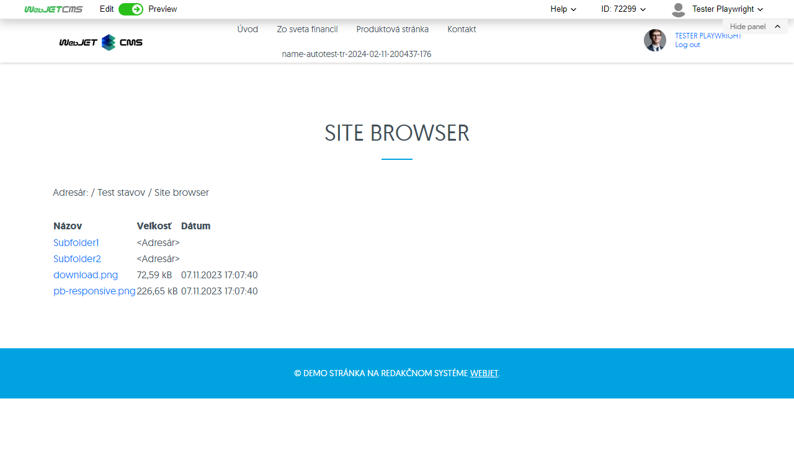
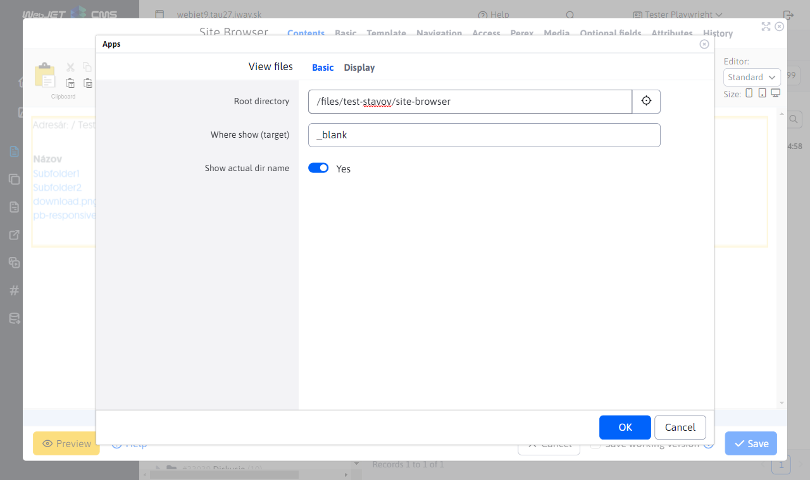

# View files

The File View application, allows you to embed a viewer of folders and files on the server's disk into the page.

The application has the following parameters in the editor:
- Root directory - specify a directory that can be searched with its subdirectories. In case you do not specify any folder, the root directory for the website will be considered.
- Where to display - you can specify where the selected file will be opened. The default value is to a new window.
- Show current directory name - if you leave this box unchecked, the path from the root directory to the current directory will be displayed.

