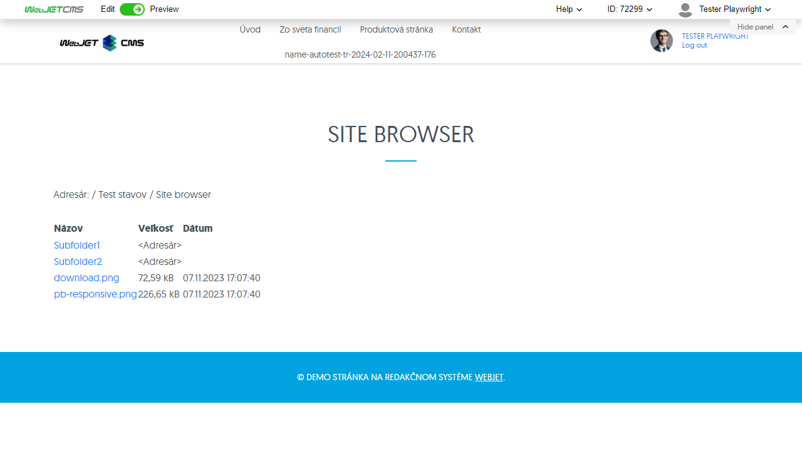
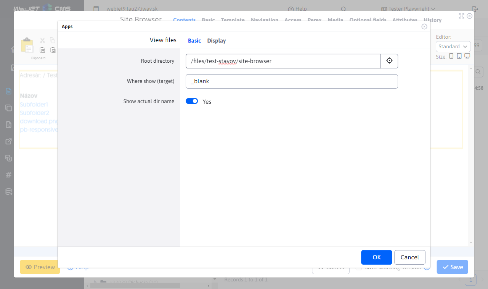

# View files

The File View application allows you to embed a browser for folders and files on the server disk into your page.

The application has the following parameters in the editor:

- Root directory - enter a directory that will be searchable, including its subfolders. If you do not enter any folder, the root directory for the website will be considered.
- Where to display - you can specify where the selected file will be opened. The default value is in a new window.
- Show current directory name - if you leave this box checked, the path from the root directory to the current one will be displayed.

