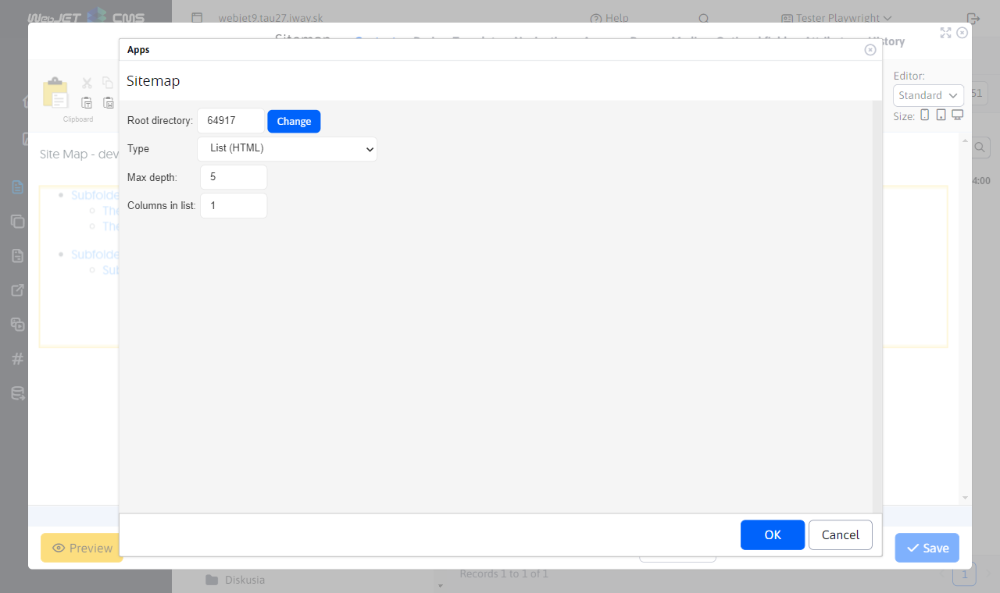

# Site Map

The Site Map application can automatically generate the tree structure of a web site.

The display of an entry in the site map depends on the setting of the Navigation Bar field in the Navigation tab of the site directory. It has the following options:
- Just like the menu - the display in the sitemap behaves the same way as the display field is set in the menu.
- Show - the item will be displayed in the sitemap.
- Don't show - the item will not appear in the sitemap (including sub-folders).
- Show without subfolders - the item will be displayed in the sitemap, but its other subfolders will not be displayed (the advantage is that the subfolders do not need to set the display method).
- Show including web pages - a folder will be displayed in the sitemap and all web pages from the folder will also be displayed as separate entries. By default, the View option does not display web pages from the folder as separate entries in the sitemap.

When displaying including web pages, you can still set each web page separately to be displayed in the sitemap. The option is also in the Navigation tab and contains the options:
- Just like the menu - the display in the sitemap behaves the same way as the display field is set in the menu.
- View - the web page will be displayed in the sitemap.
- Don't show - the web page will not appear in the sitemap.

## Application settings

In the application properties you can set:
- Root directory - selecting the root directory
- Display type - how the sitemap is displayed, see options below

for some display types can still be set:
- Directory search depth - maximum nesting of displayed items
- Number of columns in the statement - the display can be divided into a specified number of columns (for a nicer display on the web page)

## Developed tree (HTML)

The tree structure is displayed in the HTML code as a nested UL-LI list. This is the best sitemap solution with respect to search engines. It is not suitable for large web sites (or the maximum nesting should be limited so that the page is not too large).

## Seat map (Windows Explorer)

The tree structure is similar to that of Windows Explorer, so it is familiar and easy for visitors to navigate. The left column displays a list of directories and the right column displays the pages in the selected directory.

Click on the + or - sign to open/close web pages in that directory. Clicking on a directory name displays the main document of that directory, clicking on a web page name displays the desired page.

## Developed tree (Javascript)

The tree structure is expandable using JavaScript. Not recommended for large web sites.

Click on the + or - sign to open/close the web page/directory.

## Developed tree (AJAX)

The tree structure is clickable using JavaScript, individual parts of the tree are loaded from the server using AJAX calls (jQuery).

Click on the + or - sign to open/close the web page/directory.

## XML file for search engines

Site search engines (e.g. Google) automatically search for a file `/sitemap.xml` with a site map of the web site. WebJET automatically provides this file using a file `/components/sitemap/google-sitemap.jsp`.

The generated items behave similarly to the Expanded Tree (HTML) view.
