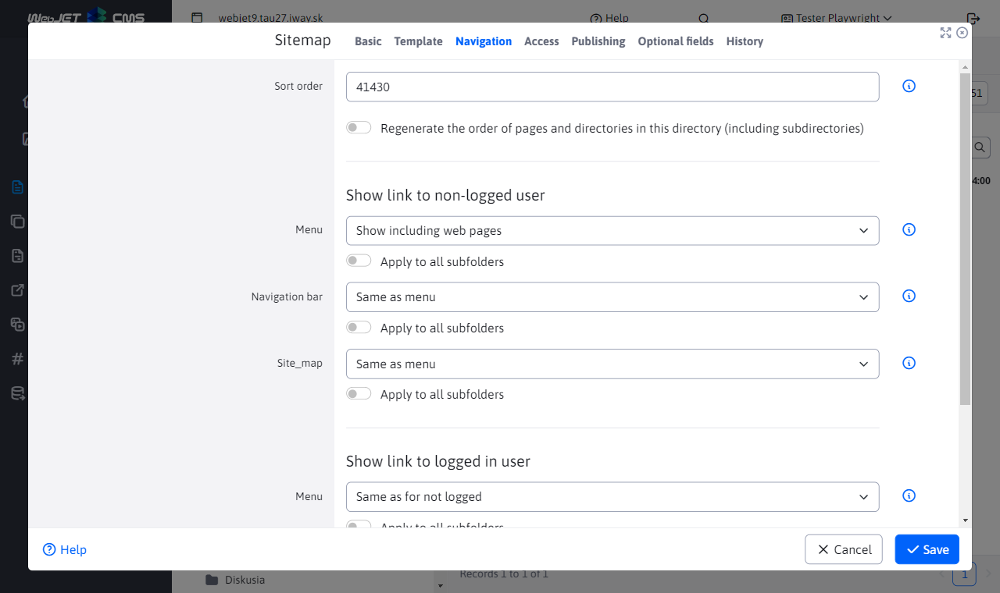
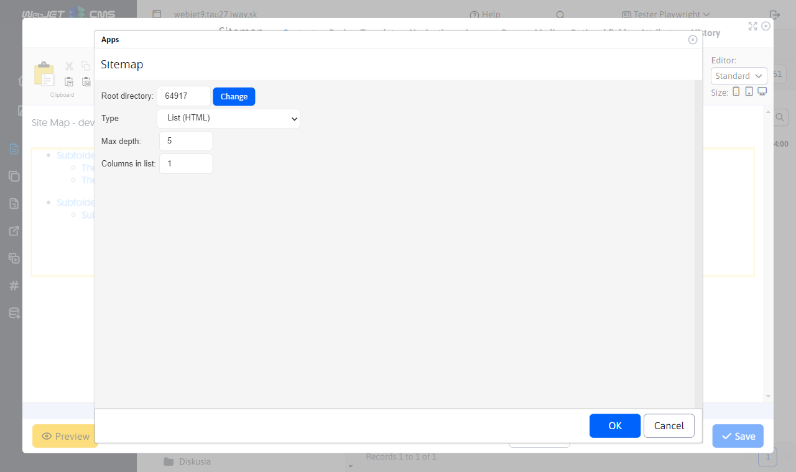
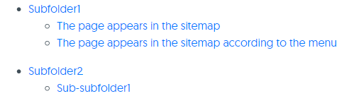

# Sitemap

The Site Map application can automatically generate a tree structure of a website.

The display of an item in the site map depends on the setting of the Navigation bar field in the Navigation tab of the website directory. It has the following options:

- Same as menu - the display in the site map behaves the same as the field set for display in the menu.
- Show - the item will be displayed in the site map.
- Do not display - the item will not be displayed in the site map (including subfolders).
- Show without subfolders - the item will be displayed in the site map, but its other subfolders will not be displayed (the advantage is that it is not necessary to set the display method for subfolders).
- Show including web pages - the folder will be displayed in the site map and all web pages from the folder will also be displayed as separate items. By default, the Show option does not display web pages from the directory as separate items in the site map.

When viewing including web pages, you can also set the option to display in the sitemap for each web page separately. The option is also in the Navigation tab and includes the following options:

- Same as menu - the display in the site map behaves the same as the field set for display in the menu.
- Show - the website will be displayed in the sitemap.
- Do not display - the website will not appear in the sitemap.



## Application settings

In the application properties you can set:


  - Root directory - select root directory
  - Display type - how the site map is displayed, see options below

For some display types it is still possible to set:


  - Directory search depth - maximum nesting of displayed items
  - Number of columns in the statement - the display can be divided into a specified number of columns (for a more beautiful display on the web page)



## Expanded tree (HTML)

The tree structure is displayed in the HTML code as a nested UL-LI list. This is the best solution for a sitemap with respect to search engines. It is not suitable for large websites (or it is necessary to limit the maximum nesting so that the page is not too large).



## Headquarters map (Windows Explorer)

The tree structure is similar to Windows Explorer, so it is familiar and easy for visitors to navigate. The left column displays a list of directories, and the right column displays the pages in the selected directory.

Clicking on the + or - sign will display/close the web pages in the given directory. Clicking on the directory name will display the main document of the given directory, clicking on the web page name will display the desired page.

## Expanded tree (Javascript)

The tree structure is clickable using JavaScript. Not recommended for large websites.

Clicking on the + or - sign will display/close the web pages/directory.

## Expanded tree (AJAX)

The tree structure is clickable using JavaScript, individual parts of the tree are loaded from the server using AJAX calls (jQuery).

Clicking on the + or - sign will display/close the web pages/directory.

## XML file for search engines

Search engines (e.g. Google) automatically look for a file ```/sitemap.xml``` with a website sitemap. WebJET automatically provides this file using the file ```/components/sitemap/google-sitemap.jsp```.

The generated items behave similarly to the Expanded Tree (HTML) view.