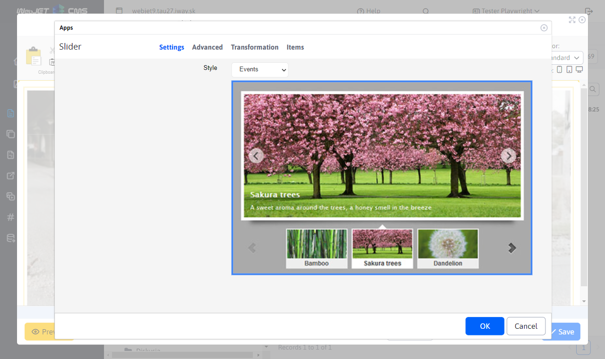
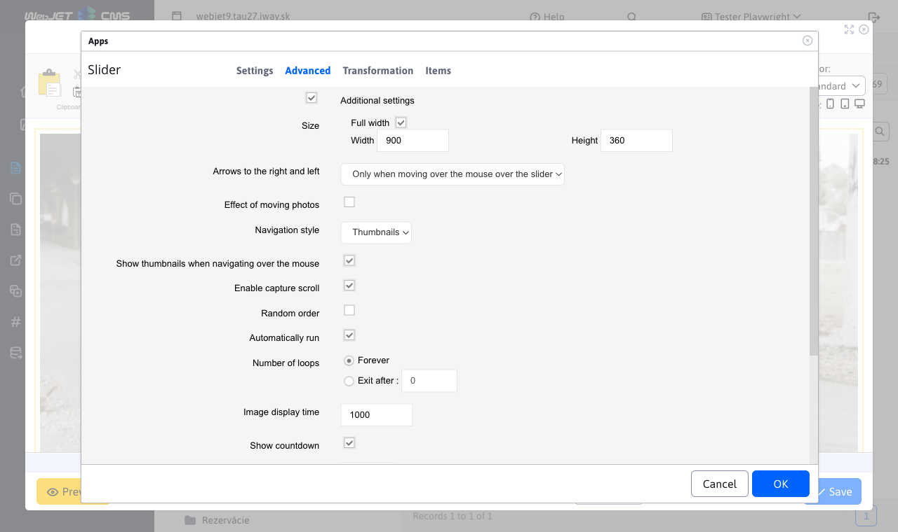
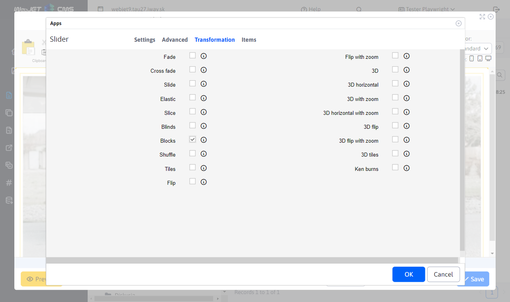
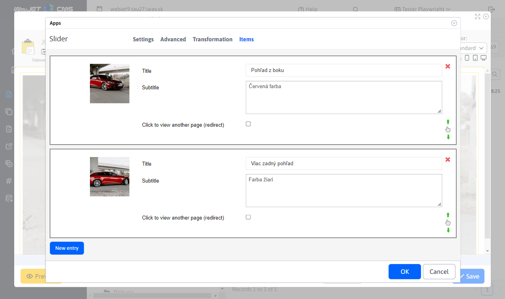
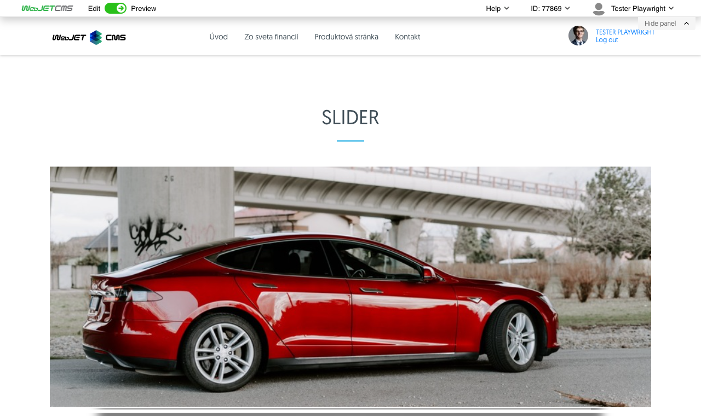

# Slider

Add an eye-catching animated slider with images to your page. Choose from a wide range of design styles and animation effects, some designs also include a title and additional text.

## Application settings

### Settings

In this section you can set the style by selecting from the available styles:
- Classic
- ContentBox
- Cube
- Elegant
- Events
- FeatureList
- FrontPage
- Gallery
- Header
- Lightbox
- TextNavigation

### Advanced

In this section it is possible to set:
- Dimensions
- Display of right and left arrows
- Moving photo effect
- Navigation style
- Show thumbnails when hovering over the navigation
- Enable scrolling by grabbing
- Random order
- Automatically start
- Number of loops
- Image display time
- Show countdown
- Countdown colour
- Countdown position
- Go to the first picture
- Pause on mouseover
- Numbering
- Shadow

### Transitions

In this section, transitions can be selected:
- Fade
- Cross fade
- Slide
- Elastic
- Slice
- Blinds
- Blocks
- Shuffle
- Tiles
- Flip
- Flip with zoom
- 3D
- 3D horizontal
- 3D with zoom
- 3D horizontal with zoom
- 3D flip
- 3D flip with zoom
- 3D tiles
- Ken boom

### Items

In this section you can add or remove an item:
- When adding, you can fill in the title, subtitle, redirect.
- You can change the order of the items by dragging and dropping them.
- You can remove an item by clicking on the red cross.

## View application

