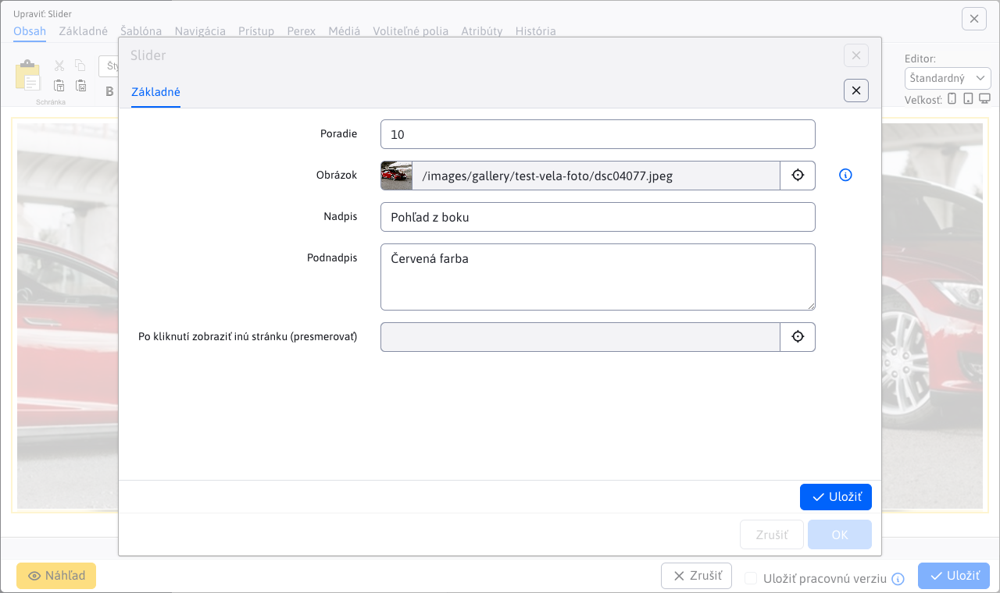

# Slider

Add an eye-catching animated slider with images to your page. Choose from a wide range of design styles and animation effects, some designs also include a title and additional text.

## Application settings

Available cards:
- **Generated CSS styles**
- **Advanced**
- **Transitions**
- **Items**

### Generated CSS styles

In this section you can set the style for the Slider.

### Advanced

In this section it is possible to set:
- Full width
- Width
- Height
- Display of right and left arrows (Not, Always, Only when mouse over slider)
- Moving photo effect
- Navigation style (Not, Balls, Numbers, Thumbnails)
- Show thumbnails when hovering over the navigation
- Enable scrolling by grabbing
- Random order
- Automatically start
- Number of loops (Forever, Exit after)
- Image display time
- Show countdown
- Countdown colour (hex/ENG)
- Countdown position (Up, Down)
- Go to the first picture
- Pause on mouseover
- Numbering
- Shadow

### Transitions

In this section you can select the transition (animation) to be used when changing images.

### Items

In this section you can see and manage the application items, so classic actions like add/edit/delete...

You can set the following parameters for each item:
- **Image**, image selection using the explorer is supported, as well as direct entry of the image path
- **Title**, picture caption
- **Subtitle**, image caption
- **Click to view another page (redirect)**, select the page you will be redirected to (direct path entry is also supported)

## View application

