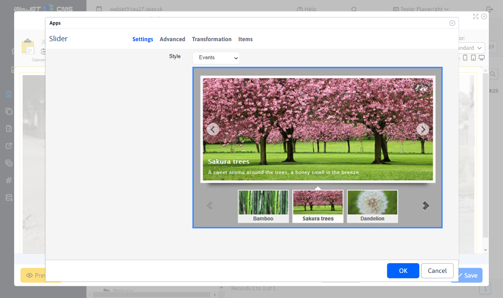
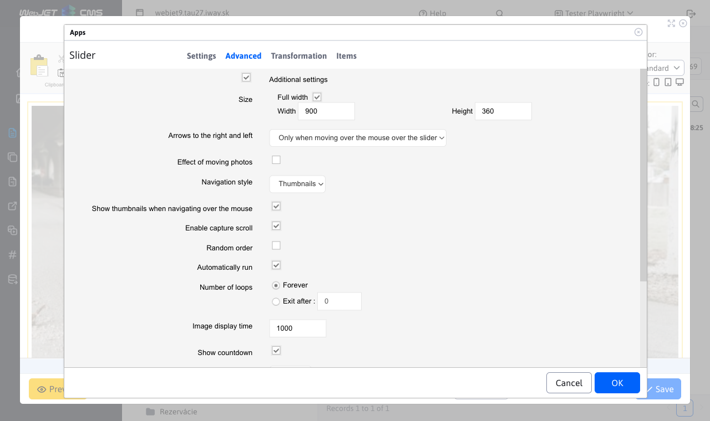
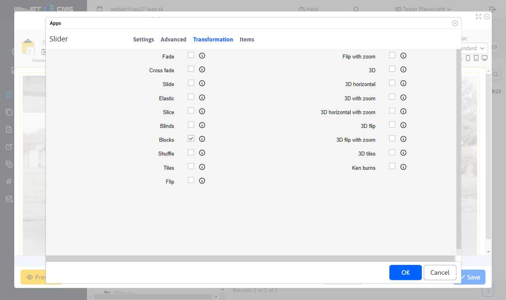
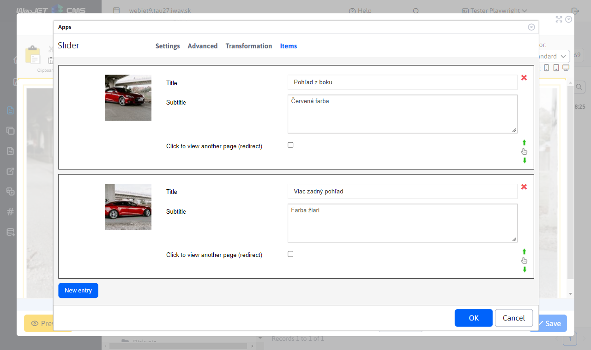
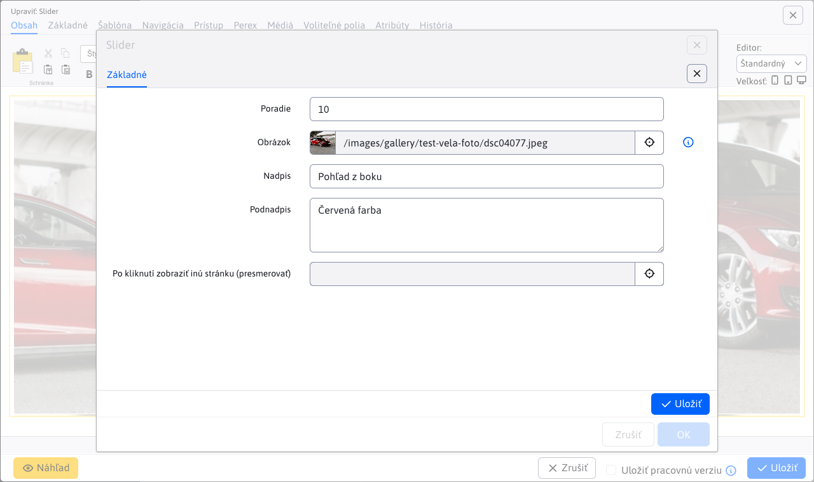
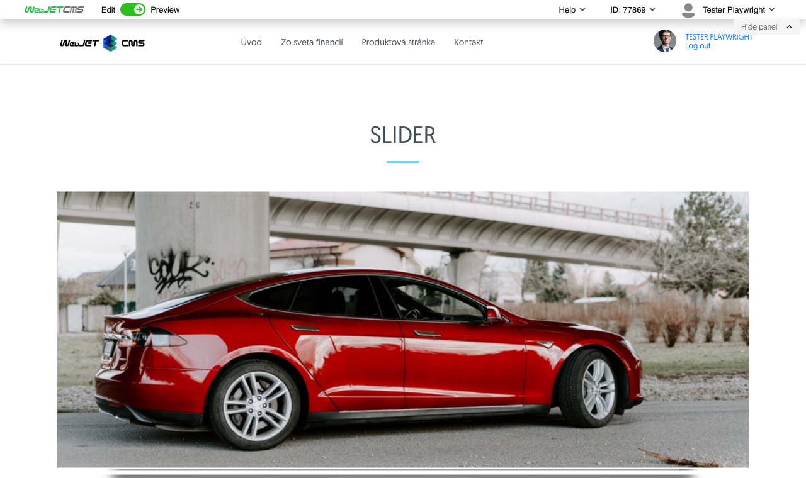

# Slider

Add an eye-catching animated image slider to your site. Choose from a wide range of design styles and animation effects, some designs also include a title and additional text.

## Application settings

Available cards:

- **Generated CSS styles**
- **Advanced**
- **Transitions**
- **Items**

### Generated CSS styles

In this section you can set the style for the Slider.

### Advanced

In this section you can set:

- Full width
- Width
- Height
- Display of arrows on the right and left (None, Always, Only when hovering over the slider)
- Moving photo effect
- Navigation style (None, Bullets, Numbers, Thumbnails)
- Show thumbnails when hovering over navigation
- Enable scrolling by grabbing
- Random order
- Automatically start
- Number of loops (Forever, End after)
- Image display time
- Show countdown
- Countdown color (hex/ENG)
- Countdown position (Up, Down)
- Go to the first image
- Pause on mouseover
- Numbering
- Shadow

### Transitions

In this section you can select the transition (animation) that will be used when changing images.

### Items

In this section, you can see and manage application items, so classic actions like adding/editing/deleting...

You can set the following parameters for individual items:

- **Image**, image selection using explorer is supported, as well as direct entry of the image path
- **Title**, image title
- **Subtitle**, subtitle of the image
- **When clicked, display another page (redirect)**, select the page to which you will be redirected (direct path entry is also supported)

## View the application

