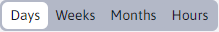
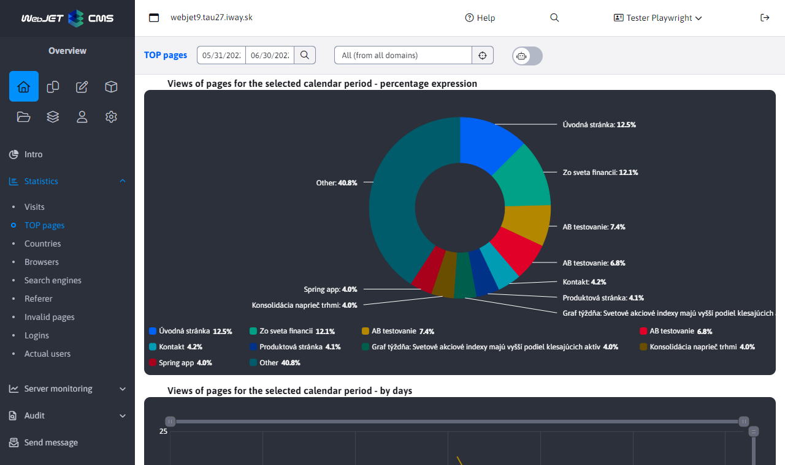
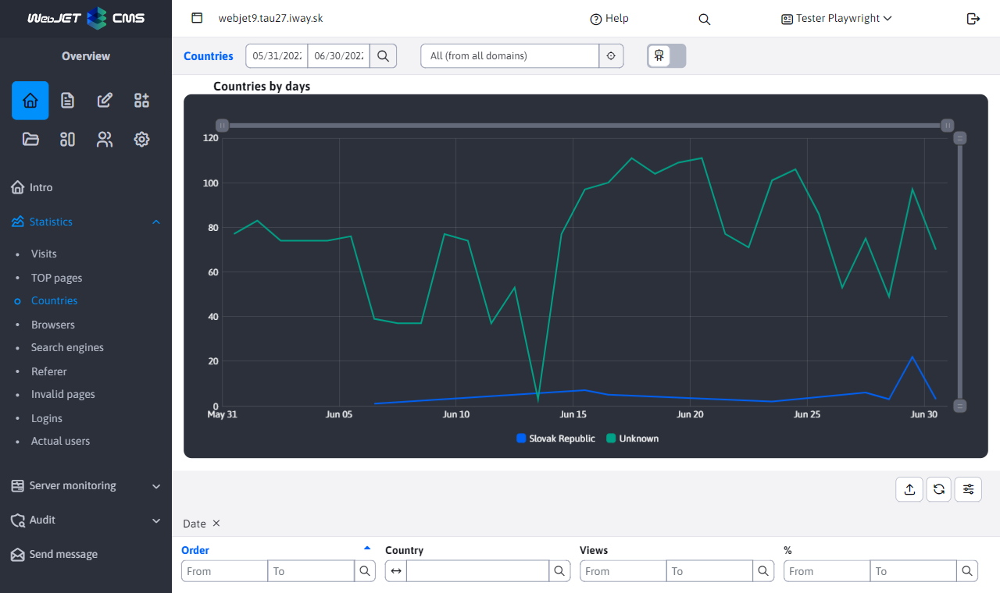
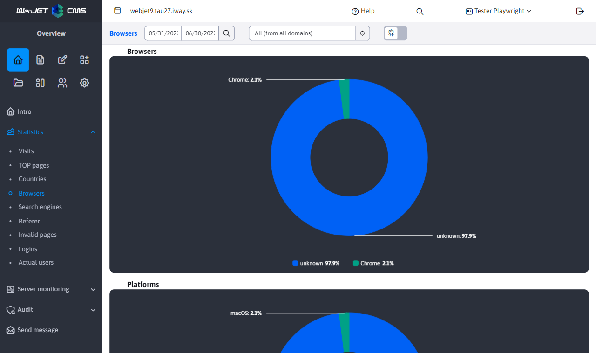
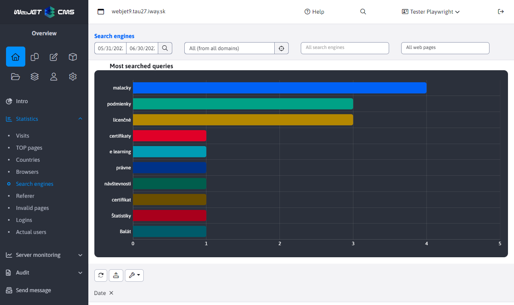
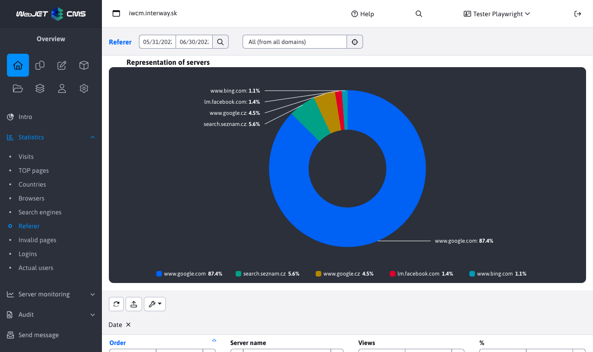
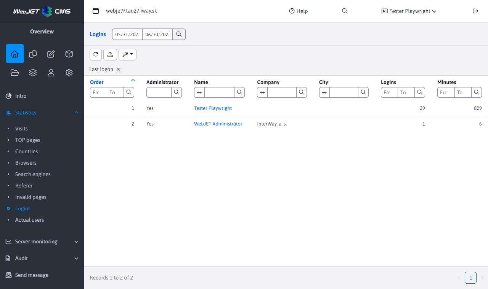
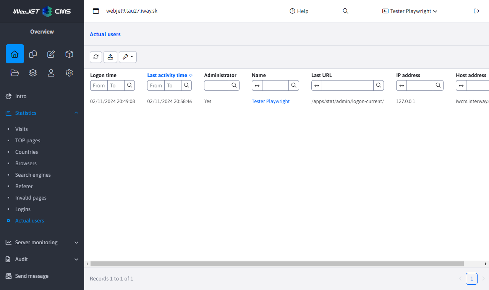

# Statistics

The statistics application allows you to view statistical information about visitors to your website. It is available in the Overview section of the left menu as a Statistics item.

The following terms are used in the application:
- `videní` - total number of pages viewed
- `návštev (alebo sedení)` - the number of visits by each person, where a visit is defined as the time during which the visitor has not closed the web browser. So if a visitor came to your site and viewed 5 pages, 5 views and 1 visit are counted. If they close their browser (or don't view any page for more than 30 minutes) and come to the site again, it counts as another visit
- `rôznych používateľov` - the approximate number of genuinely different visitors to the site. If a visitor visits your site, a cookie will be sent to the visitor, which will be used to identify them the next time they visit. The validity of this cookie is set to one year, so even if he comes to the site for a relatively long period of time, he will still be considered the same visitor

Please note: the storage of statistics is subject to GDPR consent to the storage of statistical cookies. If the visitor does not give consent to store them, the statistics are anonymised:
- visit time is rounded to 15 minutes
- browser is set to unknown
- the landscape is set for the unknown
The Statistics section uses an external filter, which is described in more detail here [External filter](./external-filter.md)

## Traffic

> You can find out on which days (e.g. regularly on Wednesdays) the traffic is increasing, or in a grouping by hours at which time you have the highest/lowest traffic.

Section **Traffic** offers an overview of traffic to the entire website and bar charts of traffic by day, week, month and hour.

**Choice of grouping**

There are four options for grouping statistics. Grouping changes the counting of mainly unique (different) users. If I, as a unique user, visit a web page today and tomorrow I am counted in the grouping by day every day. But in the grouping by week or month, I can only group once.

Monthly grouping compares total traffic between multiple months. You can see the total number of page views and also the number of different users by month of the year.

Grouping by hours is useful for determining the highest traffic during the day - at which hour the site has the most traffic, which is typically associated with the greatest load on servers and infrastructure.

## Top pages

> What are the most visited pages?

Displays a list of the web pages with the most views. It displays a pie chart of the top 10 most viewed pages, a timeline, and a table listing the top 100 most viewed pages.

The table below lists the most visited pages with data on the number of views, visits and the number of different users.

## Countries

> Which countries do visitors come from? Which languages should be targeted?

Shows traffic by country. The country is determined by the HTTP header `accept-language` the browser that displays the web page. Typically, this is the language that the user has set in the operating system. If the country could not be identified it is classified as `Neznáma`.

## Browsers

> What browsers do visitors use? Which browsers and operating systems does the site need to be optimised for?

List of browsers and their versions. The chart shows the most used browsers with version, time view and complete table.

Value `Neznámy` or `???` is displayed for unknown browsers and for browsers for which the visitor has not given consent to the collection of statistical cookies.

## Search engines

> What do visitors search for on our website? What search terms did they come to our site from search engines?

List of search terms on your website, but also on external search engines `google`, `seznam` etc. Click on a search term to see a detailed list of times and the search engine used to search for that term. The computer address column displays the IP address/domain name of the computer from which the search was performed. The value `0.0.0.0` will be displayed if the visitor has not consented to the collection of statistical cookies.

The chart and table can be further filtered in the main top filter by search engine and possibly by the page where the search results are located (or the page was navigated to from an external search engine).

## Where they came from

> From which external sites did visitors "pre-click" on our website?

List of domains of web pages from which visitors came to your web page (clicked on the link on that domain). The page from which they come must be on a secure (https) protocol and must not prohibit the transfer of the link to another server (HTTP header `referrer`).

## Defective pages

> What URLs/pages are linked to "somewhere" but the page/URL no longer exists?

A list of URLs for which an error page (HTTP code 404) is displayed. Each failed URL is grouped by week, so in the table you can see the number of times the failed URL was called per week.

You can further filter the chart and table in the main top filter by URL expression (searched in contains mode). You can thus narrow the view to only the specified expression (e.g. `/files/` or `.pdf` show links to missing files).

**TIP:** We recommend that you correct the incorrect pages or redirect them to another suitable page/URL address.

## Login

> How long and how many times have visitors or web site administrators logged in?

Statistics of user logins to the secure (password-protected) zone or to the administration. The number of minutes logged in may not be accurate, the user may not be logged out correctly and may be logged in multiple windows/browsers at the same time, this is only a guideline.

Click on a user's name to view detailed log-in statistics for the selected user.

## Current visitors

> How many visitors does the website have right now?

A list of current sessions on the web page, it also contains a list of unlogged users (their sessions). If you have a web site in a cluster this list contains only users on the node you are currently logged in on, you do not see the list from all nodes.

Click on a user's name to view detailed log-in statistics for the selected user.

