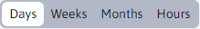
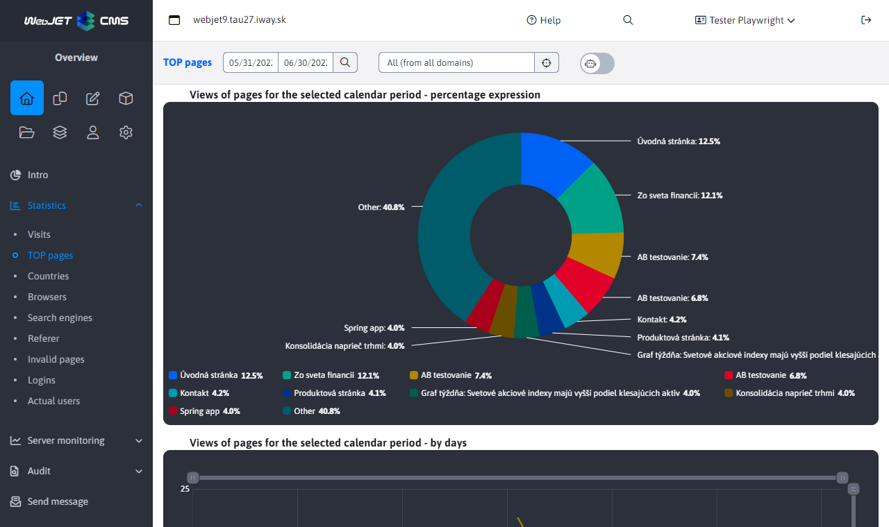
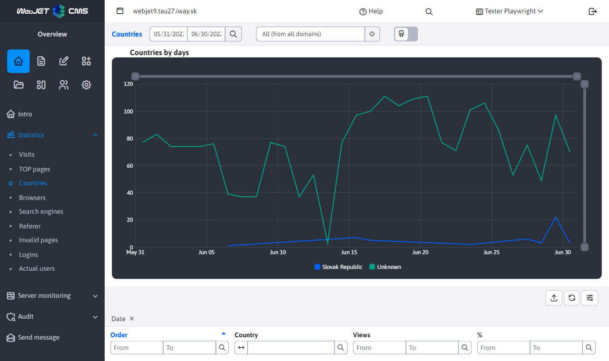
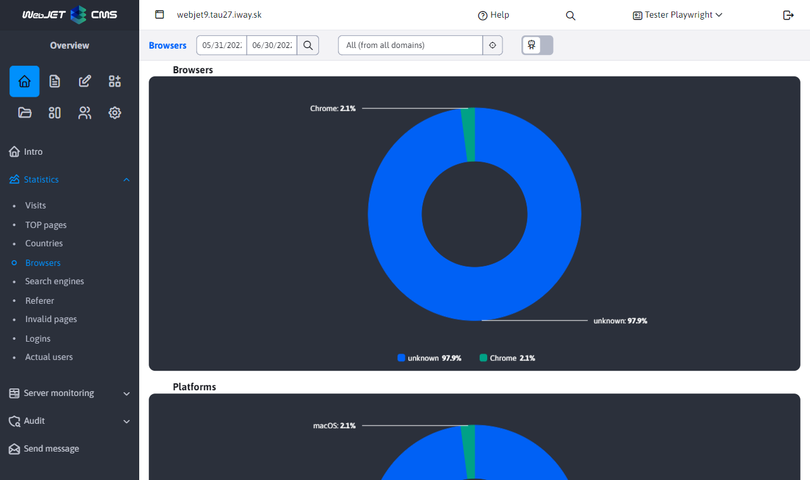
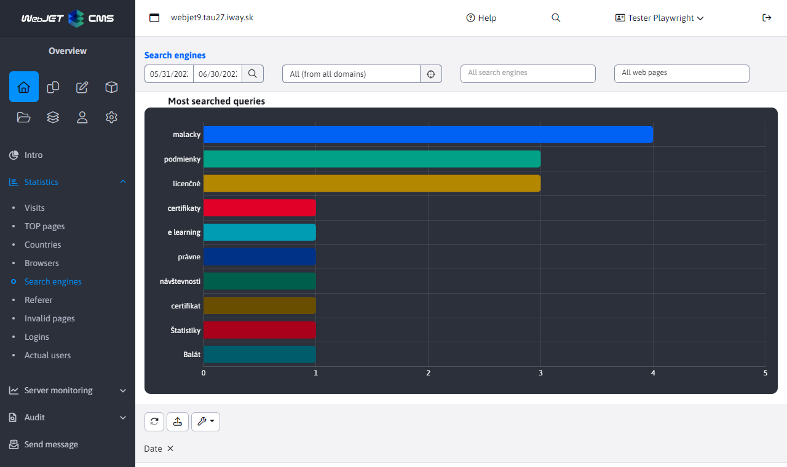
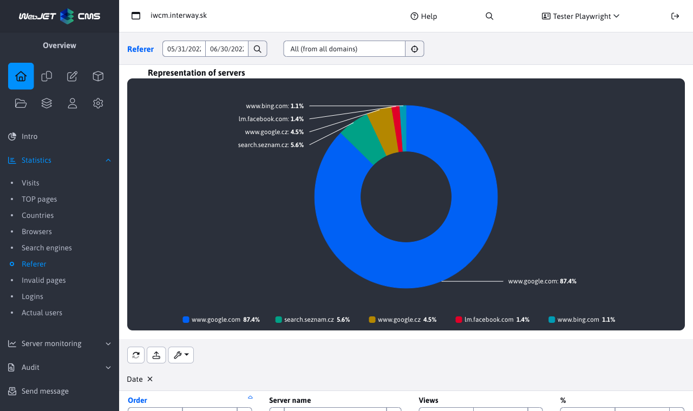
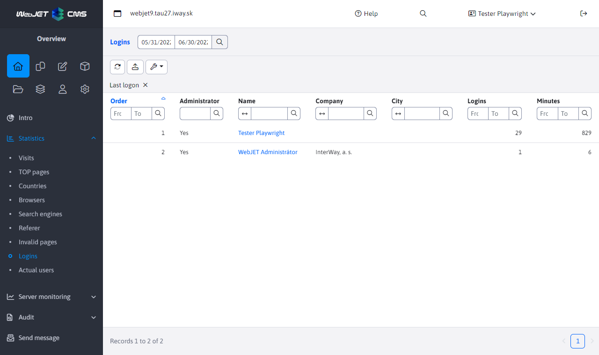
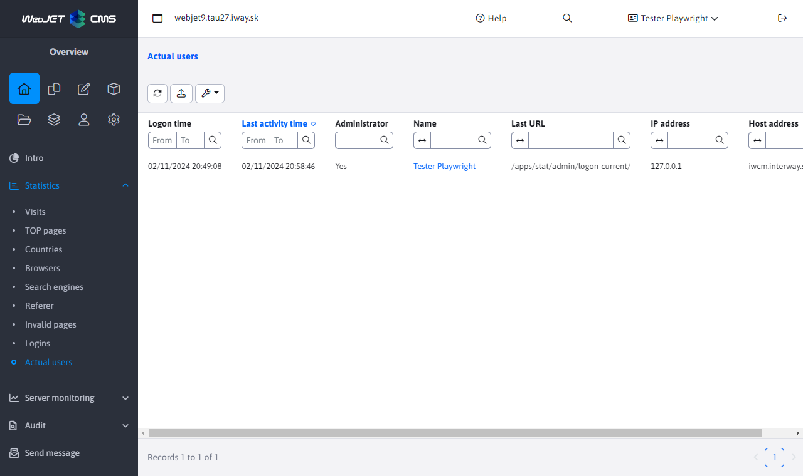

# Statistics

The Statistics application allows you to view statistical information about your website visitors. It is available in the Overview section of the left menu as the Statistics item.

The following terms are used in the application:

- views - total number of pages viewed
- visits (or sessions) - the number of visits by individual people, with one visit being the time during which the visitor did not close the web browser. So if a visitor came to your site and viewed 5 pages, 5 views and 1 visit are counted. If they close the web browser (or do not view any pages for more than 30 minutes) and come back to the site, it is counted as another visit.
- different users - an approximate number of truly different visitors to the site. If a visitor visits your site, a cookie is sent to them, which will identify them on subsequent visits. The validity of this cookie is set to one year, so even if they came to the site a relatively long time ago, they will still be considered the same visitor.

Warning: storing statistics is subject to GDPR consent to storing statistical cookies. If the visitor does not consent to their storage, the statistics are anonymized:

- visit time is rounded to the nearest 15 minutes
- browser is set to unknown
- country is set to unknown

The Statistics section uses an external filter, which is described in more detail here [External filter](./external-filter.md)

## Attendance

> Find out on which days (e.g. regularly on Wednesdays) traffic increases, or, grouped by hours, at which time you have the highest/lowest traffic.

The **Visit** section offers an overview of the traffic of the entire website and line graphs of traffic by day, week, month and hour.


**Grouping selection**



There are four options for grouping statistics. Grouping changes the counting of unique (different) users in particular. If I, as a unique user, visit the website today and tomorrow, I am counted every day in the grouping by day. But only once in the grouping by week or month.

Monthly grouping compares total traffic across multiple months. You can see the total number of page views and the number of unique users by month of the year.

Grouping by hours is suitable for determining the highest traffic during the day - at what hour the website has the most traffic, which is typically associated with the highest load on servers and infrastructure.

## Top sites

> What sites are most visited?

Displays a list of web pages with the most views. A pie chart of the 10 most visited pages, a timeline, and a table listing the 100 most visited pages are displayed.

The table lists the most visited pages with data on the number of views, visits, and the number of different users.



## Countries

> Which countries do visitors come from? What language mutations do you need to focus on?

Displays traffic by country. The country is determined by the HTTP header ```accept-language``` of the browser that displays the web page. Typically, it is the language that the user has set in the operating system. If the country could not be identified, it is classified as **Unknown**.



## Browsers

> What browsers do visitors use? What browsers and operating systems does the site need to be optimized for?

List of browsers in use and their versions. The graph shows the most used browsers with version, time display, and a complete table.

The value **Unknown** or **???** is displayed for unknown browsers and for browsers where the visitor has not consented to the collection of statistical cookies.



**Note:** type, version, operating system is detected by HTTP header `User-Agent`. The [UAP-java](https://github.com/ua-parser/uap-java) library is used. The [YAML](https://github.com/ua-parser/uap-core/blob/master/regexes.yaml) file used can be updated and the path to it can be set in the conf. variable `uaParserYamlPath`. It is applied after restarting the application server.

## Search engines

> What are visitors searching for on our site? What search terms did they use to reach our website from search engines?

List of search terms on your website, but also on external search engines ```Google```, ```Seznam``` etc. Click on the search term to view a detailed list of times and search engines used to search for the given term. The computer address column displays the IP address/domain name of the computer from which the search was performed. The value ```0.0.0.0``` is displayed if the visitor has not consented to the collection of statistical cookies.

You can further filter the graph and table in the main upper filter by search engine and possibly the page where the search results are located (or the page was accessed from an external search engine).



## Where did they come from?

> From which external sites did visitors "click through" to our website?

List of website domains from which visitors came to your website (clicked on a link on the specified domain). The site they came from must be on a secure (https) protocol and must not prohibit the transfer of the link to another server (HTTP header ```referrer```).



## Error pages

> What URLs/pages does a link "somewhere" lead to, but the page/URL no longer exists?

List of URLs for which an error page (HTTP code 404) is displayed. Each error URL is grouped by week, so the table shows the number of calls to the error URL per week.

You can further filter the graph and table by URL term in the main upper filter (searched in contains mode). This allows you to narrow the display to only the specified term (e.g. ```/files/``` or ```.pdf``` will display links to missing files).

**TIP:** We recommend that you fix broken pages or redirect them to another suitable page/URL address.


## Logins

> How long and how many times did visitors or administrators log in to the website?

Statistics of user logins to the secure (password-protected) zone or to the administration. The number of minutes logged in may not be accurate, the user may not log out correctly and may be logged in in multiple windows/browsers at the same time, this is only an indicative figure.

Click on a user name to view detailed login statistics for the selected user.



## Current visitors

> How many visitors does the website currently have?

The list of current sessions on the website also includes a list of non-logged-in users (their sessions). If you have a website in a cluster, this list only contains users on the node you are currently logged in to, you will not see a list from all nodes.

 Click on a user name to view detailed login statistics for the selected user.

