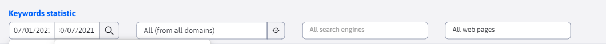
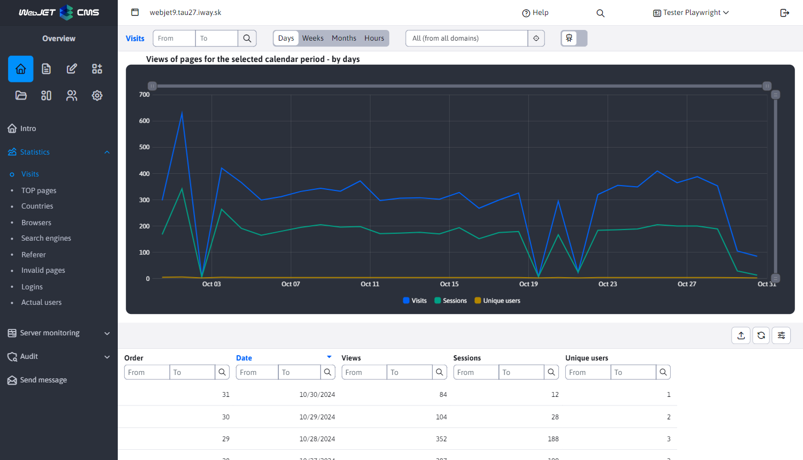
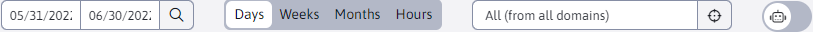
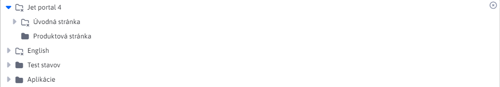
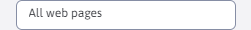
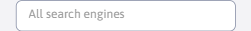

# External filter

An external filter is a special kind of filter used by sections `Štatistika` a `SEO`. The data can be filtered at the top of the page under the page title according to the options below. This filter works differently from the other datatables. At the top near the title is the main filter that filters the data retrieved from the server. Subsequently in the datatables, you can filter on the displayed data by other columns, but the filtering only happens over the data loaded according to the main filter anymore.

If the external filter contains filtering by a column that is also in the datatable, filtering over this column is automatically disabled. The reason is to prevent multiple filtering for the same parameter.

Such a case can be seen in the following figure, where the external filter includes filtering by date and the same filtering in the datatable is disabled.

> Set data si main filter at the top **remembers in the browser until you close it**. So if you set a period from-to you can scroll through the sections `Štatistika` a `SEO`, while all external filters containing period filtering are automatically set according to the value you specify. In this case, the data is automatically filtered when it is retrieved from the server. The same applies to filtering by folder etc.

## Date filter

The date filter allows you to set a date range for displaying data (e.g. traffic for Statistics).

If the filter is not specified, the data for:

**SEO**

- last 30 days

**Statistics**

- the last 30 days in case of grouping by days, weeks and hours
- the last 6 months in the case of grouping by month.

If only the "from" part is entered, the traffic from the entered date to the current day is displayed. If only the 'to' part is set, the display will show :

**SEO**

- the last 30 days to date.

**Statistics**

- the last 30 days to date in the case of statistics for days, weeks and hours and 6 months in the case of statistics for months.

## View from folder

You can filter data only for a specific folder, e.g. for language mutations or product microsites. We can think of this as traffic for statistics. Option `Všetky (zo všetkých domén)` is the default value and will display the data regardless of folder and domain, which in the case of Statistics represents **complete attendance**.

If the logged in user has limited folder permissions it will not appear **complete attendance**, but the first folder to which the user has been granted permission is set.

Folders that the user does not have permission to are displayed with an icon , such a folder cannot be selected. However, the folder may contain a subfolder to which the user has the right and will of course be able to select.

In situations where you want to allow the user to view **complete attendance** statistics, but you want to keep the restriction of rights, use the access right **View statistics for all folders**. Users with this permission will be able to see **complete attendance** in the statistics section despite limited folder permissions. This right will only affect the folder selection in the statistics section.

## Filter web pages

Filtering web pages (e.g. in the Search engines section) allows you to select a specific web page from the selected folder. If no folder is selected (folder filtering has the selected value `Všetky (zo všetkých domén)`), no web page is displayed for selection.

The default option is `Všetky web stránky` and displays the data of all websites that match the other parameters.

## Search engine filter

Filter based on the selected search engine.

**Statistics**

In this section, filtering is used, for example, to filter out search terms for a specific search engine only, which allows us to verify which search engine was used the most to access our website.

**SEO**

In this section, filtering is used e.g. to specify a search engine to verify the most searched keywords.

The search engines offered for filtering depend on the selected time range, the selected folder and the filtered web page.

The default option is `Všetky vyhľadávače` and displays data from all search engines.

## Switch to filter out bots

If you don't want to show data from bots (search bots, spam bots) in the statistics, you can filter them out. To determine the load on the server, it is necessary to take into account the bots, but for marketing purposes it is advisable to filter them out.

