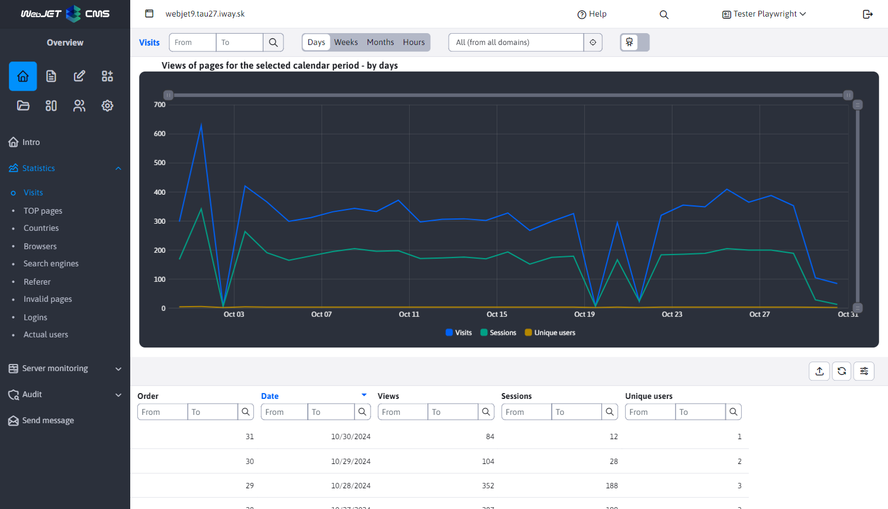
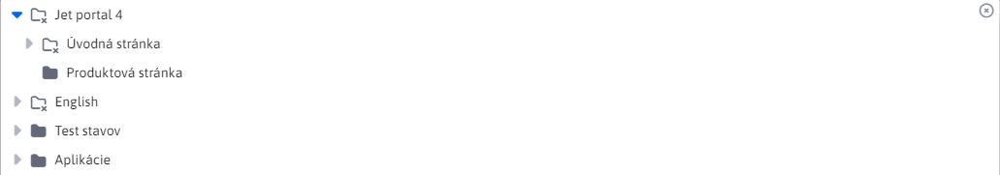

# External filter

An external filter is a special type of filter used by the **Statistics** and **SEO** sections. The data can be filtered in the upper part under the page title according to the options listed below. This filter works differently than in other data tables. In the upper part near the title there is a main filter that filters the data loaded from the server. Subsequently, in the data tables it is possible to filter the displayed data according to other columns, but filtering only takes place over the data loaded according to the main filter.

If the external filter contains filtering by a column that is also in the data table, filtering on this column is automatically disabled. The reason is to prevent multiple filtering for the same parameter.

You can see such a case in the following image, where the external filter contains filtering by date and the same filtering in the datatable is disabled.

> The main filter at the top **remembers the data you set in the browser until you close it**. So if you set a period from-to, you can navigate through the individual parts of the **Statistics** and **SEO** sections, while all external filters containing filtering by period will automatically be set according to the value you entered. In this case, the data is automatically filtered when loaded from the server. The same applies to filtering by folder, etc.

## Date filter

The date filter allows you to set a date range for displaying data (e.g. traffic in Statistics).

If no filter is specified, data for:

**SEO**

- last 30 days

**Statistics**

- the last 30 days when grouped by days, weeks and hours
- the last 6 months if grouped by months.

If only the "from" part is specified, the traffic from the specified date to the current day will be displayed. If only the to part is specified, the following will be displayed:

**SEO**

- the last 30 days as of the given date.

**Statistics**

- the last 30 days as of the given date in the case of statistics for days, weeks and hours and 6 months in the case of statistics for months.

## View from folder

You can filter data only for a specific folder, e.g. for language mutations or product micro sites. We can imagine this as traffic in statistics. The **All (from all domains)** option is the default value and will display data regardless of folder and domain, which in the case of Statistics represents **complete traffic**.

If the logged in user has limited folder rights, **complete traffic** will not be displayed, but the first folder to which the user has been granted rights will be set.

Folders that the user does not have access to will be displayed with the icon , such a folder cannot be selected. However, the folder may contain a subfolder that the user has access to and will of course be able to select it.

In situations where you want to allow a user to view **complete traffic** statistics, but want to keep the rights restricted, use the **View statistics for all folders** access right. Users with this right will be able to see **complete traffic** in the statistics section despite restricted folder rights. This right only affects the folder selection in the statistics section.

## Website filter

Website filtering (e.g. in the Search Engines section) allows you to select a specific website from a selected folder. If no folder is selected (folder filtering has the selected value **All (from all domains)**), no website is displayed for selection.

The default option is **All websites** and will display data from all websites that match the other parameters.

## Search engine filter

Filter based on the selected search engine.

**Statistics**

In this section, filtering is used, for example, to filter out search terms only for a specific search engine, which allows you to verify which search engine was used most to access our website.

**SEO**

In this section, filtering is used, for example, to specify a search engine to verify the most searched keywords.

The search engines offered for filtering depend on the selected time range, selected folder, and filtered web page.

The default option is **All search engines** and will display data from all search engines.

## Toggle to filter out bots

If you do not want to display data from bots (search bots, spam bots) in the statistics, you can filter them out in the display. Bots must also be taken into account to determine the load on the server, but for marketing purposes it is advisable to filter them out.

