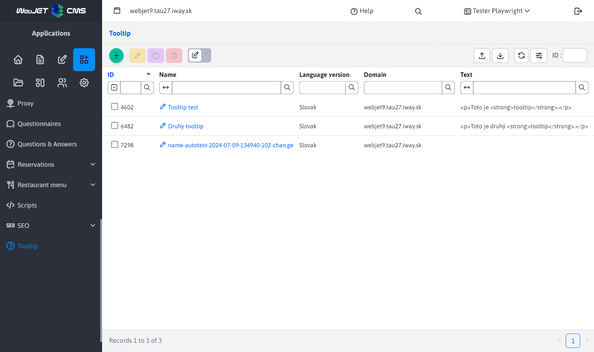
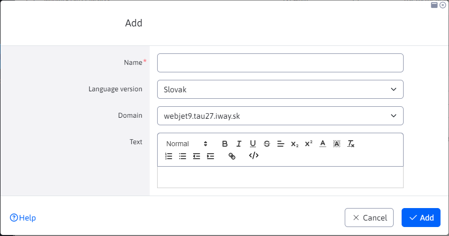
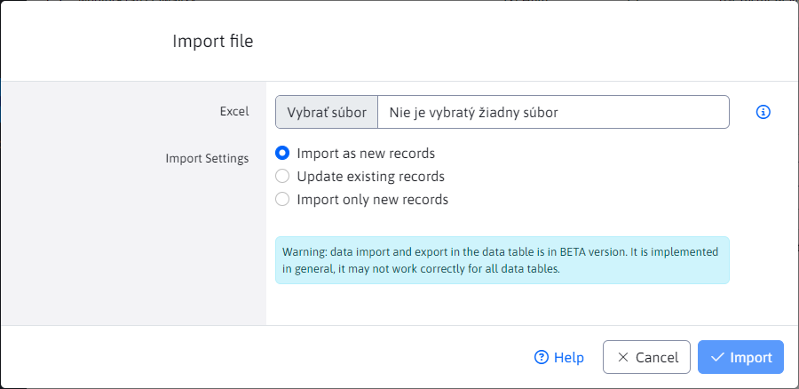
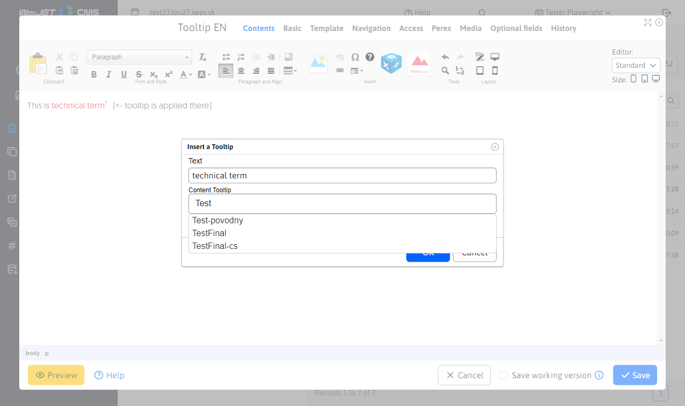

# Tooltip

In Tooltip, you can define help/explanation text for the specialized terms you display on a web page. They are usually displayed as help text in a "bubble" when the cursor passes over the technical term. Defining a Tooltip through the application allows you to globally edit the explanation of these technical terms in one place. Then when you edit it it changes in all uses at once.


## Creating a tooltip



Click on the "Add" icon to display a dialog box for creating a tooltip.

In this window you define the following parameters:
- Name - a unique identifier for the Tooltip/expert expression
- Language version - SK / CZ / EN ...
- Domain - option on which domain the Tooltip should be used
- Text - text content of the tooltip



The dialog for editing an existing tooltip looks the same.

In the table you have a "Duplicate" button if you want to copy an existing tooltip and save it under a different name, for a different language version, or for a different domain.

## Import of tooltips

In the Import tab there is a form for uploading excel with tooltips. The format of the excel should be identical to the format you get when you export the current list to Excel. The export icon is located in the top left.



## Inserting a tooltip into a page

You can create a bubble over a specialised expression directly in the editor by selecting the specialised expression and then clicking on the icon:
-  Insert tooltip

A dialog box opens, in the Tooltip (key) field, type the beginning of the specialized expression. The server will load a list of expressions containing the entered text, click the mouse to select the exact expression:



Then, the HTML code of the page will contain the type code:

```html
<p>Toto je <span class="wjtooltip" title="!REQUEST(wjtooltip:TestFinal)!">odborný výraz</span>.</p>
```

which is processed on the server and the actual text is inserted. For a nice display of the "bubble", the following JavaScript code needs to be added in the template (or via application scripts, or in the worst case via the HTML code field in the header in the page editor in the Template tab):

```javascript
<script type="text/javascript">
    $(document).ready(function() {
        $(".wjtooltip").tooltip();
    });
</script>
```


extension is used [Bootstrap Tooltip](https://getbootstrap.com/docs/4.0/components/tooltips/).
