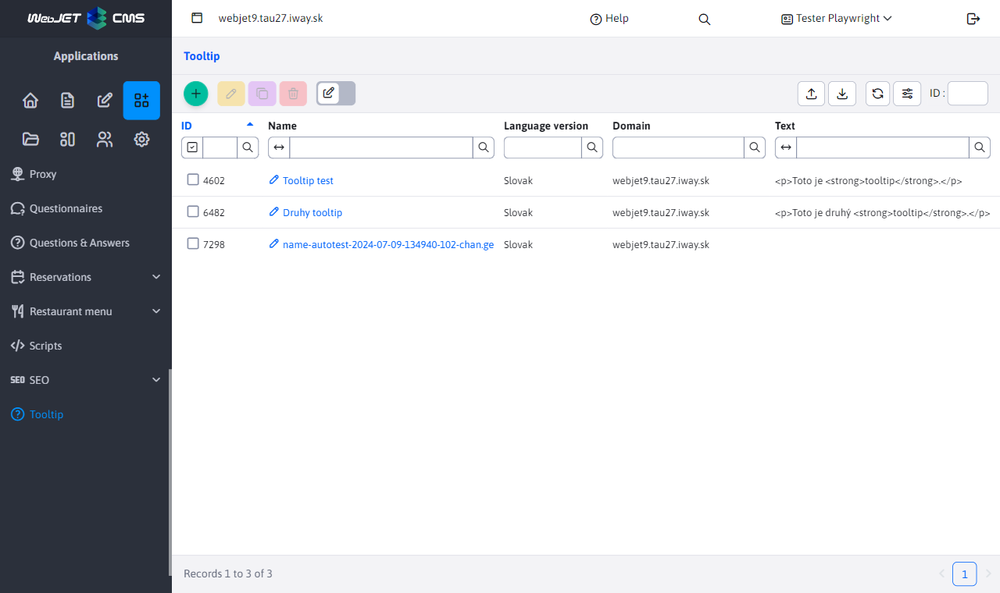
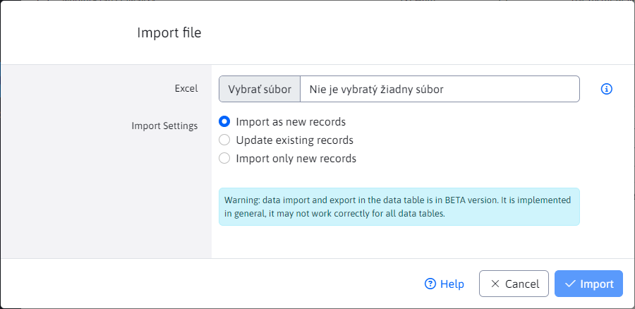
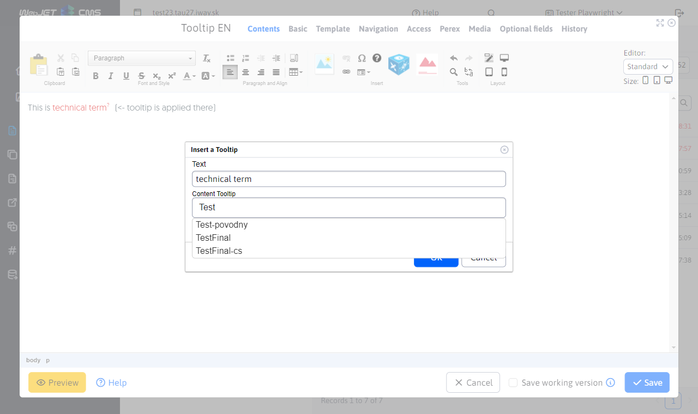

# Hints

In the Tooltip application, you can define help text/explanation for technical terms that you display on your web page. They are usually displayed as help text in a "bubble" when you hover over the technical term. Defining a tooltip through the application allows you to globally edit the explanation of these technical terms in one place. Then, when you edit it, it changes in all uses at once.


## Creating a help



By clicking the "Add" icon, you will see a dialog box for creating a tooltip.

In this window you define the following parameters:

- Name – a unique identifier for the given hint / technical term
- Language version – SK / CZ / EN ...
- Domain – choose which domain the hint should be used on
- Text – textual content of the tooltip


The dialog box for editing an existing help also looks the same.

The "Duplicate" button is available in the table if you want to copy and save the existing help under a different name, for a different language version, or for a different domain.

## Import help

The Import tab contains a form for uploading an Excel file with instructions. The Excel format should be identical to the format you get when exporting the current list to Excel. The export icon is located in the upper left.



## Inserting help into a page

You can create a bubble above a technical term directly in the editor by selecting the technical term and then clicking on the icon:

-  Insert tooltip

A dialog box will open, enter the beginning of a technical term in the Tooltip field. A list of terms containing the entered text will be retrieved from the server, click with the mouse to select the exact term:



Subsequently, the HTML code of the page will contain code like this:

```html
<p>Toto je <span class="wjtooltip" title="!REQUEST(wjtooltip:TestFinal)!">odborný výraz</span>.</p>
```

which is processed on the server and the current text is inserted. For a nice display of the "bubble", it is necessary to add the following JavaScript code to the template (or via the scripts application, or in the worst case via the HTML code field in the header in the page editor in the Template tab):

```javascript
<script type="text/javascript">
    $(document).ready(function() {
        $(".wjtooltip").tooltip();
    });
</script>
```


The [Bootstrap Tooltip](https://getbootstrap.com/docs/4.0/components/tooltips/) extension is used.