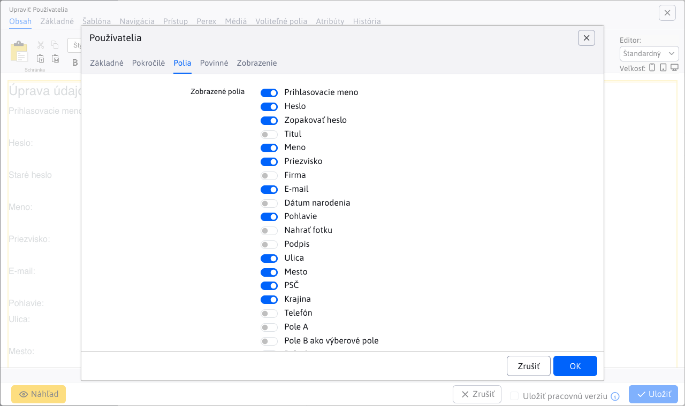
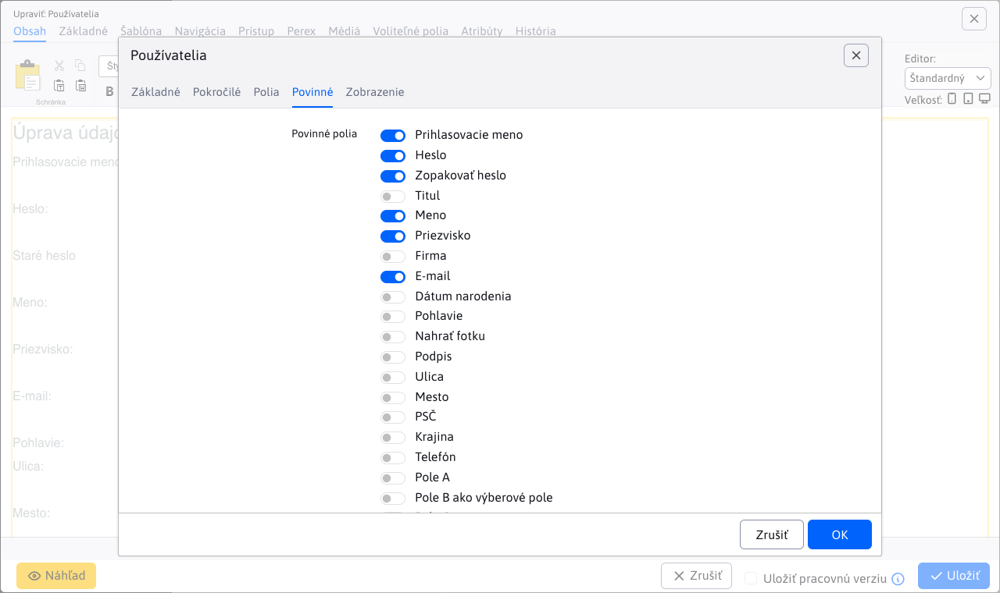
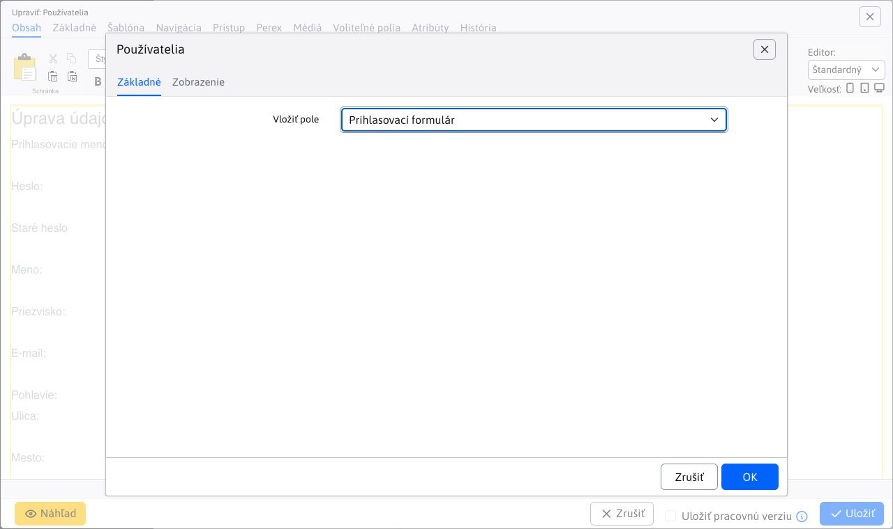

# Users

The application allows you to easily insert information about the logged-in user on the page, including name, email, address and optional fields. In addition, it allows you to insert a login form in a secure section or a registration form for new users.

## Application settings

What information is inserted on the page is indicated by selecting **Insert field** from the card **Basic**. If you select the option **Registration form** or **Registration form** additional settings/tabs will be displayed, which we will then describe.

### Registration form

**Registration form** is the preset value for the application. It offers a wide range of data settings for user registration. For default settings, you can leave the values as they are preset.

Setting options:
- **User groups**
- **User groups**, groups that the user can log in or out of during registration
- **The email address must be unique**
- **DocID pages**, the page that appears after successful registration (leave blank if you want to leave the user on the original page)
- **Notification of registration will be sent to your e-mail**, the email address to which the notification of the new registration will be sent (leave blank if you do not want to be notified)
- **Require email address confirmation**, a confirmation email will be sent to the user with a link to verify the address. If the email needs to be approved, the confirmation email will not be sent.
- **DocID of the email text page**, the page from which an email will be sent to the user if approval is required (leave blank for a standard message).
- **After registration the user will automatically log in**, after successful registration the user will be automatically logged in
- **Send via AJAX**, the form will be submitted in the background without refreshing the page (it is not possible to submit photos)

For **Registration form** tabs are additionally displayed **Viewed at** a **Required**.

#### Card - Fields

In the Fields tab, you can select the fields that will appear in the registration form.

#### Card - Required

In the Required tab, you can select the fields that will be required when you submit the form.

!>**Warning:** if you set a field as mandatory, the application does not check if it was also set as visible. This is something you need to watch out for.

### Registration form

You can set only one parameter for the login form, namely:
- **User groups**, if no option is selected, the groups are generated according to the page to which the user is trying to log in using social networks

## View application

### Registration form

### Registration form

### Email authorization line

### Forgotten password

### Name

