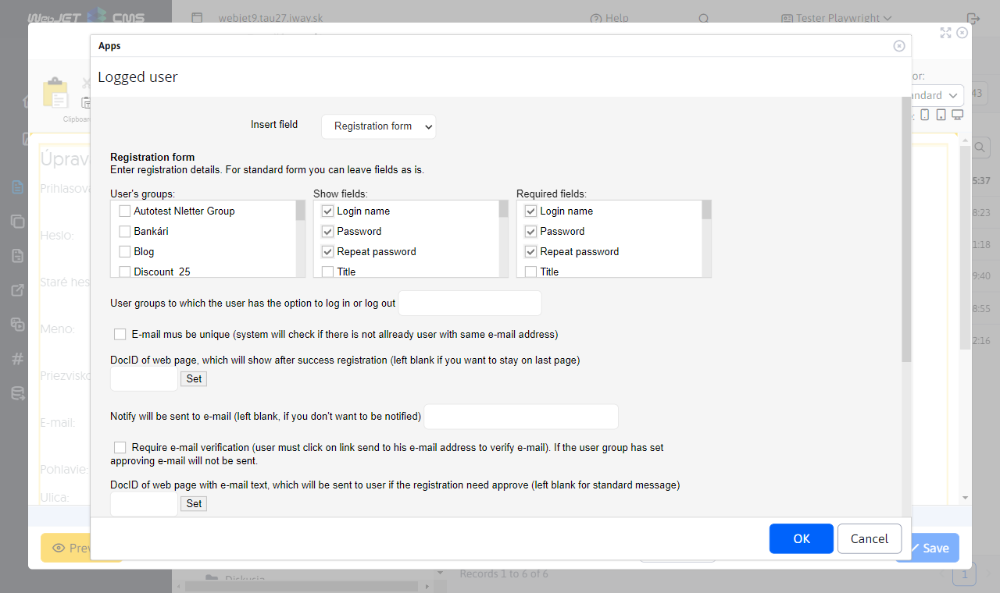
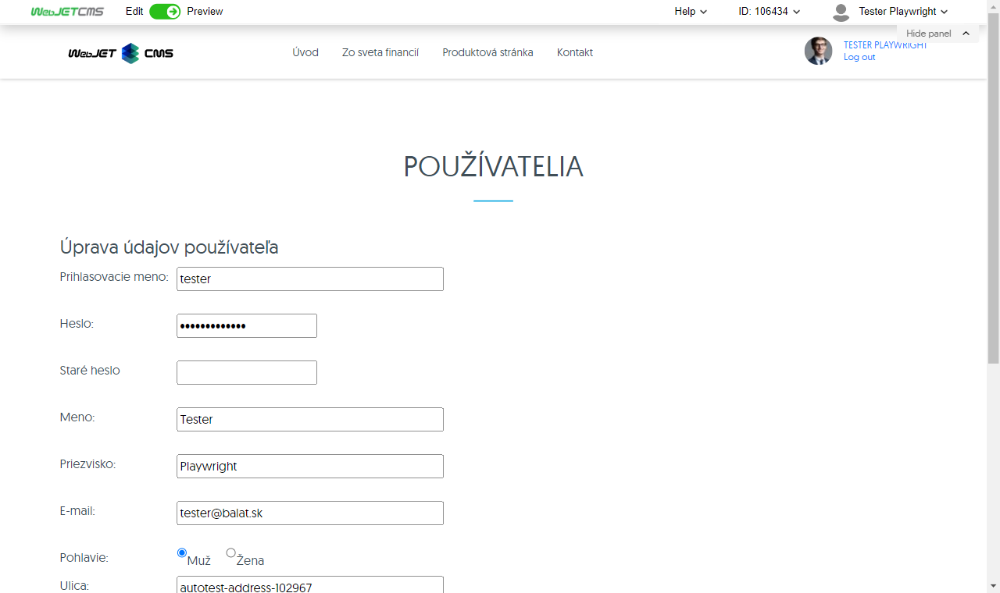
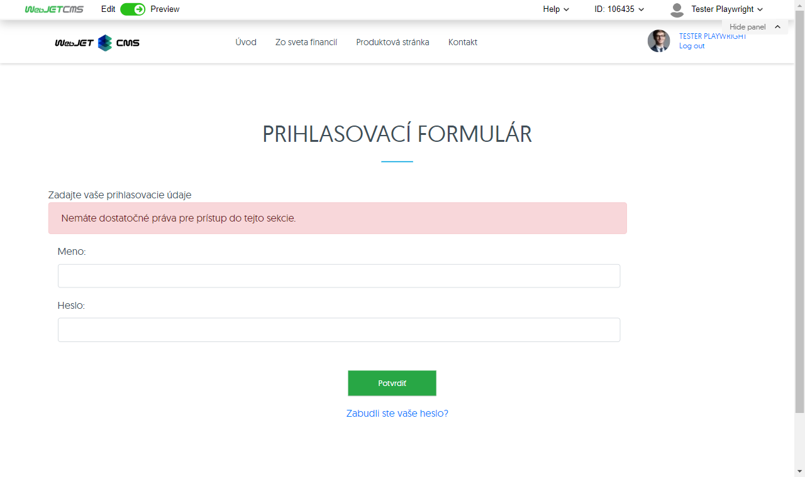
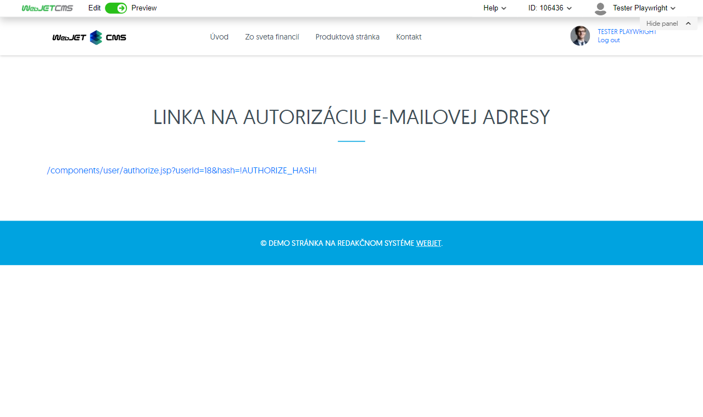
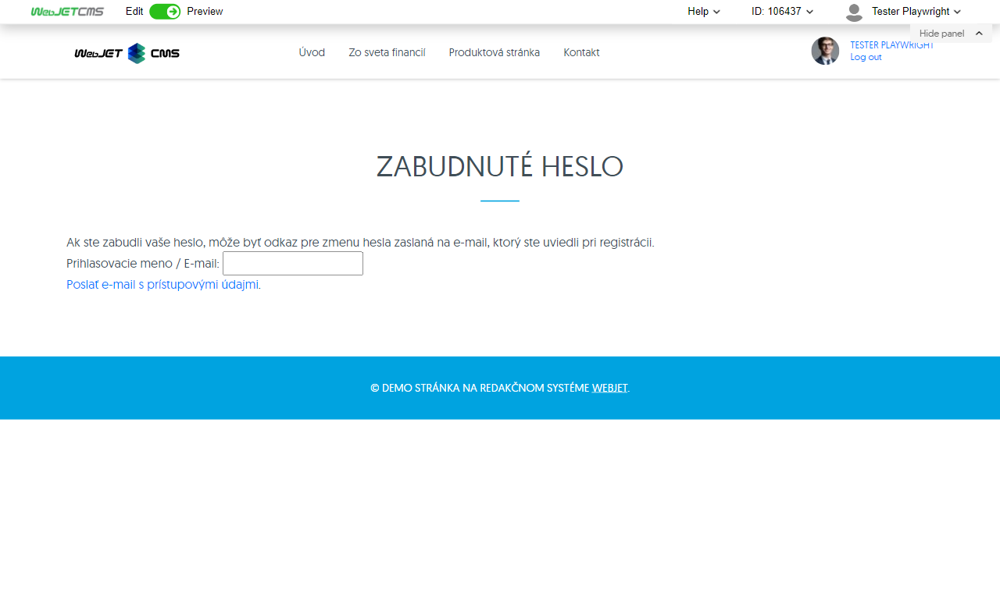
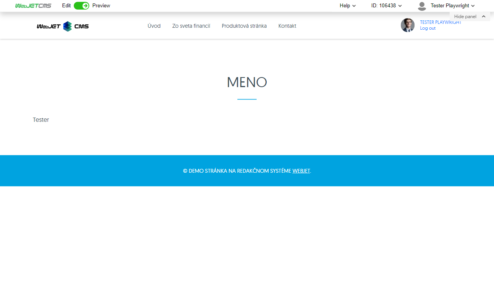

# Users

The application allows you to easily insert information about the logged-in user on the page, including name, email, address and optional fields. In addition, it allows you to insert a login form in a secure section or a registration form for new users.

## Application settings

### Settings for the Registration Form:

Enter your user registration details. For default settings, you can leave the values that are preset.

- **User groups**
- **Displayed fields**
- **Required fields**

#### Other settings:
- **DocID page after registration**: The page that appears after successful registration (leave blank if you want to leave the user on the original page).
- **Notification of registration**: Email address to which notification of new registration will be sent (leave blank if you do not want to be notified).
- **Require email address confirmation**: A confirmation email will be sent to the user with a link to verify the address. If the email needs to be approved, the confirmation email will not be sent.
- **DocID page with approval email**: The page from which an email will be sent to the user if approval is required (leave blank for a standard message).
- **Automatic login after registration**: After successful registration, the user will be automatically logged in.
- **Send via AJAX**: The form will be submitted in the background without refreshing the page (no photos can be submitted).
- **Use custom fields**:
  - **Use field A** Description of field A.
  - **Use field B** Description of field B.
  - **Use field C** Description of field C.
  - **Use field D** Description of field D.
  - **Use field E** Description of field E.

### Settings for the Login Form:

#### User groups:
- Groups that a user can join or unjoin during registration.

## View application

### Registration form

### Registration form

### Email authorization line

### Forgotten password

### Name

