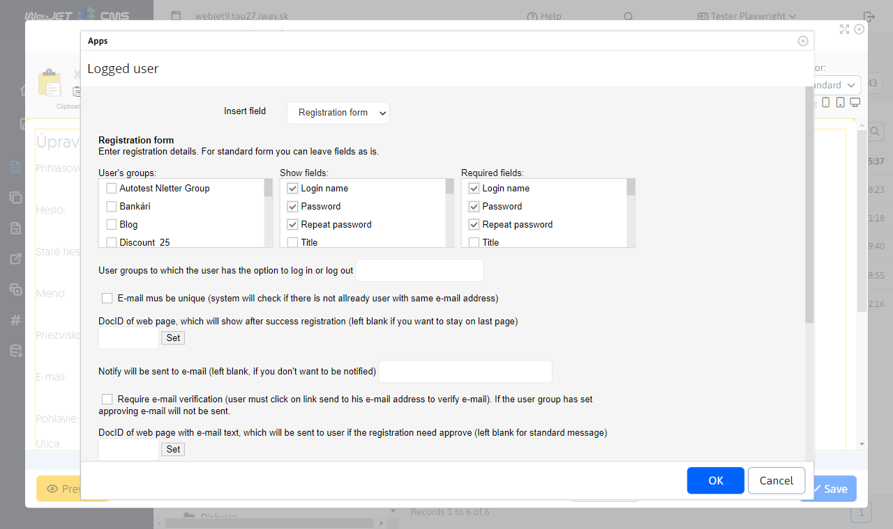
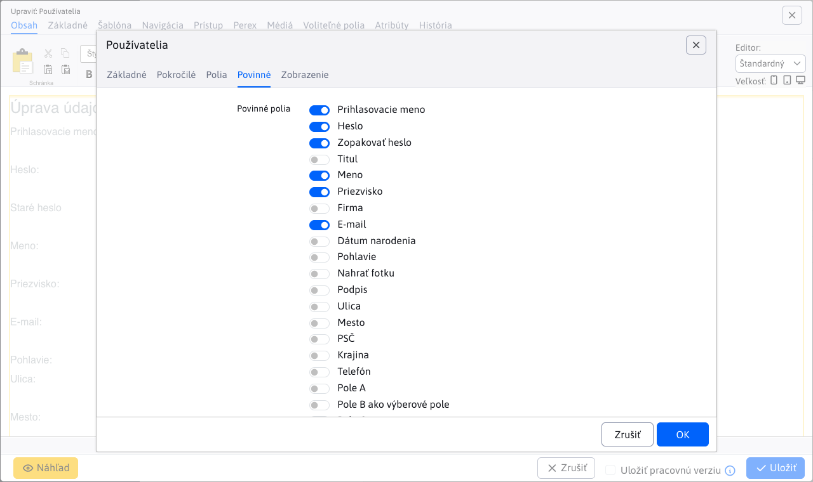
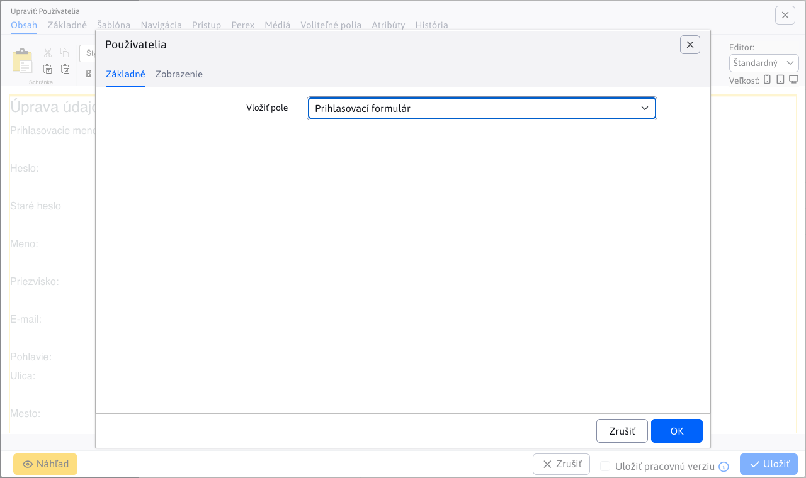
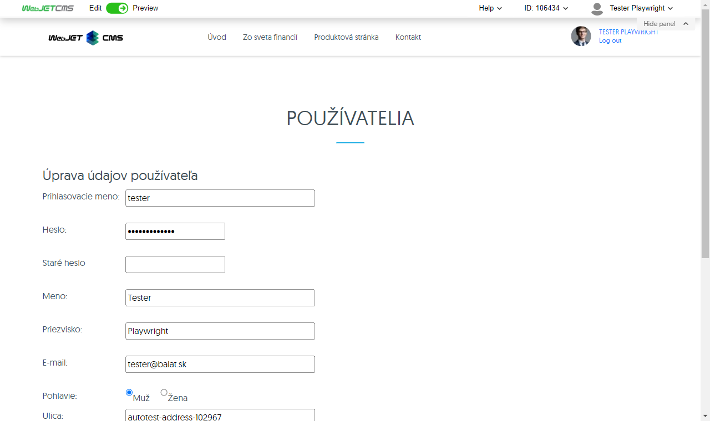
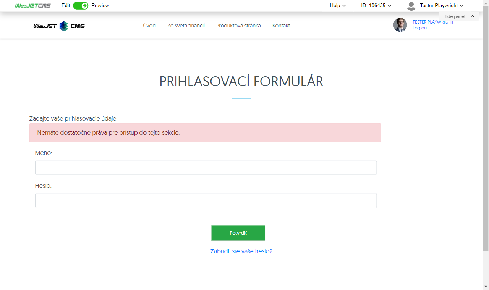
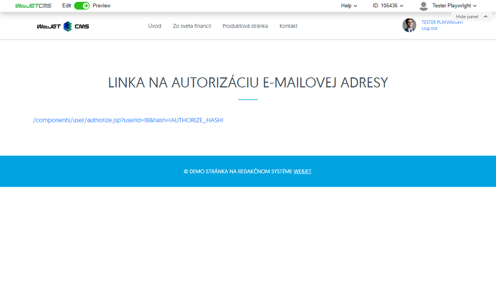
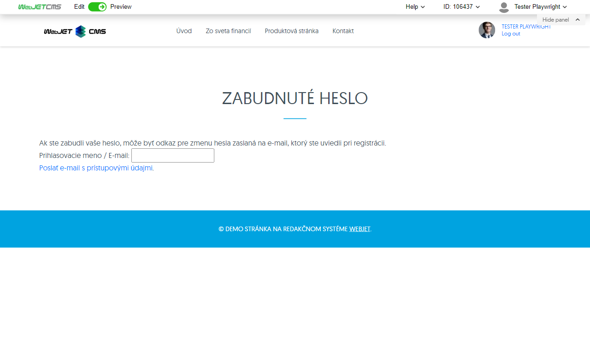
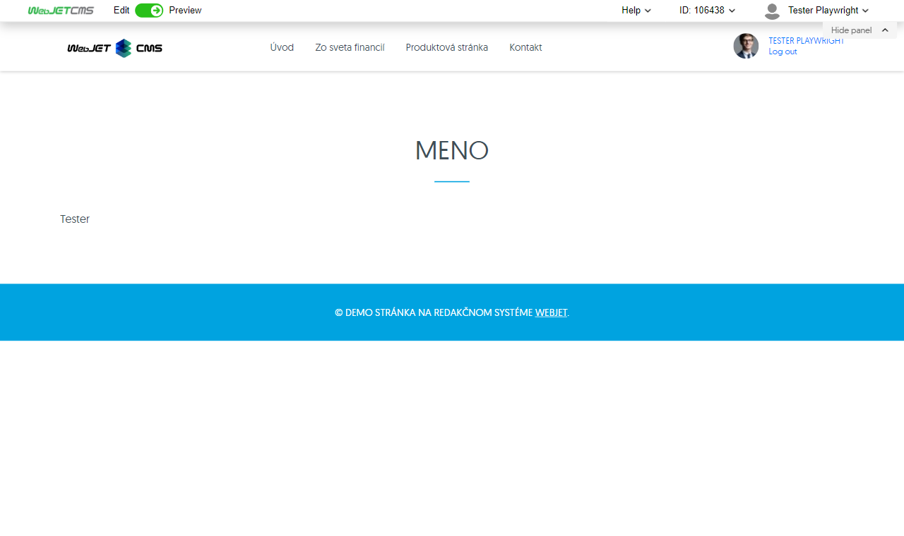

# Users

The application allows you to easily insert information about a logged-in user into a page, including name, email, address, and optional fields. It also allows you to insert a login form into a secure section or a registration form for new users.

## Application settings

What information is inserted into the page is specified by selecting **Insert Field** from the **Basic** tab. If you select the **Registration Form** or **Login Form** option, additional settings/tabs will be displayed, which we will describe below.

### Registration form

**Registration form** is the default value for the application. It offers a wide range of settings for user registration data. For a standard setting, you can leave the values ​​as they are.

Setting options:

- **User groups**
- **User Groups**, groups that a user can join or leave during registration
- **Email address must be unique**
- **Page DocID**, the page that will be displayed after successful registration (leave blank if you want to keep the user on the original page)
- **Registration notification will be sent to email**, email address to which notification of new registration will be sent (leave blank if you do not want to send notification)
- **Require email address confirmation**, a confirmation email will be sent to the user with a link to verify the address. If the email requires approval, the confirmation email will not be sent.
- **DocID of the page with the email text**, the page from which the email will be sent to the user if approval is required (leave blank for a standard message).
- **Automatically log in after user registration**, after successful registration the user will be automatically logged in
- **Submit via AJAX**, the form will be submitted in the background without refreshing the page (cannot submit photos)

For the **Registration Form**, the **Displayed** and **Required** tabs will also be displayed.

#### Tab - Fields

In the Fields tab, you can choose the fields that will appear in the registration form.

#### Card - Required

In the Required tab, you can select the fields that will be required when submitting the form.

!>**Warning:** if you set a field as required, the application does not check whether it has also been set as visible. You need to be careful about this.

### Login form

You can only set one parameter for the login form, namely:

- **User groups**, if no option is selected, groups will be generated based on the page the user is trying to log in to using social networks

## View the application

### Registration form

### Login form

### Email authorization link

### Forgotten password

### Name

