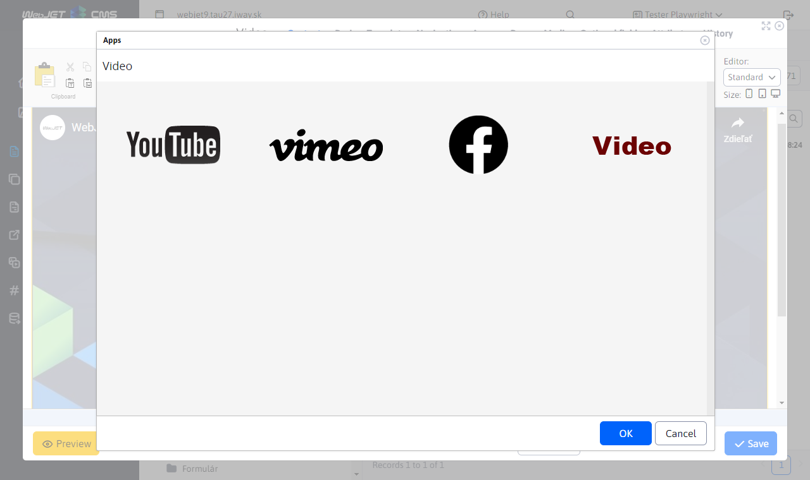
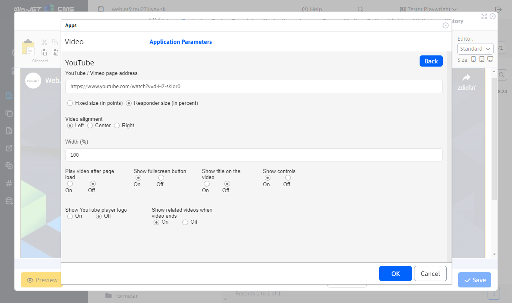
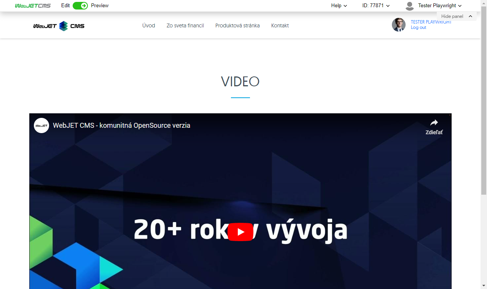

# Video

Add engaging video content from YouTube, Vimeo, Facebook or uploaded mp4 files to your page. With customizable size and playback properties, you can captivate and engage your visitors.

## Application settings

### Video source

In this section you can select from the available video sources :
- YouTube
- vimeo
- Facebook
- Video on the server

### Parameters

In this section you can set:
- Page address
- Fixed/Responsive size
- Video alignment
- Width And other settings depending on the selected source

## View application

