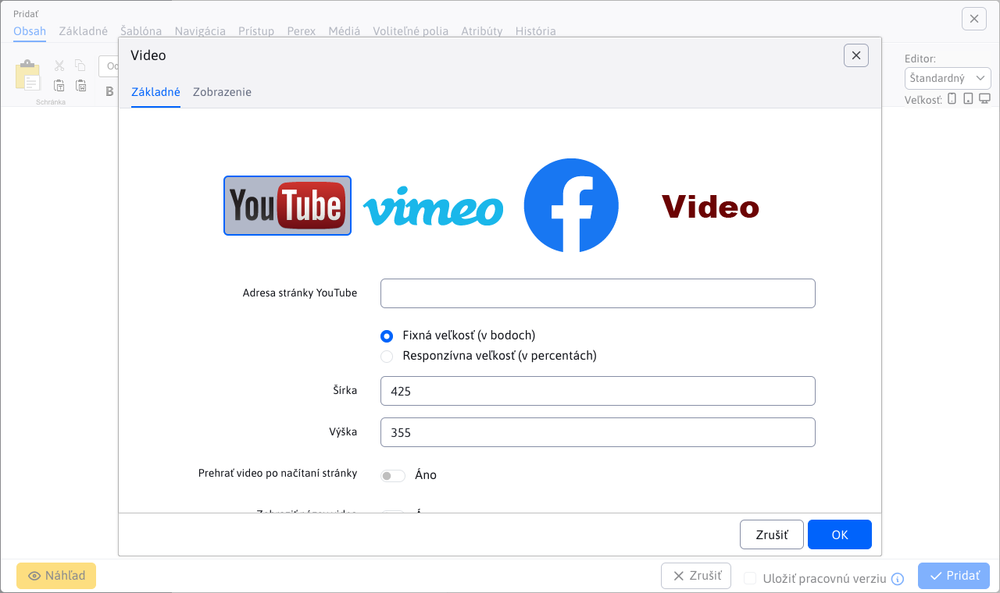
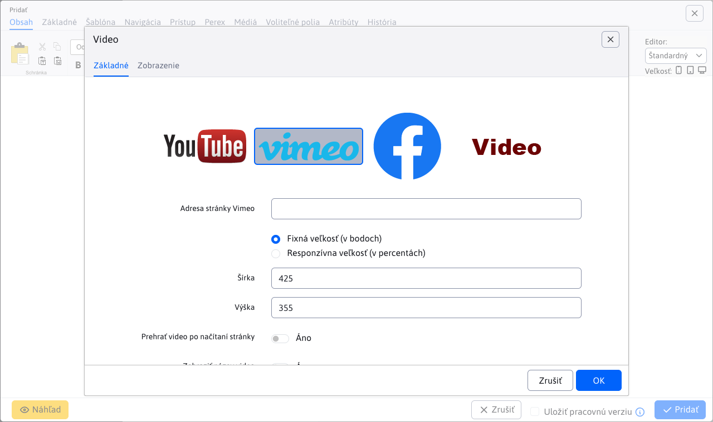
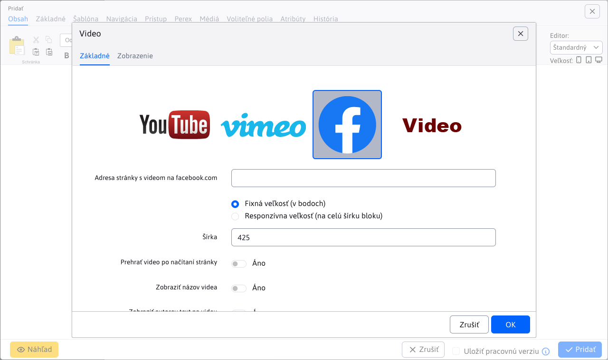
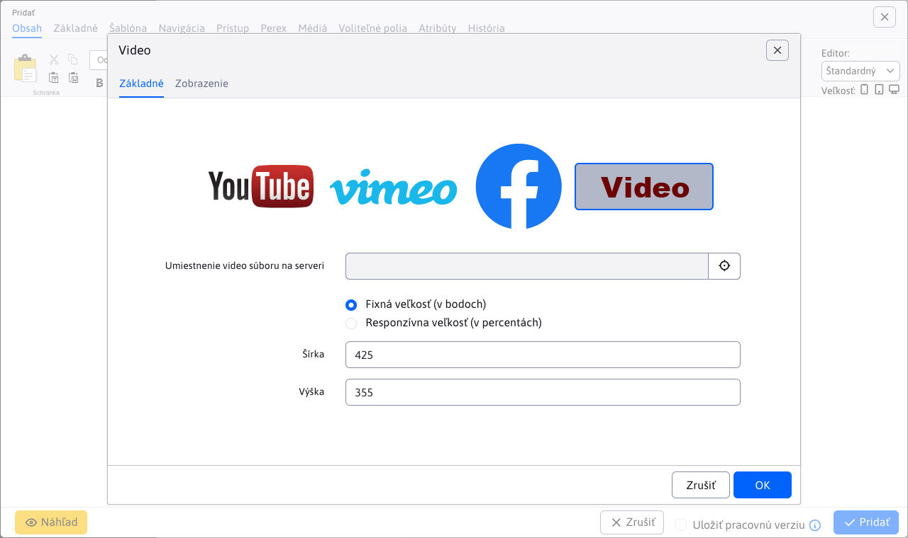

# Video

Add engaging video content from YouTube, Vimeo, Facebook or uploaded mp4 files to your page. With customizable size and playback properties, you can captivate and engage your visitors.

## Application settings

### Video source

In this section you can select from the available video sources:
- YouTube
- Vimeo
- Facebook
- Video on the server

### YouTube

YouTube video parameters:
- **YouTube page address**, simply insert a link to the web page with the video
- Fixed size (in points)
  - Width
  - Height
- Responsive size (percentage)
  - Width (%)
- Play video after page load
- View video title
- View YouTube logo
- Show option to go full screen
- View control icons
- View similar videos after playback ends

### Vimeo

Vimeo video parameters:
- **Vimeo page address**, simply insert a link to the web page with the video
- Fixed size (in points)
  - Width
  - Height
- Responsive size (percentage)
  - Width (%)
- Play video after page load
- View video title
- View author's text on video
- Show option to go full screen
- View author's photo in the video
- Enable watermarking on video

### Facebook

Facebook video parameters:
- **Address of the page with the video on facebook.com**, simply insert a link to the web page with the video
- Fixed size (in points)
  - Width
- Responsive size (full block width)
- Play video after page load
- View video title
- View author's text on video
- Show option to go full screen

### Video

Server video parameters:
- **Placing the video file on the server**, video selection using the file explorer (direct file path input is also supported)
- Fixed size (in points)
  - Width
  - Height
- Responsive size (percentage)
  - Width (%)

## View application

