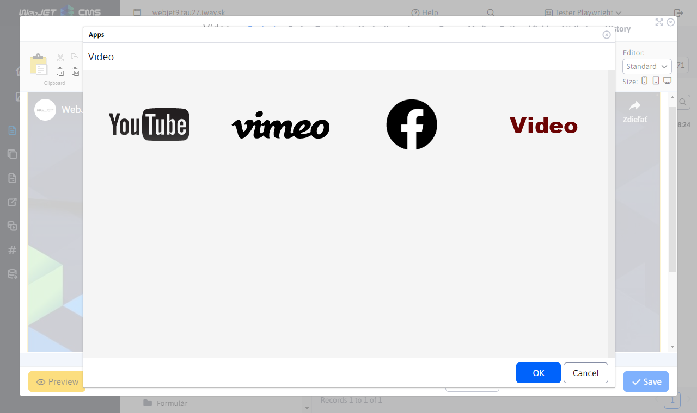
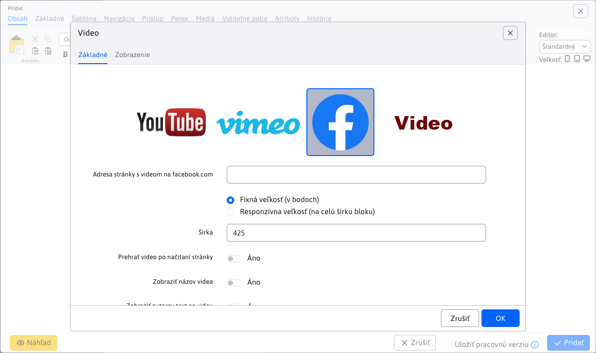
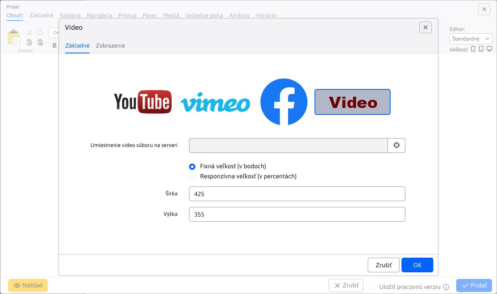
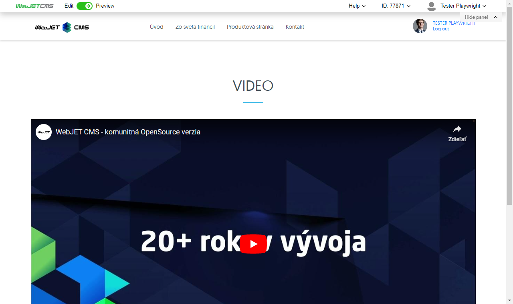

# Videos

Add engaging video content from YouTube, Vimeo, Facebook, or uploaded mp4 files to your site. With the ability to adjust the size and playback properties, you can captivate and engage your visitors.

## Application settings

### Video source

In this section you can select from the available video sources:

- YouTube
- Vimeo
- Facebook
- Video on the server

### YouTube

YouTube video parameters:

- **YouTube page address**, simply insert the link to the website with the video
- Fixed size (in points)
  - Width
  - Height
- Responsive size (in percentage)
  - Width (%)
- Play video after page loads
- Show video title
- Show YouTube logo
- Show option to go full screen
- Show control icons
- Show similar videos after playing

### Vimeo

Vimeo video parameters:

- **Vimeo page address**, simply insert the link to the video website
- Fixed size (in points)
  - Width
  - Height
- Responsive size (in percentage)
  - Width (%)
- Play video after page loads
- Show video title
- Show author's text on the video
- Show option to go full screen
- Show author's photo on video
- Enable watermark display on video

### Facebook

Facebook video parameters:

- **Address of the video page on facebook.com**, simply insert the link to the video web page
- Fixed size (in points)
  - Width
- Responsive size (full width of the block)
- Play video after page loads
- Show video title
- Show author's text on the video
- Show option to go full screen

### Videos

Server video parameters:

- **Location of video file on server**, selecting video using file explorer (direct entry of file path is also supported)
- Fixed size (in points)
  - Width
  - Height
- Responsive size (in percentage)
  - Width (%)

## View the application

