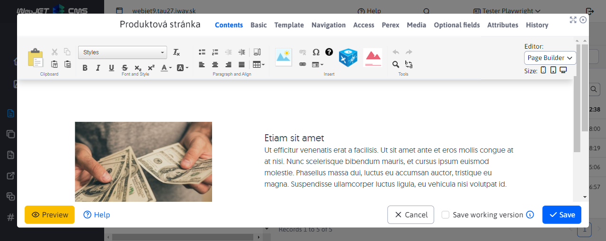
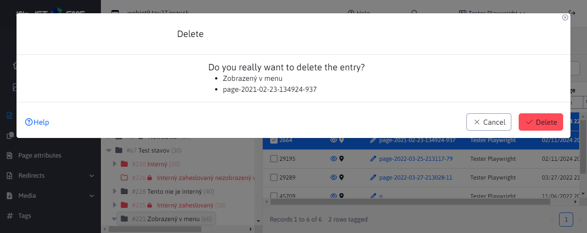
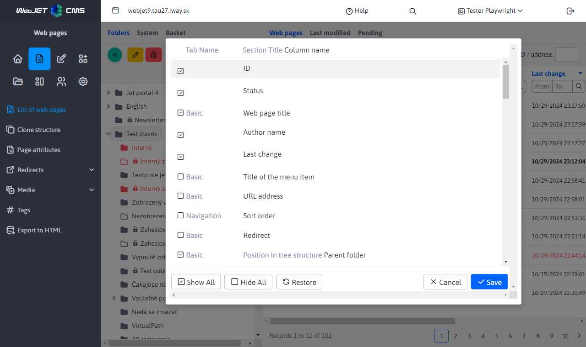
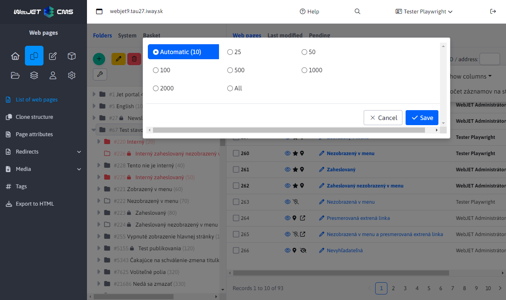

# Data tables

## Basics of working with data tables

Data tables are the basis of the interface in CMS WebJET, watch the instructional video on how to work with tables.

<div class="video-container">
    <iframe width="560" height="315" src="https://www.youtube.com/embed/-NN6pMz_bKw" title="YouTube video player" frameborder="0" allow="accelerometer; autoplay; clipboard-write; encrypted-media; gyroscope; picture-in-picture" allowfullscreen></iframe>
</div>

## New features

Compared to the video above, the standard data table has new features.

### Display name in window header

When editing an existing item (if a single record is being edited), the title of the edited item is displayed in the editor dialog box header (in the example, the text **Product Page**) instead of the general text **Edit**.



Similarly, when confirming a deletion, a list of marked items will be displayed to confirm the records you want to delete.



### Ability to move window

The editor window can be moved (for example, if you need to see information on the page covered by the window). Just start dragging the window in the header area (like a standard window in ```Windows```).

### Remembering the arrangement

If you change the way the table is organized (by clicking on the column name), the table will remember this arrangement in your browser. When you return to that section again, the table will be organized according to your preference.

Click on the icon<i class="ti ti-adjustments-horizontal" role="presentation"></i> , then the Column display setting and then the Reset button to reset the table to its basic form, including layout.

### Change the order of columns

You can move columns in the table to change their order according to your needs. Just grab the column header (name) and start dragging it left or right. The column order is remembered in the browser and when you return to that section, the column order will be preserved.

Click on the icon<i class="ti ti-adjustments-horizontal" role="presentation"></i> , then the Column display setting and then the Reset button to reset the table to its default form, including the column order.

## Setting the column display

By clicking the button<i class="ti ti-adjustments-horizontal" role="presentation"></i> settings, you will see the option to set the display of columns and the number of records displayed on one page.

In most tables, all columns are displayed by default, but some, like the table in the list of web pages, contain a lot of columns, so only the basic ones are displayed by default. By clicking on the **Show columns** option, a dialog box will open in which you can **select which columns you want to display**. You can mark them as you like and after clicking on **Save**, the selected columns will be remembered in **your browser**. The selected columns will also be displayed after refreshing the page.



The following columns are displayed in the window:

- Tab name - displays the name of the tab the field is located in in the editor. If the field is not displayed in the editor, the value is empty.
- Section title - displays a title above the fields in the editor (if specified), allows you to distinguish a group of fields, e.g. to set the display for a logged in or logged out user.
- Column name - the name of the field in the editor, the value represents the column you want to display.

In the column display settings, there is also a **Reset** button that will restore the **default column list setting**. In addition, there are **Show All** and **Hide All** buttons that will toggle the display of all columns on or off with one click.

!>**Warning:** the more columns you display, the longer it will take your computer to display the table.

## Number of records per page

By clicking the button<i class="ti ti-adjustments-horizontal" role="presentation"></i> settings, the option to set the number of records per page will appear.

To ensure that the window contains the ideal number of table rows, its size is calculated and the default value is set according to this calculation. In the number of records setting, the first option displayed is Automatic (X) where X is the calculated number of rows based on the window height.



Below the row table, information about the number of records displayed, the total number of records, and, if applicable, pagination (moving to the next pages) is displayed.

Automatic setting of the number of table rows is used only in the main window, it is not used in nested tables in the editor (e.g. in the Web page Edit History tab).

The value all is limited by the configuration variable `datatablesExportMaxRows`, so with the value All the maximum number of rows defined in this configuration variable is actually loaded. The rows are displayed directly in the browser and a high number will result in a high processor load.

## Keyboard shortcuts

For more efficient work, you can use the following keyboard shortcuts (```Windows/MacOS```):

- ```CTRL+S/CMD+S``` - ​​saves the record to the database, but leaves the editor window open. The function may not be available if multiple dialog windows are open at the same time.
