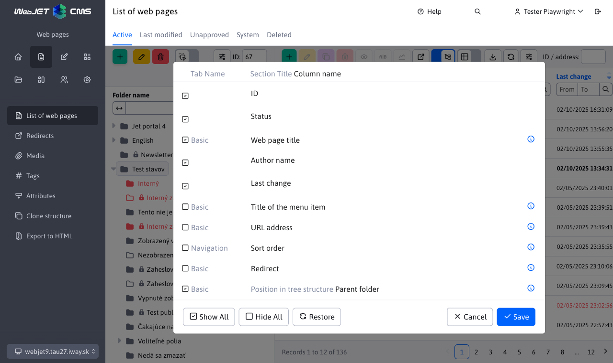
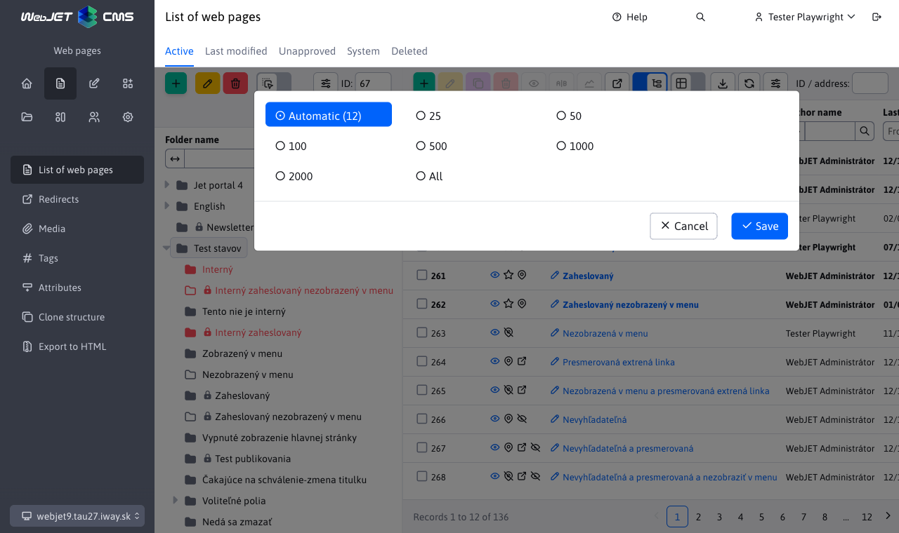

# Datatables

Data tables are the basis of the interface in CMS WebJET, watch the instructional video how to work with tables.

  <iframe width="560" height="315" src="https://www.youtube.com/embed/-NN6pMz_bKw" title="YouTube video player" frameborder="0" allow="accelerometer; autoplay; clipboard-write; encrypted-media; gyroscope; picture-in-picture" allowfullscreen></iframe>

## New features

Compared to the video above, the standard datatable has new features.

### Display name in window header

When editing an existing item (if a single record is being edited), the header of the editor dialog displays the name of the item being edited (in the example, the text `Produktová stránka`) instead of the general text `Upraviť`.

Similarly, when you confirm the deletion, a list of marked items will be displayed to confirm the records you want to delete.

### Option to move the window

The editor window can be moved (for example, if you need to see information on the page overlaid on the window). Just start dragging the window in the header area (like a standard windows window).

### Remembering the arrangement

If you change the way the table is arranged (by clicking on the column name), the table will remember this arrangement in your browser. When you go back to that section again, the table will be arranged according to your preference.

Click on the icon <i class="far fa-wrench" role="presentation" />, then the Column View setting, and then the Refresh button to reset the table to its basic form, including the layout.

### Changing the order of columns

You can move columns in the table to change their order according to your needs. Just grab the column header (name) and start dragging it left or right. The order of the columns will be remembered in the browser and when you go back to that section again, the order of the columns will be preserved.

Click on the icon <i class="far fa-wrench" role="presentation" />, then the Column View setting, and then the Refresh button to reset the table to its basic form, including the column order.

## Setting the display of columns

Click on the button <i class="far fa-wrench" role="presentation" /> settings, you will be given the option to set the display of columns and the number of records displayed per page.

In most tables all columns are displayed by default, but some like the table in the list of web pages contain very many columns, so only the basic ones are displayed by default. Click on the option **Columns display** opens a dialog box in which you can **select which columns you want to display**. Select them at will and click on the **Save**, the selected columns in **your browser will remember**. The selected columns will also be displayed after the page is refreshed.

The following columns are displayed in the window:
- Tab Name - displays the name of the tab in which the field is located in the editor. If the field is not displayed in the editor, the value is empty.
- Section heading - displays the heading above the fields in the editor (if specified), allows to distinguish a group of fields, e.g. to set the display for a logged in or logged out user.
- Column name - the name of the field in the editor, the value represents the column you want to display.
There is also a button in the column display settings **Refresh**which will restore **default column list setting**. In addition, there are also buttons **View all** a **Hide all**, which turns on or off the display of all columns with one click.

**Warning:** the more columns you have displayed, the longer it will take your computer to display the table.
## Number of records per page

Click on the button <i class="far fa-wrench" role="presentation" /> settings, the option to set the number of records per page will appear.

In order for the window to contain the ideal number of table rows, its size is calculated and preset according to this calculation. In the number of records setting, the first option displayed is Automatic (X) where X is the calculated number of rows according to the height of the window.

Below the table of rows, information about the number of records displayed, the total number of records, and, if applicable, pagination (moving to the next page) is displayed.

The automatic setting of the number of table rows is only used in the main window, it is not used in nested tables in the editor (e.g. in the Edit History tab of a web page).

## Keyboard shortcuts

To work more efficiently, you can use the following keyboard shortcuts (`Windows/MacOS`):
- `CTRL+S/CMD+S` - saves the record to the database, but leaves the editor window open. The function may not be available if multiple dialogs are open at the same time.
