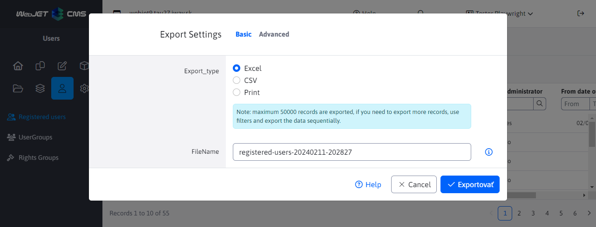
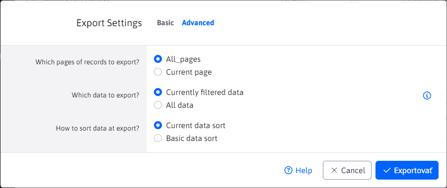
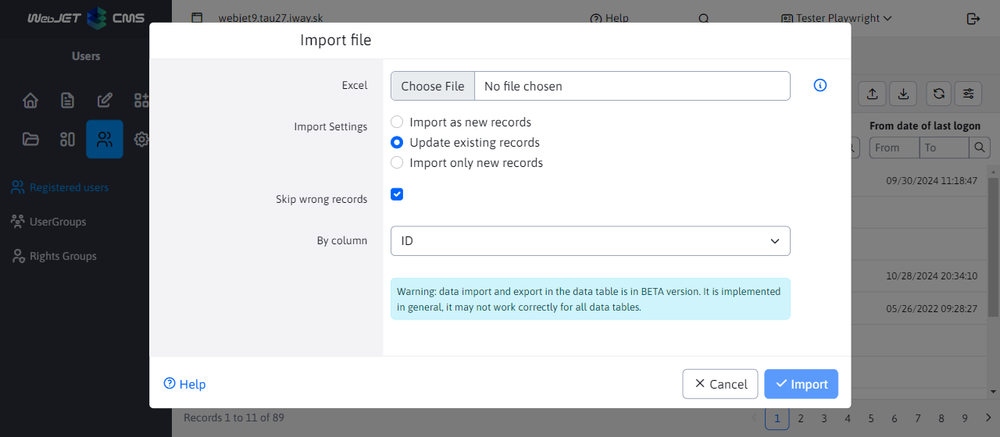

# Export and import

Datatables provide the ability to export and import data in the header:

- Allows export to **Excel(xlsx) and direct printing to the printer**
- The file is named according to the current `title` page and the current date and time will be automatically added.
- By exporting, you can get **maximum 50 000 records**. If you need to export multiple records, use multiple export using filtering. The maximum number of records can be increased by setting the conf. variable `datatablesExportMaxRows`.
- When exporting, a list of columns is prepared in the first row, **the import is consequently not sensitive to the order of the columns**.
- For **selection fields** (select/digits) with **export text value** and reconstructs back to the ID on import. This allows to have **different IDs of bound records** between environments (e.g. template ID for a web page), if the name matches, the record is correctly paired. Consequently, there is also human readable text in the export instead of the ID value.
- Import allows **import data as new** (to be added to the database) or **match existing data according to the selected column** (e.g. name, URL, etc.). When matching, it first looks up the record in the database and then updates it. If it does not exist, it creates a new record.
- Imported from format **xlsx**.

## Export of data

Click the Export icon  opens a dialog box in which the export file name is automatically set according to the current page and the date and time. You can choose to export in Excel (xlsx) format or print the spreadsheet.

In the Advanced tab of the table with server pagination it is possible to set the type of exported data **current page/all, filtered/all rows, sorting**. For a table with client pagination, only the current/all pages option is displayed.

Clicking the Export button will create `xlsx` download file, or, in the case of the Print option, the standard print window will appear.

When exporting in Excel format, the **export columns by editor**, not by the columns shown. This is so that records can be imported afterwards. The first row of the Excel file contains the column names but also its code name in the format `Pekný názov|kodovyNazov`. For example, in users, the Name column is used in both personal data and contact data. Without the code name, we would not be able to accurately pair the column to the correct field in the editor when importing.

## Import of data

Click on the Import icon  opens a dialog for importing from Excel (xlsx) format. In the import settings you can select:
- Add as new records - records are imported as new, the ID column is ignored. An error may occur during import if a duplication constraint is encountered (e.g. login name in the user list that must be unique).
- Update existing records - this option displays a selection box **By column**, in which you can select the column based on which the data will be updated. When importing, the database will contain **identical records (there may be more than one**if for example it is imported by Last Name or another column that is not unique) and these are updated according to the data in Excel. If no record is found in the database by the specified column, the **creates as a new record**.
- Import only new records - in the field **By column** select the column by which the existence of the record is identified. Only records that are not found by the specified column are imported.

Clicking the Import button will start the import from the selected Excel file.

Most tables, when updating an existing record, allow **import columns piecemeal**. In Excel, you can delete columns that you want to keep intact in the database. Subsequently, when importing, only the changes from the retained columns in Excel will be transferred to the existing records.
