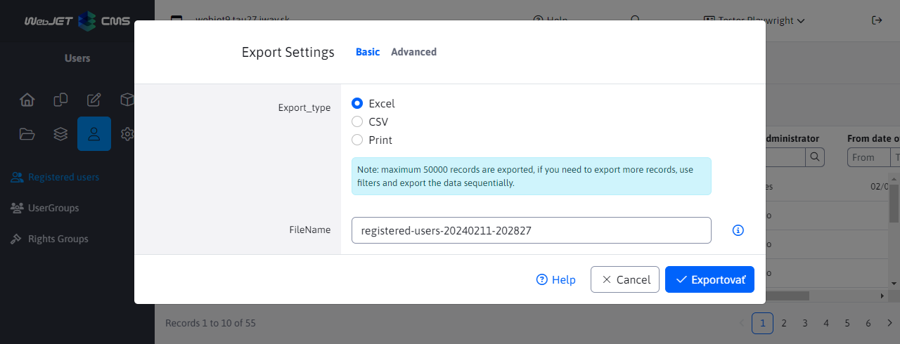
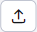
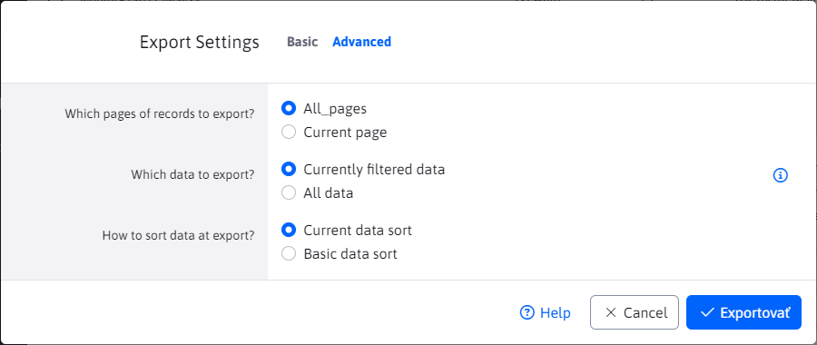
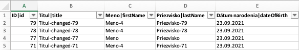
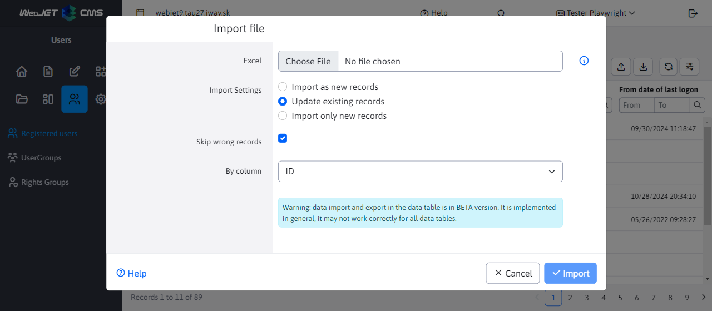
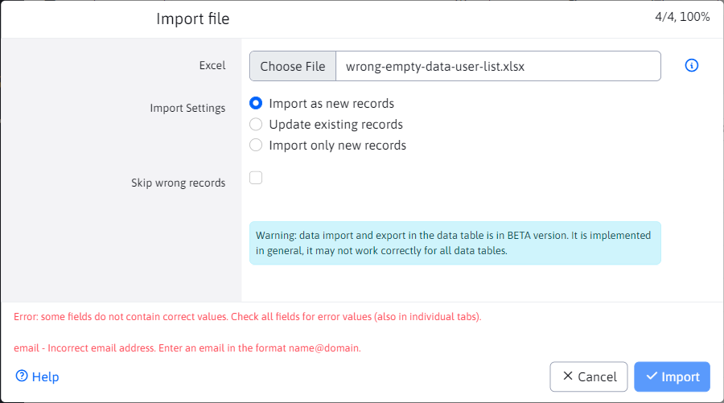
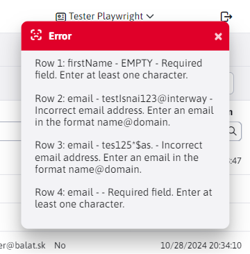

# Export and import

Data tables provide the ability to export and import data in the header:



- Allows export to **Excel(xlsx) and direct printing to printer**
- The file will be named according to the current ```title``` page and the current date and time will be automatically added.
- Export can retrieve **a maximum of 50,000 records** at a time. If you need to export more records, use multiple exports using filtering. The maximum number of records can be increased by setting the config variable `datatablesExportMaxRows`.
- When exporting, a list of columns is prepared in the first row, **the import is then not sensitive to the order of the columns**.
- For **select fields** (select/numbers), the **text value** is exported and reconstructed back to an ID when imported. This allows you to have **different IDs of linked records** between environments (e.g. template ID for a web page), if the name matches, the record is correctly matched. The export then also contains human-readable text instead of the ID value.
- Import allows you to **import data as new** (add it to the database) or **match existing data according to the selected column** (e.g. name, URL address, etc.). When matching, it first looks for a record in the database and then updates it. If it does not exist, it creates a new record.
- Imports from **xlsx** format.

## Data export

After clicking the Export icon , a dialog box opens in which the export file name is automatically set according to the current page and date and time. You can choose to export in Excel format (xlsx) or print the table.

In the Advanced tab, for a table with server paging, it is possible to set the type of exported data **current page/all, filtered/all rows, sort**. For a table with client paging, only the current/all pages option is displayed.



Clicking the Export button will create a ```xlsx``` file for download, or in the case of the Print option, a standard print window will appear.

When exporting in Excel format, **columns are exported by editor**, not by displayed columns. This is so that the records can be imported later. The first line of the Excel file contains the column names as well as their code name in the format ```Pekný názov|kodovyNazov```. For example, in users, the Name column is used in both personal data and contact data. Without the code name, we would not be able to accurately match the column to the correct field in the editor during import.



## Data import

After clicking the Import icon , a dialog box for importing from Excel (xlsx) format will open. In the import settings, you can select:

- Add as new records - records are imported as new, the ID column is ignored. An error may occur during import if a duplication constraint occurs (e.g. login name in the user list, which must be unique).
- Update existing records - this option displays the **By column** selection field, in which you can select the column based on which the data will be updated. During import, **matching records** are found in the database (there may be more than one**, if, for example, importing by Last name or another column that is not unique) and they are updated according to the data in Excel. If a record is not found in the database according to the specified column, it is **created as a new record**.
- Import only new records - in the **By column** field, select the column by which the existence of the record is identified. Only records that are not found by the specified column are imported.



Clicking the Import button will start the import from the selected Excel file.

Most spreadsheets allow you to **import columns partially** when updating an existing record. In Excel, you can delete columns that you want to keep unchanged in the database. Then, when importing, only the changes from the columns you left in Excel will be transferred to the existing records.

### Skip erroneous records

The import offers the option to skip erroneous records. If this option is **disabled** and the imported data contains an error, the import will be interrupted and an error message will be displayed. The disadvantage is when importing a large number of records, where one error will interrupt the import of other records.

All matching records before the faulty record have been saved.



If this option is **enabled**, the import will not stop when an error is found, but will continue. Error values, including the line number, will be displayed in a notification:



More notifications may appear because the data is processed in parts - they are sent sequentially after 25 records, an error message may appear for each. More technical information can be found in the [Conversion from Excel](../../developer/datatables/export-import.md#konversia-z-excelu).