# Explorer

File Explorer is an application for managing and working with files.

It consists of several parts:
- toolbar
- navigation bar
- main area
- footer

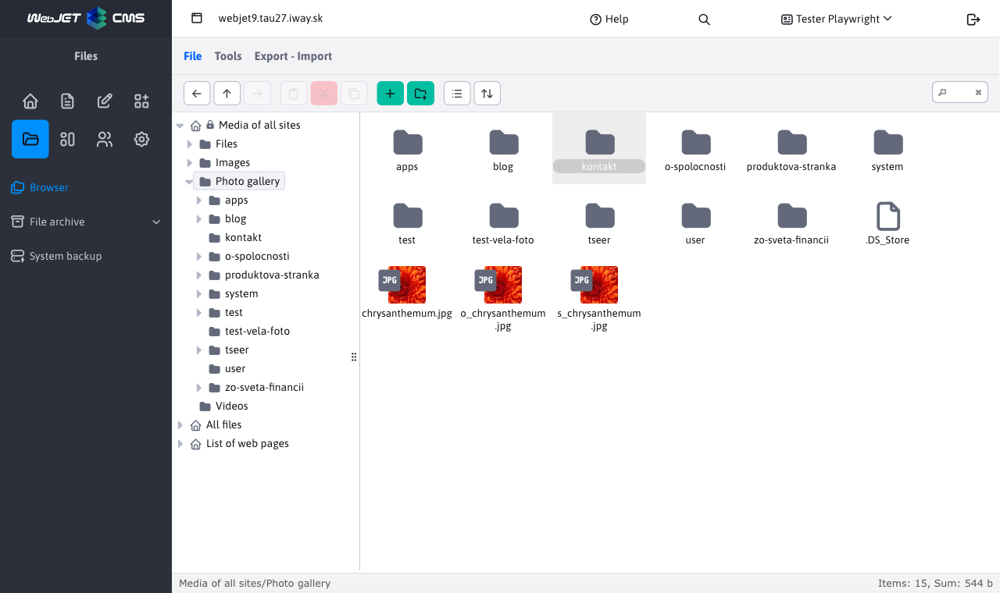

## Toolbar

The toolbar offers a wide selection of tools/functions for working with files and file folders. Each button, offers a different unique tool.

!>**Warning:** individual buttons are only activated under specific conditions, so they are not always available. The toolbar also includes a search.

The given tools are divided into 3 tabs by the logic field:
- File
- Tools
- Export - Import

### File tab

The File tab offers basic options to work as:
- <button class="btn btn-sm btn-outline-secondary"><i class="ti ti-arrow-left" ></i></button>, **Back to**, navigating one step back in the tree structure. Option only available if another folder was selected before the currently selected folder.
- <button class="btn btn-sm btn-outline-secondary"><i class="ti ti-arrow-up" ></i></button>, **Go to parent folder**, navigating up a level in the tree structure. Option only available if the currently selected folder has a parent folder that we can navigate to.
- <button class="btn btn-sm btn-outline-secondary"><i class="ti ti-arrow-right" ></i></button>, **Next**, navigating one step ahead in the tree structure. Option only available if you have used **Back to**.
- <button class="btn btn-sm btn-outline-secondary"><i class="ti ti-clipboard" ></i></button>, **Embed**, puts the copied/retrieved file or folder in the currently selected location.
- <button class="btn btn-sm btn-danger"><i class="ti ti-cut" ></i></button>, **Excerpted from**, copies the marked file/folder from the source location. Once pasted into the destination location, the original from the source location is deleted.
- <button class="btn btn-sm btn-outline-secondary"><i class="ti ti-copy" ></i></button>, **Click to copy**, copies the selected file/folder

   

   

- <button class="btn btn-sm btn-success"><i class="ti ti-plus" ></i></button>, **Upload files**, allows you to upload files to the currently selected location.
- <button class="btn btn-sm btn-success"><i class="ti ti-folder-plus" ></i></button>, **New folder**, allows you to create a new folder in the currently selected location.

   

   

- <button class="btn btn-sm btn-outline-secondary"><i class="ti ti-list" ></i></button>, **List**, changes the view of files/folders in the work area to a leaf view.
- <button class="btn btn-sm btn-outline-secondary"><i class="ti ti-layout-grid" ></i></button>, **Icons**, changes the display of files/folders in the work area to an icon-based view.

| List | Icons |
| :--------------------: | :--------------------: |
| 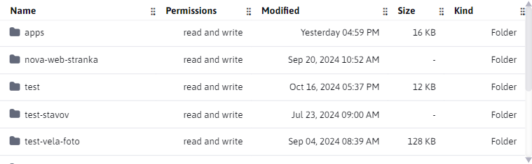 | 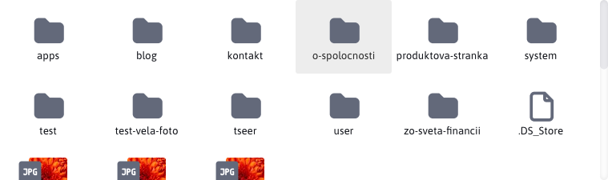 |

- <button class="btn btn-sm btn-outline-secondary"><i class="ti ti-arrows-up-down" ></i></button>, **Sort by**, allows you to sort files/folders by the selected criteria.

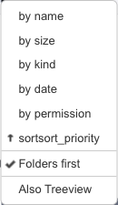

### Tools tab

Offers advanced tools for working with folders/files.

- <button class="btn btn-sm btn-outline-secondary"><i class="ti ti-file-download" ></i></button>, **Download**, allows you to download the selected file (IBA file).
- <button class="btn btn-sm btn-outline-secondary"><i class="ti ti-eye" ></i></button>, **Preview**, provides different functionality depending on the selected element, the base is always a dialog that can be enlarged/reduced. It can always be opened at the same time **only one window**. When you select a different file/folder, the window is refreshed (it does not open a new one). Use the arrow keys to change the selected file/folder in the currently selected location.
- Folder or current file, provides information about the name and the last modification.
- Text file as `text/plain`, `text/html`, `text/jsp`, `text/javascript`, `text/css`, `text/xml`, `text/x-js`, `text/markdown`, opens the file in a dialog box (however, the file is **cannot be adjusted**).
- The image is displayed as a preview in the dialog box.

| Folder/File | Text Files | Image |
| :-----------------------: | :---------------------: | :----------------------: |
| 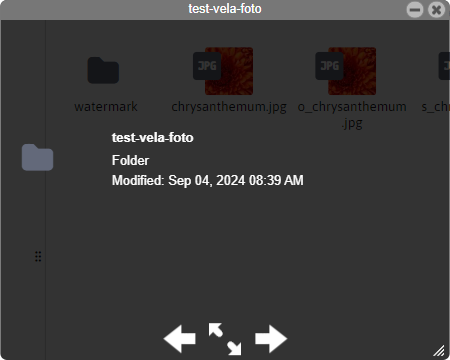 | 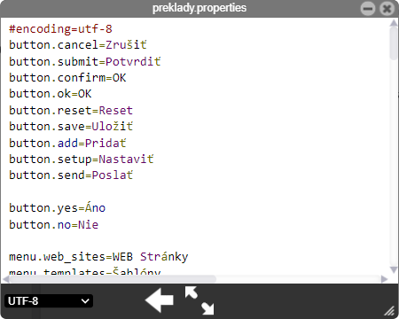 | 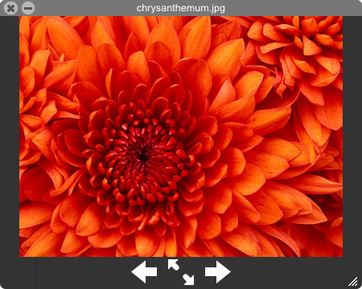 |

- <button class="btn btn-sm btn-outline-secondary"><i class="ti ti-info-square-rounded" ></i></button>, **Get info**, provides detailed information about the selected file/folder that will be displayed in the window. There can be more than one of these windows (as opposed to **Preview**). If you select multiple files/folders, you will only get information about their number and common size.

| Folder | File |
| :------------------: | :----------------: |
| 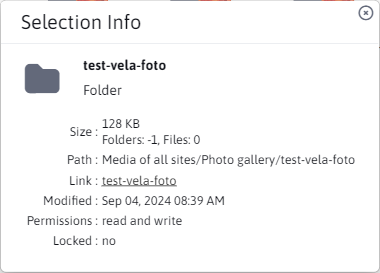 | 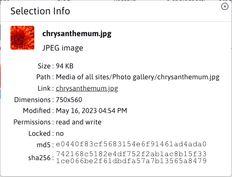 |

!>**Warning:** folder size counts the size of files in the given folder, it does not count files in sub-folders.

 

 

- <button class="btn btn-sm btn-warning"><i class="ti ti-edit" ></i></button>, **Edit by**, allows editing of files and IBA files. For more information see [Editing files](../fbrowser/file-edit/README.md).
- <button class="btn btn-sm btn-duplicate"><i class="ti ti-copy" ></i></button>, **Duplicate of**, allows you to duplicate selected folders/files. The cloned folders/files are saved in the same location from which they were duplicated.
- <button class="btn btn-sm btn-danger"><i class="ti ti-trash" ></i></button>, **Delete**, allows you to permanently delete selected folders/files.
- <button class="btn btn-sm btn-outline-secondary"><i class="ti ti-abc" ></i></button>, **Rename**, allows you to rename the folder/file. Only ONE folder/file can be selected at a time.

   

   

- <button class="btn btn-sm btn-outline-secondary"><i class="ti ti-archive-off" ></i></button>, **Create archive**, allows you to archive all tagged folders/files into a single ZIP archive (ZIP is the only supported one). The archive is saved in the same location as the selected folders/files.
- <button class="btn btn-sm btn-outline-secondary"><i class="ti ti-archive" ></i></button>, **Extract files from the archive**, allows extracting data from tagged ZIP archives. The extraction is performed in the same location in which the archive is located.

### Export - Import tab

Clicking on the Export - Import tab will open the file export/import/rollback dialog.

### Search

File search is available in the right side of the toolbar . Files are searched by name as well as extension. The default mode is "Here" where only files in the currently selected folder are searched. In the "In subfolders" mode, files are searched both in the current folder and in all subfolders (and at all nesting levels).

| Mode "Here"        | Mode "In sub-folders" |
| :--------------------: | :-----------------------: |
|  | 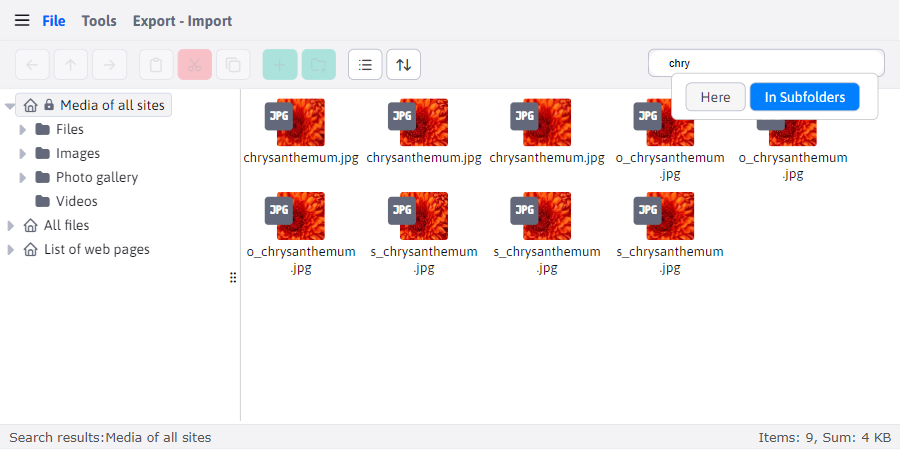 |

## Navigation bar

It contains sorted file folders in a tree structure. If folders have sub-folders (children) they can be expanded/collapsed as needed. There are also tools for navigating this tree structure **Back to**, **Go to parent folder** a **Next** from section [toolbar](#card-file).

The width of the navigation bar is not fixed and can be changed as required. The tree structure also supports `Drag and Drop`, i.e. it allows you to move folders. Each folder row can contain icons:
- <i class="ti ti-home" ></i>, a main folder that no longer has a parent folder above it
- <i class="ti ti-lock" ></i>, locked folder, read-only
- <i class="ti ti-caret-right-filled" ></i>, a folder that contains sub-folders, but the list is collapsed
- <i class="ti ti-caret-down-filled" ></i>, the folder that contains the sub-folders, and the list is expanded

## Main area

On the main desktop we have all folders and files of the currently selected folder. !>**Warning:** Nested folders and files are not displayed.

As well as the "Navigation Bar", the "Main Desktop" also supports `Drag and Drop` Action. !>**Warning:** action `Drag and Drop` also works between "Main Desktop" and "Navigation Bar", so you can move a folder/file from the desktop directly to the navigation bar folder.

**Left click**, used to label folders and files.

**Double left click**on:
- folder, performs its opening
- to a text file of types `text/plain`, `text/html`, `text/jsp`, `text/javascript`, `text/css`, `text/xml`, `text/x-js`, `text/markdown`, trigger the editing action
- to unsupported files other than `.tld`, will do nothing

**Right click** is mainly used to display the most used tools from [Toolbars](#toolbar). A small window will appear with the available tools, which may vary depending on how the element has been right-clicked.

| Right click on the desktop | Right click on a folder | Right click on a file |
| :-------------------: | :---------------------: | :-----------------: |
| 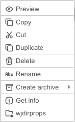 | 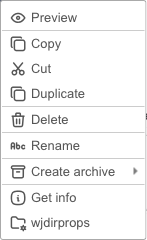    | 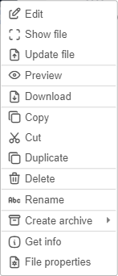   |

As you can see from the previous series of images, the tools displayed vary depending on the selected element. For example, for a file we have the option shown **Download** but not for the folder, since ONLY file downloads are allowed. You may also have noticed the tools we've listed in the [Toolbars](#toolbar) not mentioned, as they don't have their own button in the panel. These are tools:
- <i class="ti ti-reload" ></i>, **Refresh**, it is the action above the main desktop that performs a reload of the current folder's data.
- <i class="ti ti-file-plus" ></i>, **New text file**, an action above the main desktop, allows you to immediately create a text file of the following types in the current folder `TEXT, CSS, HTML`.
- <i class="ti ti-folder-cog" ></i>, **Directory settings**, this is the action above the folder, for more information see [Directory settings](../fbrowser/folder-settings/README.md).
- <i class="ti ti-maximize" ></i>, **View file**, opens the file in a new tab.
- <i class="ti ti-file-upload" ></i>, **Update file**, it's an action over a file, it allows you to upload a new file to replace the selected file (over which we called this action).
- <i class="ti ti-file-settings" ></i>, **File settings**, this is the action above the file, for more information see [File settings](../fbrowser/file-settings/README.md).

## Configuration

- `elfinderMoveConfirm` - by default, a confirmation of the file or folder move is displayed when using drag & drop or copy/paste via the context menu. To disable the file or folder move confirmation, change the value of the configuration variable `elfinderMoveConfirm` at `false`.

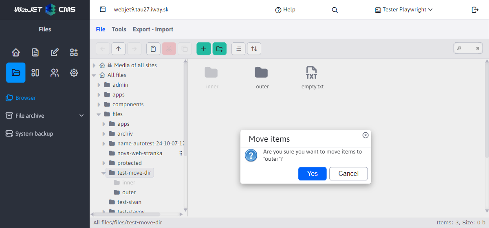

- After setting the conf. variable `iwfs_useVersioning` at `true` the history of changes in the files starts to be written (each file is archived in a folder after uploading and before being overwritten `/WEB-INF/libfilehistory`). The list is available in the explorer in the File Settings context menu, with options to compare, view the historical version, and undo the change. Path `/WEB-INF/libfilehistory` you can edit in the configuration variable `fileHistoryPath` if you need to store files on a network drive, for example.
