# Explorer

File Explorer is an application for managing and working with files.

It consists of several parts:

- toolbar
- navigation bar
- main area
- foot

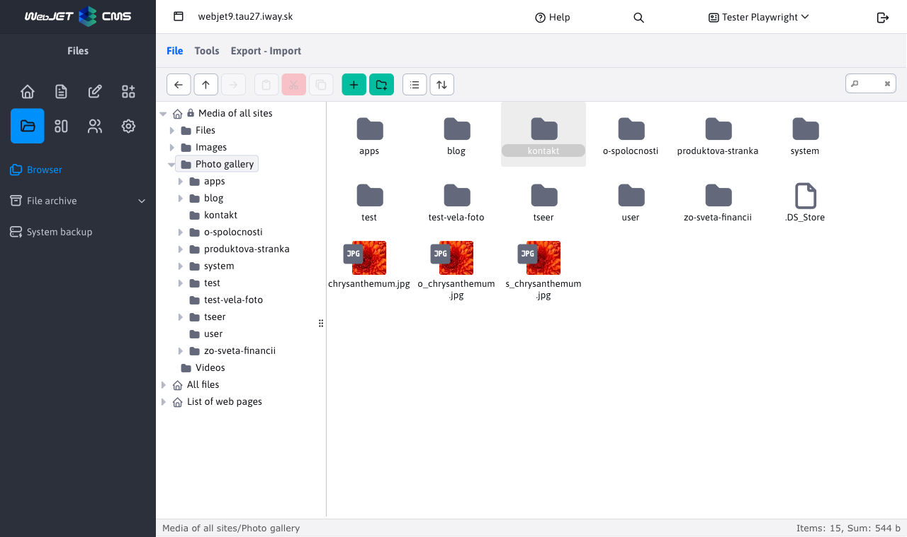

## Toolbar

The toolbar offers a wide selection of tools/functions for working with files and folders of files. Each button offers a different unique tool.

!>**Note:** individual buttons are only activated under specific conditions, so they are not always available. The toolbar also includes a search.

The given tools are logically divided into 3 tabs:

- File
- Tools
- Export - Import

### File tab

The File tab offers basic options for working such as:

- <button class="btn btn-sm btn-outline-secondary"><i class="ti ti-arrow-left"></i></button> , **Back**, navigates one step back in the tree structure. Option available only if another folder was selected before the currently selected folder.
- <button class="btn btn-sm btn-outline-secondary"><i class="ti ti-arrow-up"></i></button> **Go to parent folder**, navigates one level up in the tree structure. This option is only available if the currently selected folder has a parent folder that we can navigate to.
- <button class="btn btn-sm btn-outline-secondary"><i class="ti ti-arrow-right"></i></button> , **Next**, navigates one step forward in the tree structure. Option available only if **Back** was used.

- <button class="btn btn-sm btn-outline-secondary"><i class="ti ti-clipboard"></i></button> , **Paste**, inserts the copied/cut file or folder into the currently selected location.
-<button class="btn btn-sm btn-danger"><i class="ti ti-cut"></i></button> , **Cut**, copies the selected file/folder from the source location. When pasted into the destination location, the original from the source location is deleted.
-<button class="btn btn-sm btn-outline-secondary"><i class="ti ti-copy"></i></button> , **Copy**, copies the selected file/folder
  

-<button class="btn btn-sm btn-success"><i class="ti ti-plus"></i></button> **Upload files**, allows you to upload files to the currently selected location.
-<button class="btn btn-sm btn-success"><i class="ti ti-folder-plus"></i></button> **New Folder**, allows you to create a new folder in the currently selected location.
  

-<button class="btn btn-sm btn-outline-secondary"><i class="ti ti-list"></i></button> , **List**, changes the view of files/folders in the work area to a list view.
- <button class="btn btn-sm btn-outline-secondary"><i class="ti ti-layout-grid"></i></button> , **Icons**, changes the display of files/folders in the work area to an icon view.

List | Icons
:-------------------------:|:-------------------------:

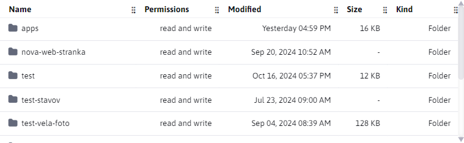

 | 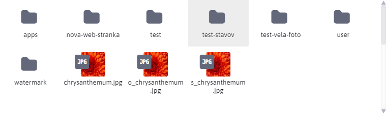

- <button class="btn btn-sm btn-outline-secondary"><i class="ti ti-arrows-up-down"></i></button> , **Sort**, allows you to sort files/folders according to the selected criteria.

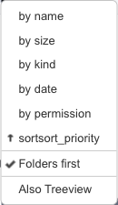

### Tools tab

It offers advanced tools for working with folders/files.

- <button class="btn btn-sm btn-outline-secondary"><i class="ti ti-file-download"></i></button> , **Download**, allows you to download the selected file (ONLY the file).

-<button class="btn btn-sm btn-outline-secondary"><i class="ti ti-eye"></i></button> , **Preview**, provides different functionality depending on the selected element, the basis is always a dialog window that can be enlarged/reduced. **Only one window** can be open at a time. When selecting another file/folder, the window is updated (a new one is not opened). You can use the arrows to change the selected file/folder in the currently selected location.
  - A folder or regular file, will provide information about the name and last modification.
  - A text file like `text/plain`, `text/html`, `text/jsp`, `text/javascript`, `text/css`, `text/xml`, `text/x-js`, `text/markdown`, will open the file in a dialog box (however, the file **cannot be edited**).
  - The image will be displayed as a preview in the dialog box.

Folder/file            |  Text files           | Image
:-------------------------:|:-------------------------:|:-------------------------:

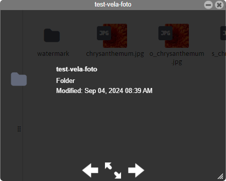

  |  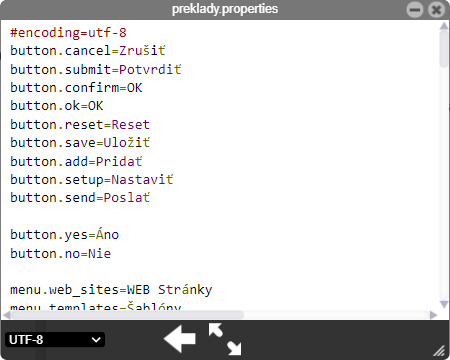  | 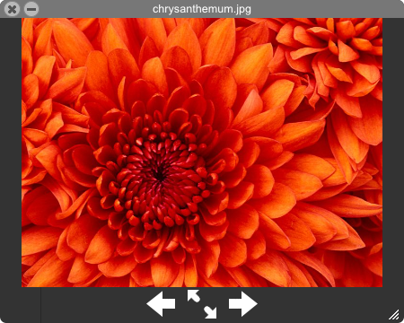

- <button class="btn btn-sm btn-outline-secondary"><i class="ti ti-info-square-rounded"></i></button> **Get Info** provides detailed information about the selected file/folder, which is displayed in a window. There can be more than one of these windows (unlike **Preview**). If you select multiple files/folders, you will only get information about their number and total size.

Folder | File
:-------------------------:|:-------------------------:

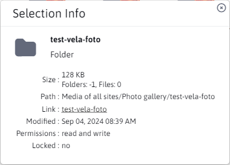

 | 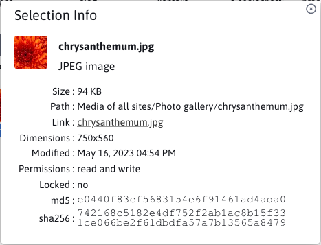

!>**Note:** Folder size counts the size of files in a given folder, it does not count files in subfolders.

  

-<button class="btn btn-sm btn-warning"><i class="ti ti-edit"></i></button> , **Edit**, allows editing files and ONLY files. For more information, see [Editing Files](../fbrowser/file-edit/README.md).
-<button class="btn btn-sm btn-duplicate"><i class="ti ti-copy"></i></button> **Duplicate**, allows you to duplicate the selected folders/files. The cloned folders/files will be saved to the same location from which they were duplicated.
-<button class="btn btn-sm btn-danger"><i class="ti ti-trash"></i></button> **Delete**, allows you to permanently delete the selected folders/files.
-<button class="btn btn-sm btn-outline-secondary"><i class="ti ti-abc"></i></button> **Rename**, allows you to rename a folder/file. Only ONE folder/file can be selected at a time.
  

- <button class="btn btn-sm btn-outline-secondary"><i class="ti ti-archive-off"></i></button> **Create archive**, allows you to archive all selected folders/files into a single ZIP archive (ZIP is the only supported). The archive will be saved in the same location as the selected folders/files.
-<button class="btn btn-sm btn-outline-secondary"><i class="ti ti-archive"></i></button>**Extract files from archive**, allows you to extract data from selected ZIP archives. The extraction will be performed in the same location where the archive is located.

### Export - Import tab

Clicking on the Export - Import tab will open a dialog box for exporting/importing/rollbacking files.

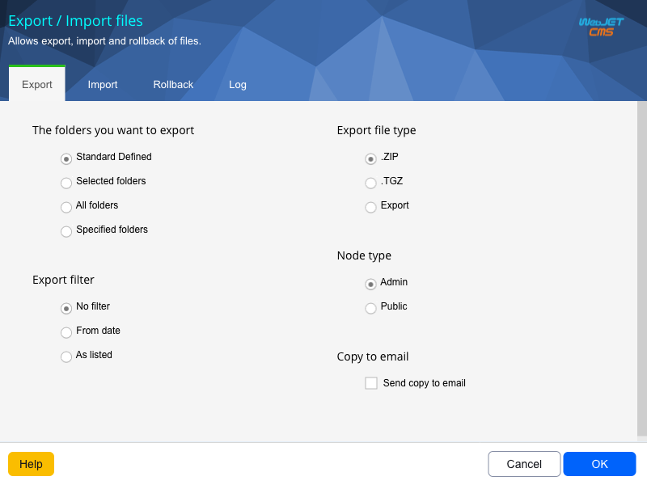

### Search

In the right part of the toolbar, a file search is available . Files are searched by name as well as by extension. The default is the "Here" mode, which searches only files in the currently selected folder. In the "In subfolders" mode, files are searched both in the current folder and in all subfolders (and in all nesting levels).

"Here" mode | "In subfolders" mode
:-------------------------:|:-------------------------:

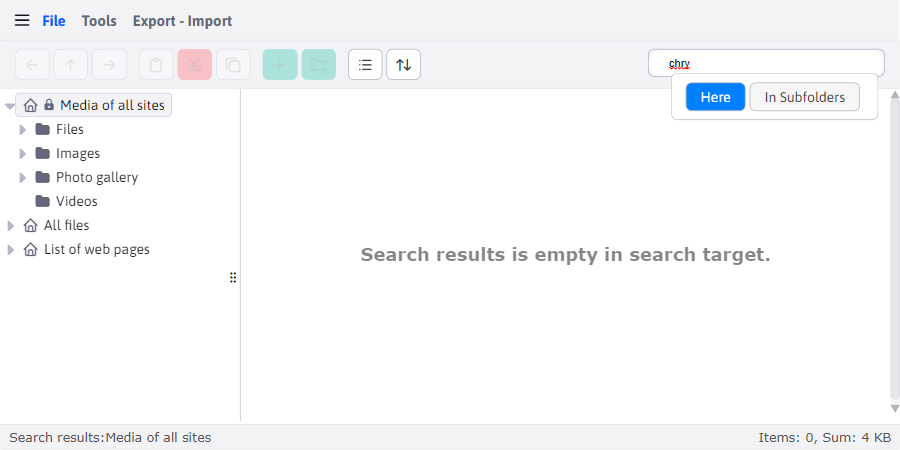

 | 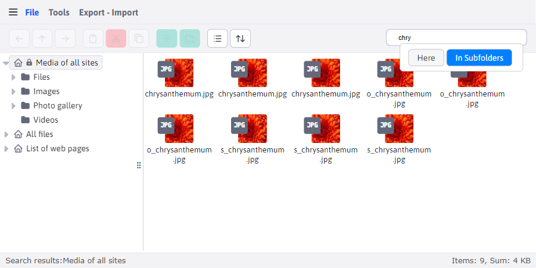

## Navigation bar

It contains sorted folders with files in the form of a tree structure. If the folders have subfolders (children), they can be expanded/collapsed as needed. For navigation in this tree structure, there are also tools **Back**, **Go to parent folder** and **Next** from the [toolbar] section (#file-tab).

The width of the navigation bar is not fixed, and can be changed as needed. The tree structure also supports `Drag and Drop`, which allows moving folders. Each row with a folder can contain icons:

-<i class="ti ti-home"></i> , a root folder that no longer has a parent folder above it
-<i class="ti ti-lock"></i> , locked folder, read only allowed
-<i class="ti ti-caret-right-filled"></i> , a folder that contains subfolders, but the list is collapsed
-<i class="ti ti-caret-down-filled"></i> , a folder that contains subfolders, and the list is expanded

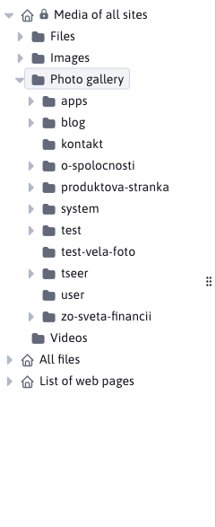

## Main area

On the main screen we have all the folders and files of the currently selected folder.
!>**Warning:** Nested folders and files are not displayed.

Like the "Navigation Bar", the "Home" also supports the `Drag and Drop` action.
!>**Note:** the `Drag and Drop` action also works between the "Home" and "Navigation bar", so you can move a folder/file from the home screen directly to the navigation bar folder.

**Left click**, used to select folders and files.

**Double left click**, on:

- folder, opens it
- on a text file of types `text/plain`, `text/html`, `text/jsp`, `text/javascript`, `text/css`, `text/xml`, `text/x-js`, `text/markdown`, run the edit action
- on other unsupported files like `.tld`, it will do nothing

**Right-click** is mainly used to display the most commonly used tools from the [Toolbar](#toolbar). A small window will appear with the available tools, which may vary depending on the element you right-clicked on.

Right click on the desktop       |  Right click on the folder  | Right click on the file
:-------------------------:|:-------------------------:|:-------------------------:

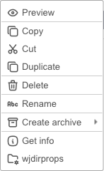

      |  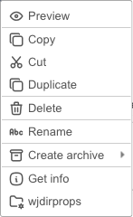       | 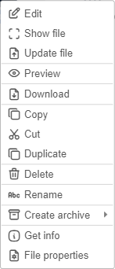

As you can see from the previous series of images, the tools displayed vary depending on the element selected. For example, for a file we have the **Download** option displayed, but not for a folder, as ONLY downloading files is allowed.
You may also have noticed tools that we didn't mention in the [Toolbar](#toolbar) section because they don't have their own button in the panel. These are the tools:

-<i class="ti ti-reload"></i> **Refresh** is an action above the main interface that reloads the data of the current folder.
-<i class="ti ti-file-plus"></i> **New text file**, this is an action above the main area, allows you to immediately create a text file of these types `TEXT, CSS, HTML` in the current folder.
-<i class="ti ti-folder-cog"></i> **Directory settings**, this is an action on a folder, more information in the [Directory settings] section (../fbrowser/folder-settings/README.md).
-<i class="ti ti-maximize"></i> **View file** opens the file in a new tab.
-<i class="ti ti-file-upload"></i> **Update file**, this is an action on a file, it allows you to upload a new file that will replace the selected file (on which we called this action).
-<i class="ti ti-file-settings"></i> **File settings**, this is an action on a file, more information in the [File settings] section (../fbrowser/file-settings/README.md).

## Configuration

- `elfinderMoveConfirm` - ​​by default, a confirmation of moving a file or folder is displayed when using the "drag & drop" function or copy/paste via the context menu. If you want to disable confirmation of moving a file or folder, change the value of the configuration variable `elfinderMoveConfirm` to `false`.

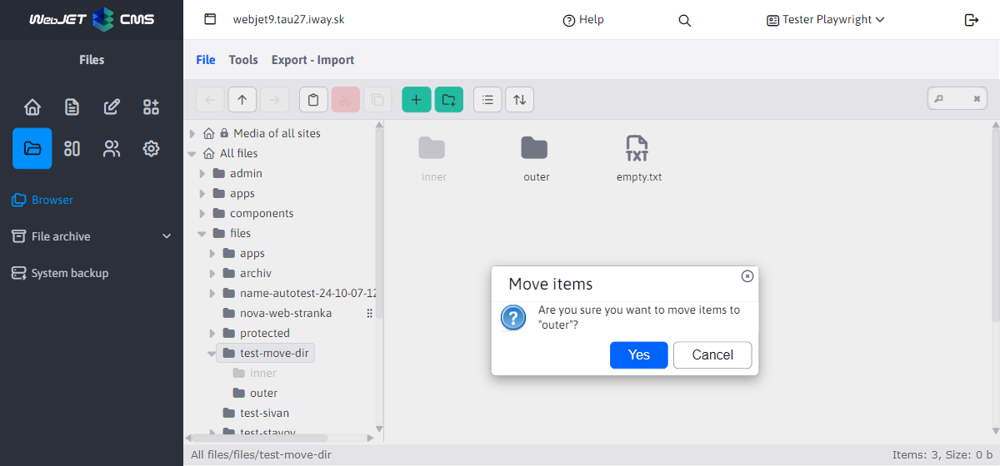

- After setting the config. variable `iwfs_useVersioning` to `true`, the history of changes in files will start to be recorded (each file is archived to the folder `/WEB-INF/libfilehistory` after uploading and before overwriting). The list is available in the explorer in the File settings context menu with the option to compare, view historical versions and revert changes. You can edit the path `/WEB-INF/libfilehistory` in the configuration variable `fileHistoryPath` if you need to save files, for example, to a network drive.