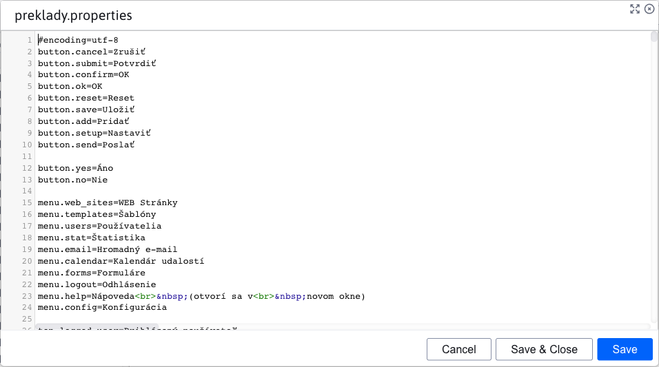
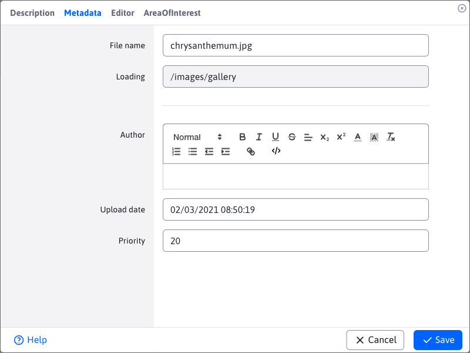
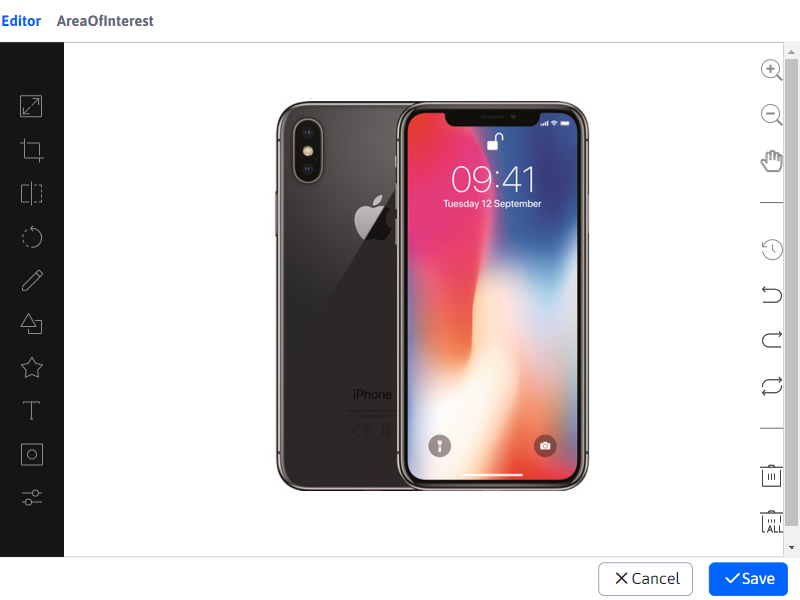

# Editing files

Because editing files in the application [Explorer](../../fbrowser/README.md) has multiple states, we address it in this separate section.

When editing text files as `.text .json .properties` a dialog box will be called up, similar to the **Preview**. The difference is that this dialog can be opened for multiple files at the same time and allows editing of the file itself.

Image editing varies by file location.

If the image path **Contains** Part of `/gallery`, so that means it's a picture from the gallery. In this case, it will open in a new browser window in the application [Gallery](../../../../redactor/apps/gallery/README.md), where the editor will automatically open for the image.

If the image path **does not contain** Part of `/gallery`, opens the image editor dialog box, which is the same as the application editor [Gallery](../../../../redactor/apps/gallery/README.md).

