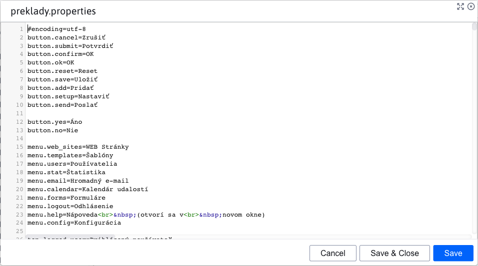
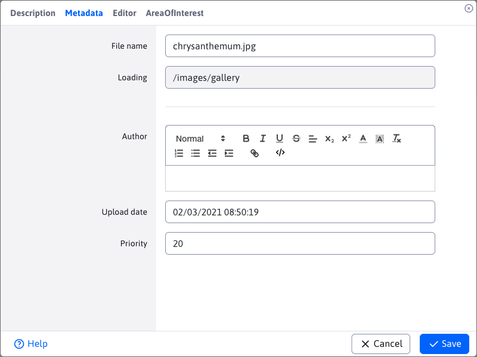
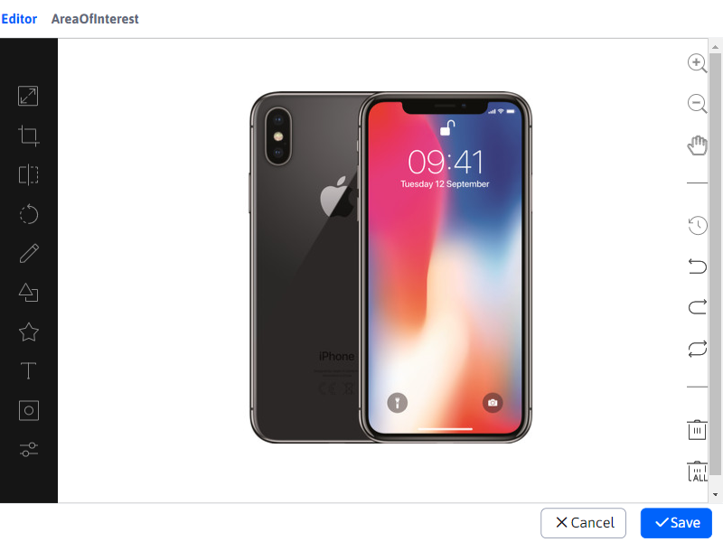

# Editing files

Since editing files in the [Explorer](../../fbrowser/README.md) application has multiple states, we will cover it in this separate section.

When editing text files like `.text .json .properties`, a dialog box is brought up, similar to **Preview**. The difference is that this dialog box can be open for multiple files at the same time and allows editing of the file itself.

Image editing varies depending on the file location.

If the image path **contains** the `/gallery` part, it means that it is an image from the gallery. In this case, the [gallery] application (../../../../redactor/apps/gallery/README.md) will open in a new browser window, where the editor for the given image will automatically open.

If the image path **does not** contain the `/gallery` part, a dialog box with an image editor will open, which is the same as the [gallery] application editor (../../../../redactor/apps/gallery/README.md). 

