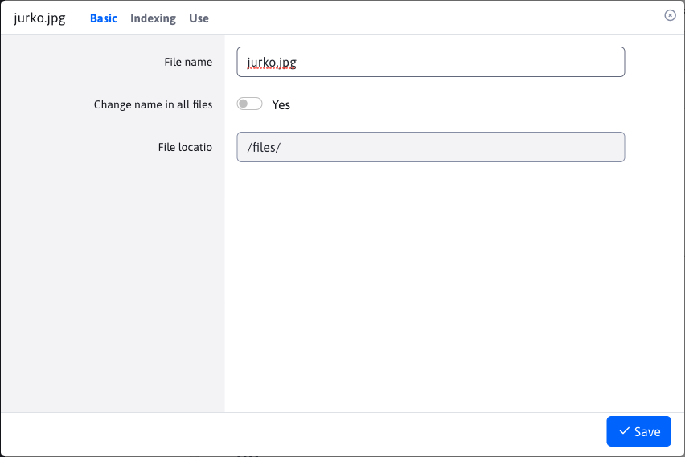
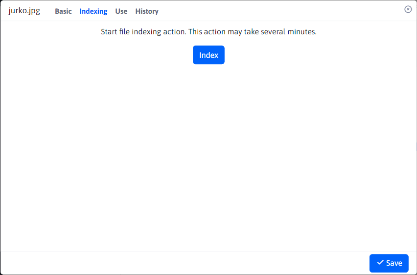
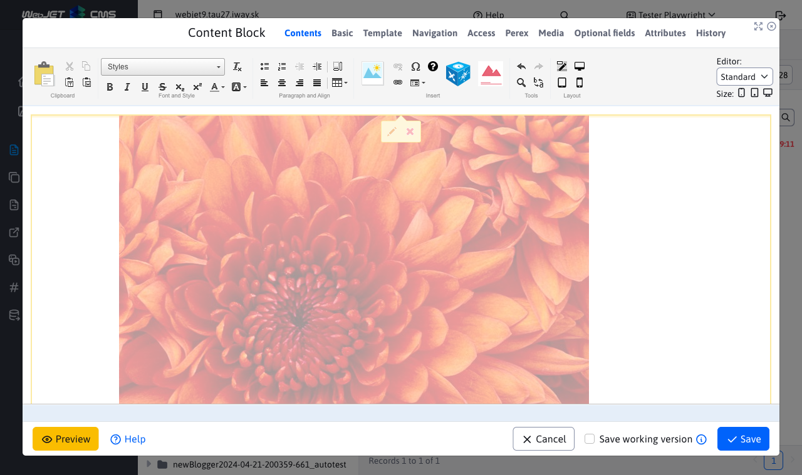
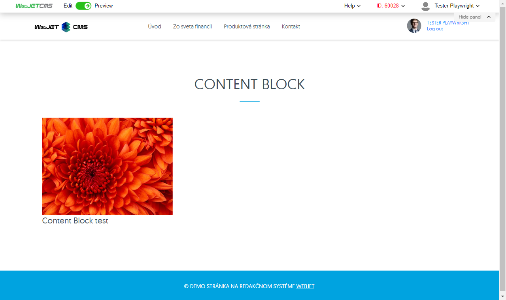

# File settings

To view the file settings, right-click on the file and select File Settings. The window contains the following tabs:
- Basic
- Indexing (**Attention** shown only in special circumstances)
- Use

## Tab - Basic

Informs about the name and location of the file. The file name can be changed.

The "Change name in all files" parameter overwrites the file name with the new one, so that the link to this file will be up-to-date after the name change.

## Tab - Indexing

The tab is displayed ONLY if the location of the file starts with the value `/files`. Used for file indexing actions.

After pressing the "Index" button, the indexing will start, which can take several minutes.

## Tab - Usage

Shows the use of a folder in the form of a nested data-table. Each entry represents a web page using that file. The data table contains columns:
- Name, website
- URL address, website
The two values are simultaneously lines pointing to different locations.

**Name** web site is a link to [List of web pages](../../../../redactor/webpages/README.md), where the web page is searched and the editor is automatically opened.

**URL address** web page is a link directly to the web page.

