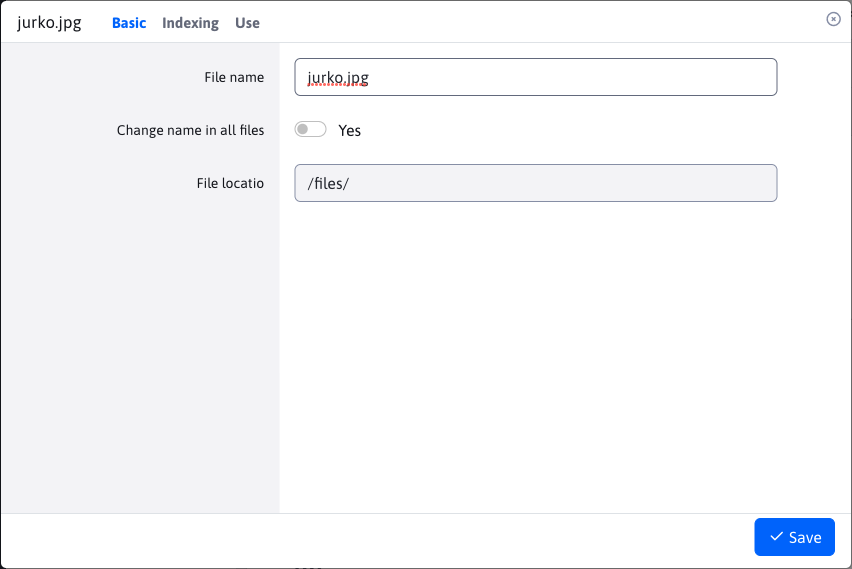
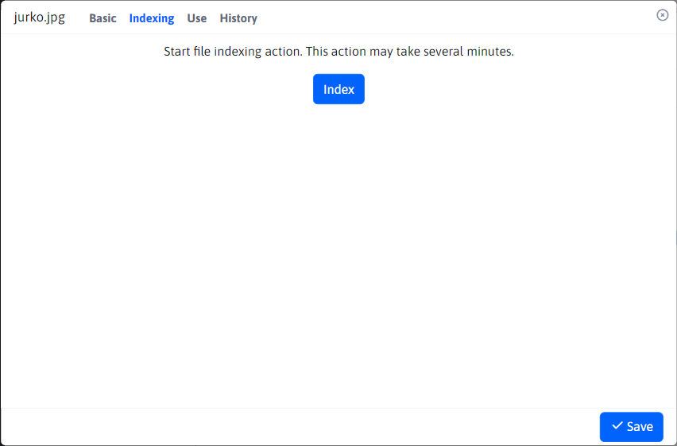
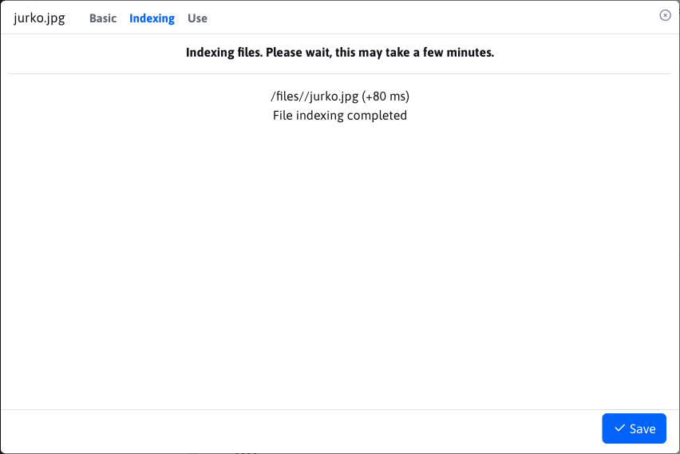
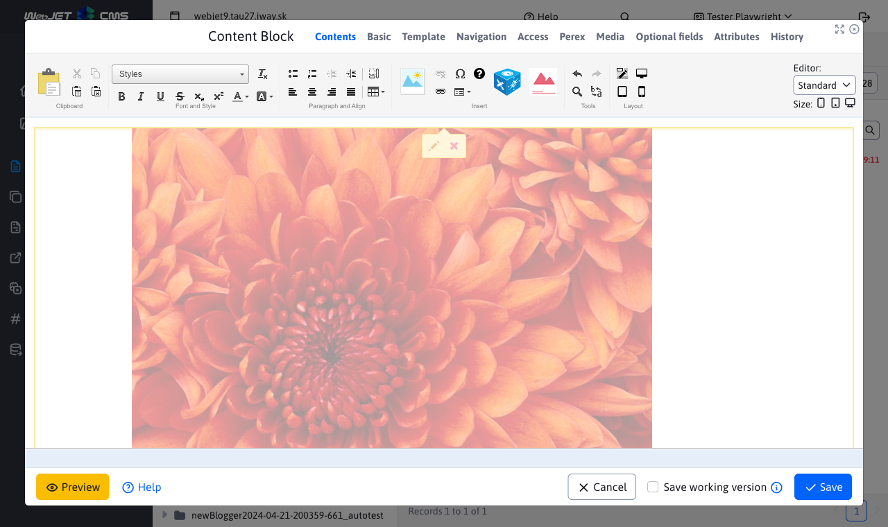
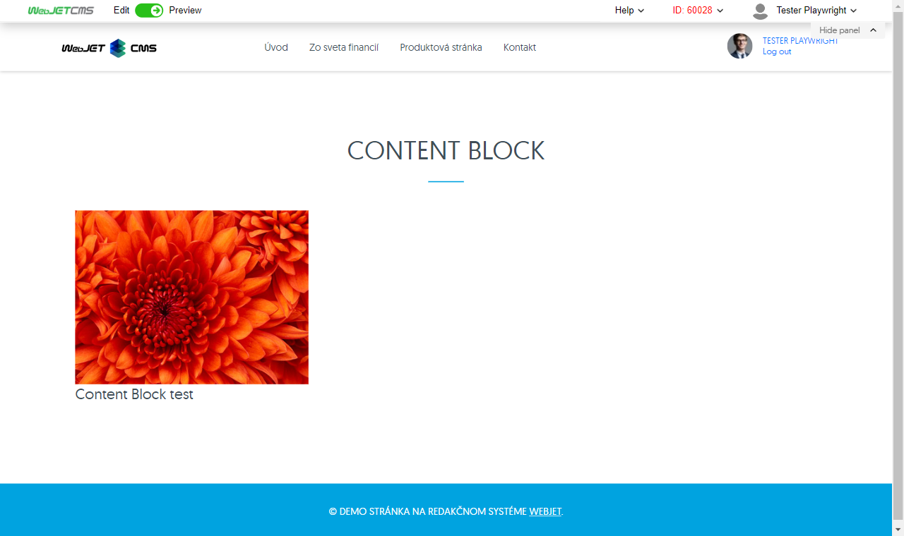

# File settings

To view file settings, right-click the file and select File Settings. The window contains the following tabs:

- Basic
- Indexing (**Warning:** only displayed under special circumstances)
- Use

## Basic

The **Basic** tab provides information about the file name and location. The file name can be changed.

The "Rename all files" parameter overwrites the file name with a new one so that the link to this file is up-to-date after changing its name.

## Indexing

The **Indexing** tab is ONLY displayed if the location of the given file starts with the value `/files`. It is used for file indexing actions.

After pressing the "Index" button, indexing will start, which may take several minutes.

## Use

The **Usage** tab shows the folder usage in the form of a nested data table. Each entry represents a web page using the given file. The data table contains the following columns:
- Name, website
- URL address, website

Both values ​​are simultaneously lines pointing to different locations.

**Website name** is a link to [Website list](../../../../redactor/webpages/README.md), where the given website will be searched and the editor will automatically open.

The **URL address** of a website is a link directly to that website.

