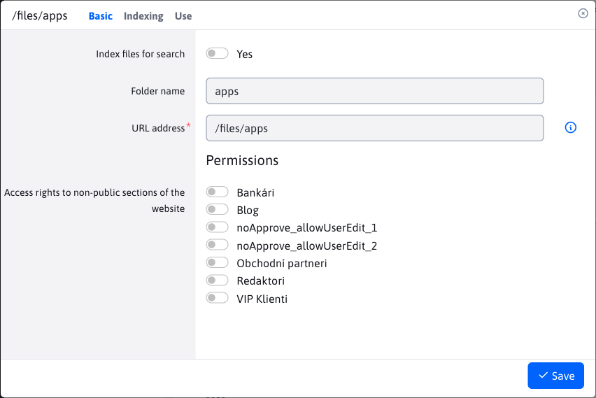
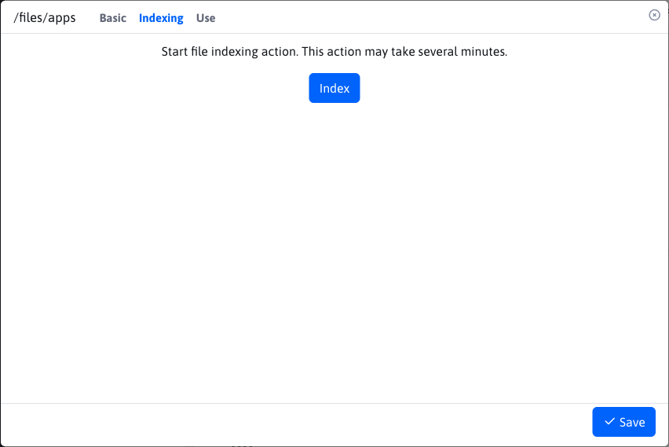
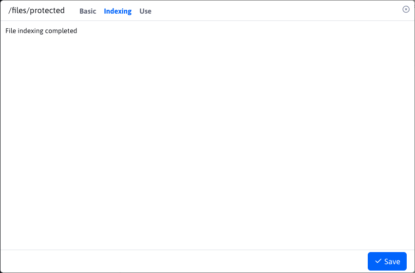
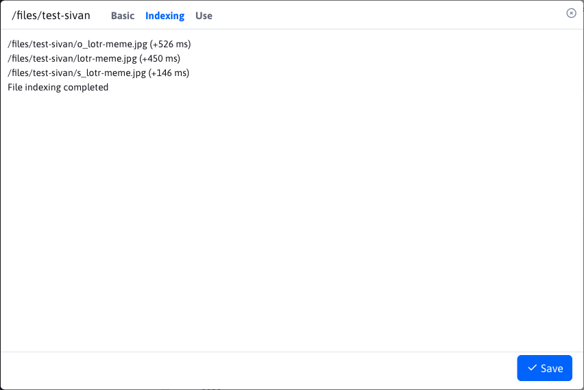
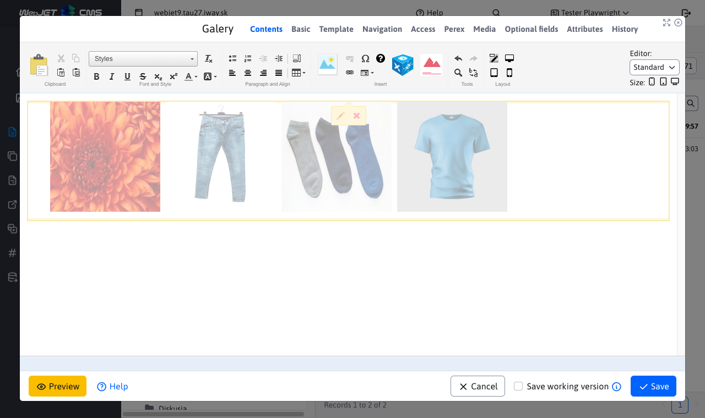
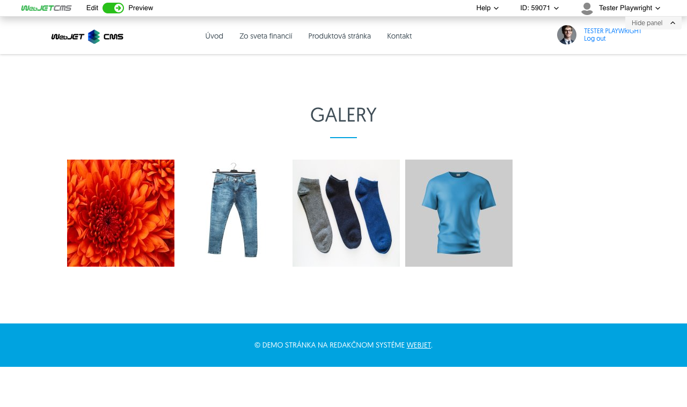

# Folder settings

To view the folder settings, right-click the folder and select Folder Settings. The window contains the following tabs:
- Basic
- Indexing (**Attention** shown only in special circumstances)
- Use

## Tab - Basic

Provides basic information about the folder as well as the ability to restrict access rights using the User Group.

Use the "Index files for search" option to enable indexing of the files in the folder.

## Tab - Indexing

The tab will be displayed ONLY if the URL of the folder starts with the value `/files`. Used for file indexing actions. Indexing is performed ONLY if enabled in [Map - Basic](#karta---základné).

After pressing the "Index" button, the indexing will start, which can take several minutes.

| Indexing is not enabled or no files were found to be indexed       | Indexing is enabled and files were found to be indexed  |
| :----------------------------------------------------------------: | :-----------------------------------------------------: |
|                                |                 |

## Tab - Usage

Shows the use of a folder in the form of a nested data-table. Each entry represents a web page. The data-table contains columns:
- Name, website
- URL address, website
The two values are simultaneously lines pointing to different locations.

**Name** web site is a link to [List of web pages](../../../../redactor/webpages/README.md), where the web page is searched and the editor is automatically opened.

**URL address** web page is a link directly to the web page.

