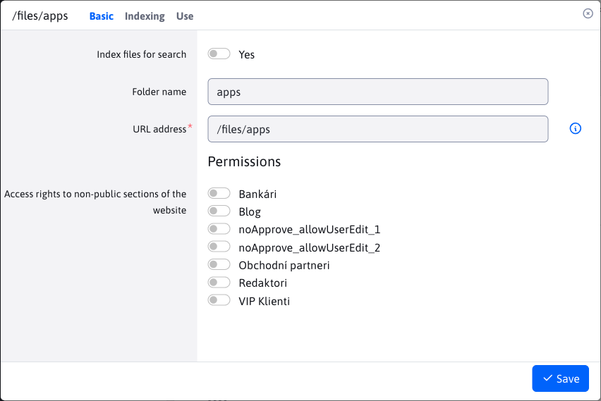
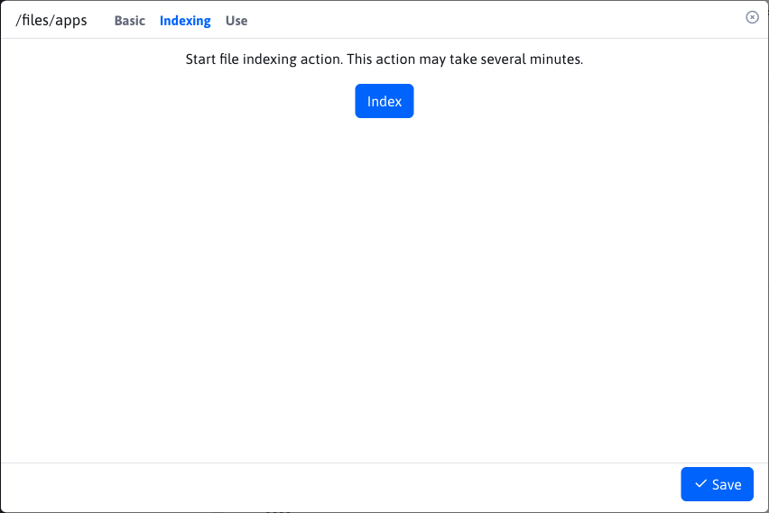
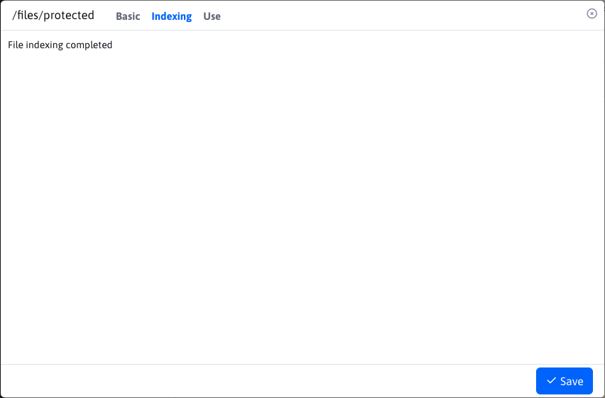
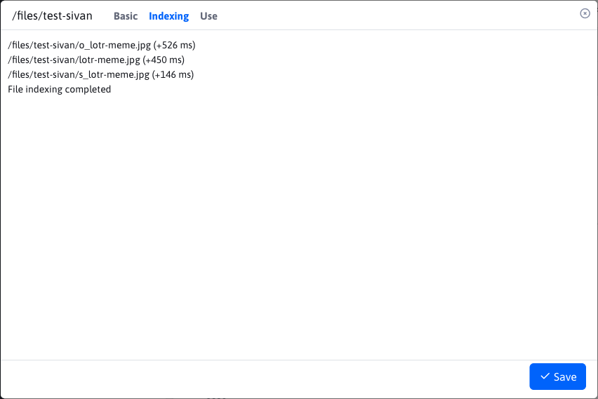
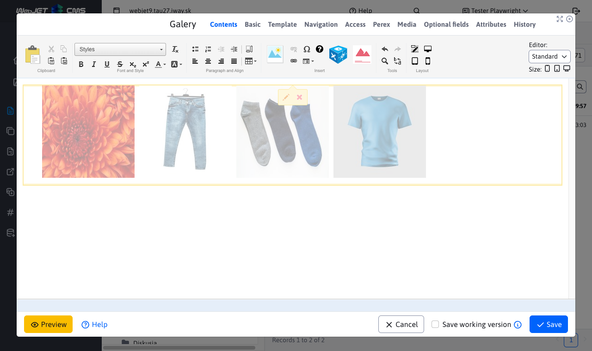
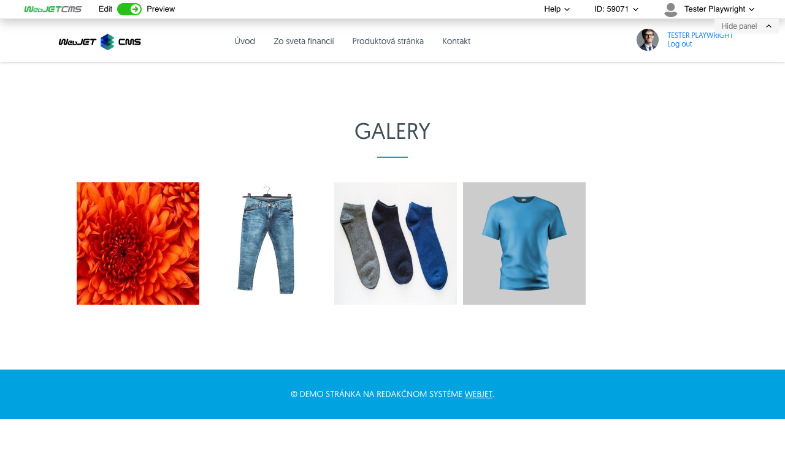

# Folder settings

To view folder settings, right-click on a folder and select Folder Settings. The window contains the following tabs:

- Basic
- Indexing (**Warning:** only displayed under special circumstances)
- Use

## Basic

The **Basic** tab provides basic information about the folder as well as the ability to restrict access rights using User Groups.

The "Index files for search" option enables indexing of files in the given folder.

## Indexing

The **Indexing** tab is displayed ONLY if the URL of the given folder starts with the value `/files`. It is used for file indexing actions. Indexing is performed ONLY if enabled in the [Basic](#basic) tab.

After pressing the "Index" button, indexing will start, which may take several minutes.

Indexing is not enabled or no files were found to index | Indexing is enabled and files were found to index
:-----------------------------------------------------------------:|:-----------------------------------------------------------------:

 | 

## Use

The **Usage** tab displays the folder usage in the form of a nested data table. Each entry represents a web page. The data table contains the following columns:
- Name, website
- URL address, website

Both values ​​are simultaneously lines pointing to different locations.

**Website name** is a link to [Website list](../../../../redactor/webpages/README.md), where the given website will be searched and the editor will automatically open.

The **URL address** of a website is a link directly to that website.

