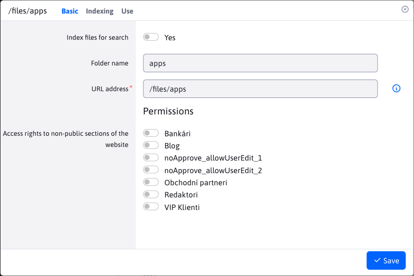
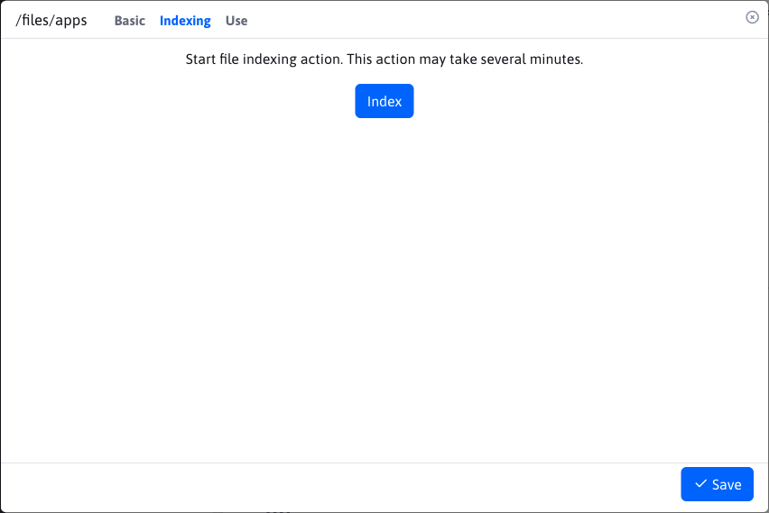
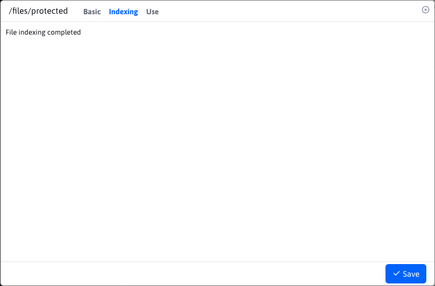
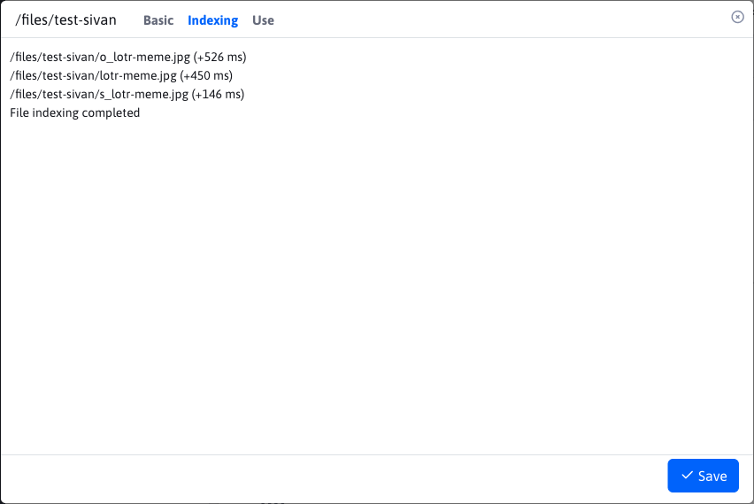
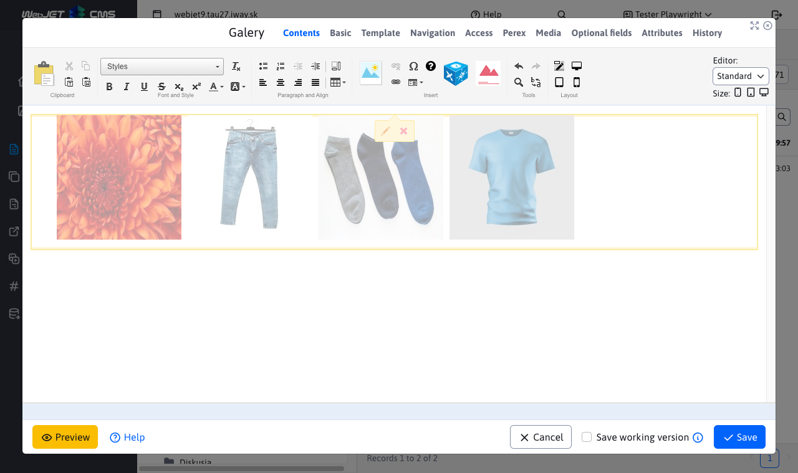
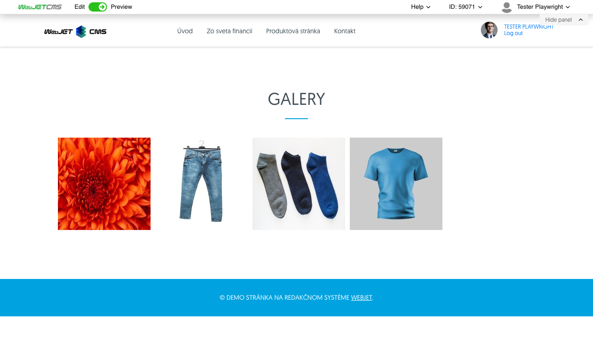

# Folder settings

To view folder settings, right-click on a folder and select Folder Settings. The window contains the following tabs:

- Basic
- Indexing (**Warning:** only displayed under special circumstances)
- Use
- Unused files

## Basic

The **Basic** tab provides basic information about the folder as well as the ability to restrict access rights using User Groups.

The "Index files for search" option enables indexing of files in the given folder.

## Indexing

The **Indexing** tab is displayed ONLY if the URL of the given folder starts with the value `/files`. It is used for file indexing actions. Indexing is performed ONLY if enabled in the [Basic](#basic) tab.

After pressing the "Index" button, indexing will start, which may take several minutes.

Indexing is not enabled or no files were found to index | Indexing is enabled and files were found to index
:-----------------------------------------------------------------:|:-----------------------------------------------------------------:

 | 

## Use

The **Usage** tab displays the folder usage in the form of a nested data table. Each entry represents a web page. The data table contains the following columns:

- Name, website
- URL address, website

Both values ​​are simultaneously lines pointing to different locations.

**Website name** is a link to [Website list](../../../../redactor/webpages/README.md), where the given website will be searched and the editor will automatically open.

The **URL address** of a website is a link directly to that website.

## Unused files

The **Unused Files** tab is used to find and remove files that have no known use in known parts of the system. It helps free up disk space and keep folders organized by highlighting files that are probably no longer needed.

!> The tab is only available to a user with file management rights who also has write rights to the selected folder. The tab will not be visible to other users.

### Starting the check

The new scan **does not start automatically** - you must always start it manually. However, if the last scan is available for the current administrator, domain, and folder, opening the tab will automatically refresh its status, **Include subfolders** radio button setting, and result. If the scan is still running, tracking its status will also refresh. To start a new scan:

1. If necessary, enable the **Include subfolders** switch. It is off by default, so only files directly in the selected folder are scanned. When enabled, all its subfolders are also scanned.
2. Start the check with the button <button class="btn btn-sm btn-warning" type="button"><i class="ti ti-line-scan"></i></button> **Start scan**.
3. Wait for it to complete. The scan runs in the background, the folder window remains usable, and its status is updated continuously.

The status of the check is displayed in the information bar above the table:

Status | Meaning
:----|:------
The check has not yet been run. | Initial state before first run.
Checking unused files... | Checking in progress.
Number of unused files found: N | The scan finished and found N files.
No unused files found. | Scan finished, all files are in use.

### Result and deletion

The result is displayed in a table that contains the following columns:

- **File name** – click to open a preview of the file
- **URL address** – full virtual path to the file
- **Date** – date of last file change
- **Size**

There are two ways to remove files from the result:

- Delete marked files with the button <button class="btn btn-sm buttons-selected btn-danger" type="button"><i class="ti ti-trash"></i></button> **Delete marked**.
- You can delete the entire displayed result at once by pressing the button <button class="btn btn-sm btn-danger" type="button"><i class="ti ti-recycle"></i></button> **Delete all**.

!> The deletion is irreversible. Before confirming, please check that these are files that you no longer need. Also read the [Restrictions](#restrictions) section, as the system may not recognize use from some sources.

?> Each administrator runs their own scan with their own result. The results are not shared between administrators or domains and can only be retrieved by the user who ran the scan. The completed result is stored in the application memory for 30 minutes and is automatically loaded when the same folder is reopened. After this time, the scan must be run again. Files that have ceased to exist in the meantime will not be displayed when the result is reloaded.

### What is being checked?

The check compares files with their use in published websites and in selected parts of the system:

- external site links,
- banners,
- calendar,
- discussion forum,
- gallery,
- media,
- tips of the day,
- links in the template and component files of the respective installation.

System and hidden paths are **not included** in the result, namely:

- `/WEB-INF`, `/META-INF`, `/admin`, `/wjerrorpages`,
- folder `/components` (except for the components folder of the current installation),
- hidden folders (containing `/.`) and folders `CVS`.

### Simultaneous work of multiple administrators

Multiple administrators can work with a card at the same time. To prevent a file from being checked at the exact moment another administrator is deleting it, the system follows simple rules:

- **Checks never block each other.** Multiple administrators can check the same folder at the same time, and each will receive their own result.
- **The deletion will be locked to the folder.** While a deletion is in progress in the folder, another scan or deletion of the same folder will not be initiated.
- **A conflicting action will not be queued.** If an action is blocked, the system rejects it immediately (it does not wait for release). Simply re-run it after the ongoing operation is complete.

The following table shows what is allowed and what is temporarily blocked:

Concurrent Operations | Behavior
:-----------------|:---------
Two checks of the same folder | ✅ Allowed - each administrator gets their own result.
Checking and deleting in the same folder | ⛔ The second operation is blocked.
Checking *with* subfolders + deleting in its subfolder | ⛔ The second operation is blocked.
Scan *without* subfolders + delete in its subfolder | ✅ Enabled – the scan does not affect the subfolder.
Subfolder check + deletion in parent folder | ✅ Allowed.
Two deletions in the same folder | ⛔ The second operation is blocked.
Deletions in different folders (e.g. parent and subfolder) | ✅ Allowed – a specific folder is always locked.

?> If a single request deletes files from multiple folders, the system will first check and reserve all affected folders. If there is a conflict, it will reject the entire request before deleting the first file.

### Restrictions

Before starting the scan and deletion, it is good to know the following limitations:

- **The scan may take a while.** With a large number of files or websites, it may take several minutes. A maximum of two scans are running at a time, with more waiting in line. A pending scan also temporarily blocks deletion in the folders it covers.
- **Only usage from known sources is recognized.** The check recognizes standard WebJET CMS locations and database fields. If you use a file from your own code, an external system, a configuration file, or other non-standard source, the system may not recognize it and may mistakenly mark the file as unused.
- **Use is not re-verified between check and deletion.** Deletion is based on the result of the last check and does not compare the size or modification date of the file. If someone starts using or modifying the file in the meantime, deletion does not know about it.
- **A security check is performed before each deletion.** The system verifies the file path, its type, and your write rights. A file that has ceased to exist in the meantime is considered securely deleted; a file that fails to be deleted remains in the result.
- **Coordination only applies within a single server.** When running on multiple servers (nodes), operations running on different servers do not block each other.
