# Document manager

An application for managing documents and their versions in one place. It also allows you to set up future document publishing, categorize individual documents, and assign them to products. To work with the application, you will need the Document Manager (`cmp_file_archiv`) right.

## Documents

In the displayed list, we see all documents that have been uploaded to the manager in the currently selected domain. The default filtering is to display only **main documents**, in other words, current versions of documents.


### Document status

The status of documents is displayed in the **Status** column, which contains icons representing the individual statuses that documents can take on.

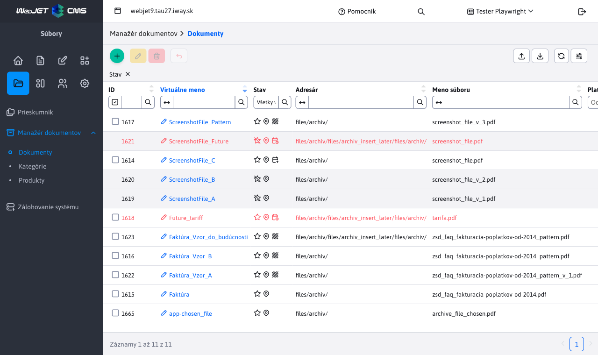

-<i class="ti ti-star"></i> - **Current version of the document** or in other words **master document**, which is currently in use and may (but may not) have one or more **historical versions**. The value of the **Reference** column is -1.
-<i class="ti ti-star-off"></i> - **Historical version of the document**, which was used in the past and is now replaced by the **main document**. These historical versions are marked in gray in the table for better identification. The value of the **Reference** column is greater than 0;
-<i class="ti ti-map-pin"></i> - **Displays document**, meaning they **have** permission to view files
-<i class="ti ti-map-pin-off"></i> - **Does not display document**, meaning they **are** not allowed to display files
-<i class="ti ti-texture"></i> - **Template** of another main document (which is not a template). If the referenced main document is a form, the template can be, for example, a form filled out in a template.
-<i class="ti ti-calendar-time" style="color : #E00028!important"></i> - **Document pending upload (in the future)** is a document that has been uploaded with a delay. This means that it will be automatically uploaded in the future at the selected date and time. Once the document has been successfully uploaded, it **will** no longer have this status. Documents with this status are marked in red as they are special.
-<i class="ti ti-calendar-plus"></i> - **There is a new version of the document waiting to be uploaded (in the future)** The document has a new version that is to replace it as the **main document** in the future. The document will be automatically replaced and this version will then become the **historical version**.

## Inserting a new document into the manager

In this section, we will first review the contents of the individual tabs and then explain the procedure and possible problems when inserting a new document into the manager.

### Tab - Basic

The card contains basic information for inserting a document.

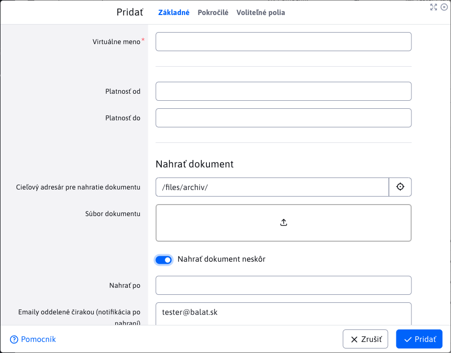

- **Name** - enter the name of the document that will be displayed on the page (as a link to the document). The field is **required**. It may contain accents, spaces, special characters.
- **Valid from** - set the date and time when the document starts to be valid
- **Valid until** - set the date and time of the end of the document's validity
- **Destination directory for document upload** - select the directory where you want to upload the document (this will be useful later when filtering the display of documents on the page). The default destination directory is set with the configuration variable ```fileArchivDefaultDirPath```. The user will also be able to select a subfolder.
- **File** - a field for uploading a file that represents a document. You can read more about the ```UPLAOD``` field [here](../../../developer/datatables-editor/field-file-upload.md). You can set the allowed file extensions using the ```fileArchivAllowExt``` configuration variable.
- **Upload document later** - if you need to upload a document to the manager at a specific time and date, you can set the document to be uploaded automatically in the future. Selecting this option will display hidden fields
  - **Upload after** - select the date and time after which the document should be uploaded
  - **Comma-separated emails (notification after upload)** - enter comma-separated emails to which you want to send notification about successful/unsuccessful document upload

### Tab - Advanced

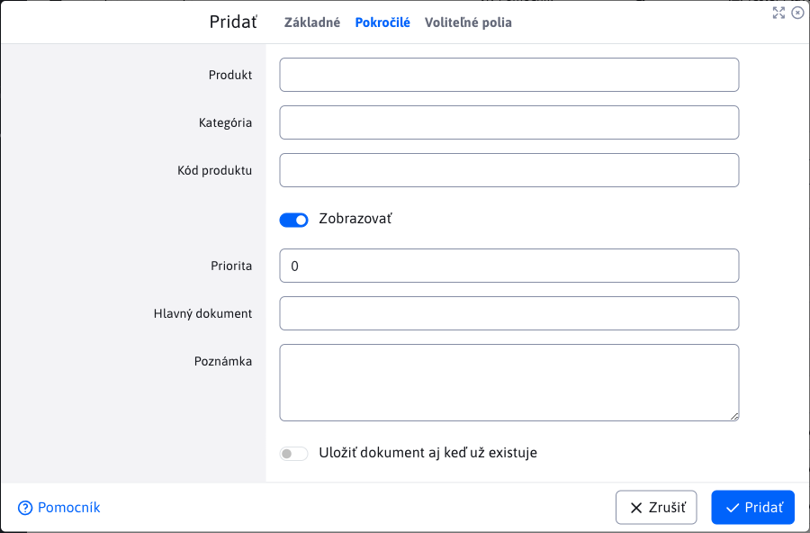

- **Product** - enter any product name. The field will automatically offer you other products already defined in the manager. You can use the [Products](./product-manager.md) section for management.
- **Category** - enter any category name. The field will automatically offer you other already defined categories in the manager. You can use the [Categories](./category-manager.md) section for management.
- **Product Code** - enter any product code name
- **Show** - setting for displaying the document on the page (if you do not want to display the document on the page, uncheck this setting)
- **Browse** - allows you to enable file indexing. New files have this option enabled by default. More
- **Priority** - using priority you can freely set the order in which documents are displayed on the page
- **Main document** - reference to the main document. The field offers paths to individual main documents that the current document can refer to, making it a **template**. Only document paths that meet the following are offered:
  - it is not the same document that is being edited
  - the document must be the main one (historical cannot be referenced)
  - the document must not be waiting to be uploaded (it must already be uploaded)
  - it can't be a pattern
- **Note** - the note will appear on the page when linking to the document
- **Save document even if it already exists** - by default the manager does not allow adding the same document multiple times (to prevent duplication). If you want to allow this, you must check this option.

!>**Note:** The **Product** / **Category** / **Product Code** fields will later be used to filter the display of files on the page

### Tab - Optional fields

In the Optional Fields tab, you can set optional attributes (values, texts) for the document according to your needs. Types (text, number, selection field...) and field names can be set as needed, more information is available in the [Optional Fields] section (../../../frontend/webpages/customfields/README.md).

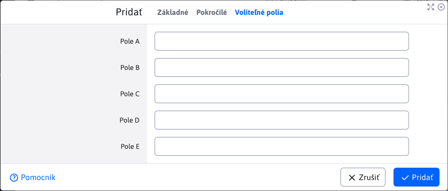

### Procedure for inserting a new document

First, you need to fill in the mandatory fields **Name**. **Destination directory for document upload** is also a mandatory value that is pre-filled automatically, but you can change it. Then you need to upload a file (representing the document) with an allowed extension. After successfully uploading the file, you can save the new record to the manager.

If you uploaded a file with the wrong format, validation will not save the record, and will remind you which file extensions are allowed for upload.

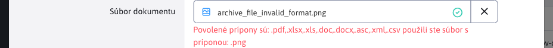

In the background, it checks whether the uploaded file/document already exists in the manager.

!>**Warning:** it is not the document name that is checked, but its **content**. This means that if the documents are the same, renaming them will not help.

If an existing document is detected, the save operation will be aborted and an error message will be displayed. A notification will also be displayed listing all documents with the same content. If you want to save this document anyway, you must enable the **Save document even if it already exists** option from the Advanced tab.

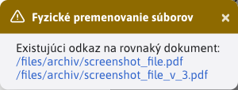

## Publishing scheduled versions

If you selected the **Upload document later** option when creating a new main document, your document will not be uploaded until after the specified date and time. The same applies to documents of the **Template** type. Yes, you can also schedule a template to be uploaded in the future.

The created [Automated task](../../../admin/settings/cronjob/README.md) is used to automatically upload a document. This task, labeled `sk.iway.iwcm.components.file_archiv.FileArchivatorInsertLater`, is automatically executed (**only if enabled**) in a time interval that you can adjust. Every time after the time interval, it checks whether a document is waiting to be uploaded and its specified value **Upload after** containing the upload date/time has already occurred. If so, it automatically uploads this document.

## Editing a historical version of a document in the manager

To edit a historical version of a document in the manager, you need to have the Edit historical version metadata right (`cmp_fileArchiv_history_metadata_edit`). Historical versions can only be edited in terms of metadata, meaning it is not possible to change the physical file representing the document, its name, etc. These changes can only be made in the nested table on the **Versions** tab of the main document.

!>**Warning:** If you do not have the Edit Metadata Historical Version right, you can open the editor, view the saved values, but you will not be able to save your changes.

## Editing the current version of a document in the manager

The manager allows various actions and modifications over the main documents. The composition of the **Basic** tab has changed and new tabs **Versions**, **Pending** and **Templates** have been added. We will talk about the functionalities of the individual added tabs later. For this action and all editing actions, you need to have the `cmp_fileArchiv_edit_del_rollback` right.

!>**Warning:** if you want to insert new files while editing, you must have the configuration variable `fileArchivCanEdit` enabled in addition to the `cmp_fileArchiv_edit_del_rollback` right.

!>**Note:** for documents of type **template**, the **Templates** tab is not displayed, as sample documents cannot have their own template.

If you have added a document as a scheduled version for the future, the editor will allow you to change the upload date/time as well as the notification emails. If the document has already been uploaded, these fields will be locked and cannot be changed further.

The most important change in the basic tab is the addition of the **Upload Document** section, where you can choose a special action to be performed on the given document. We will describe these actions in the following chapters and they are:

- **Upload new version**
- **Replace current document**
- **Add to version history**

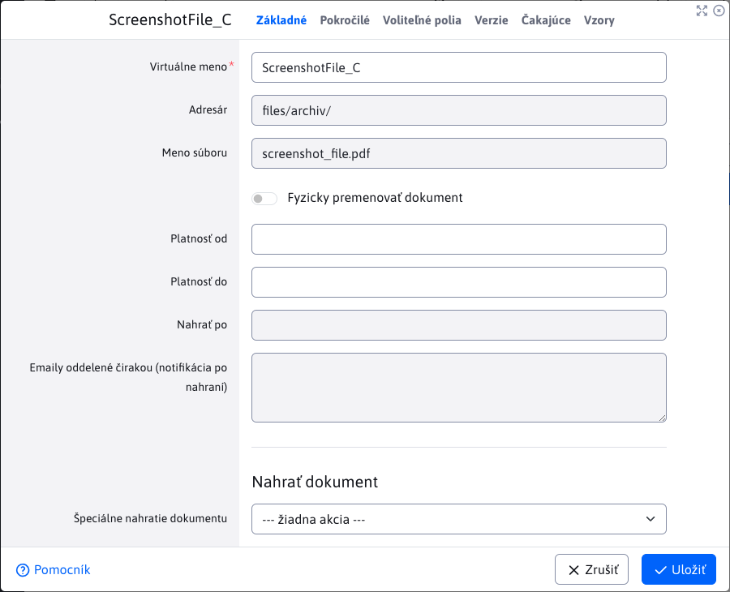

### Physically rename a document/file

The Basic tab offers the option to physically **rename the document** (i.e. the real file representing our document) not its virtual name. When you select this option, a new field **New document name without extension** will appear where you can enter a new name for the document.

!>**Warning:** All static links to this document must be updated after this change.

### Action - Upload new version

This action will create a new current version of the document. The current version (which we are going to replace) will become the historical version of the document. You just need to upload a new document, as the destination directory is pre-populated (but can be changed). We will get to the **Upload document later** option in the next section.

!>**Warning:** You are only allowed to upload a document of the same type as the current document being replaced.

Please note that the uploaded document will be automatically physically renamed to the name of the document being replaced after saving. If you want the document to be called differently, you must use the **Physically rename document** option and enter a new name.

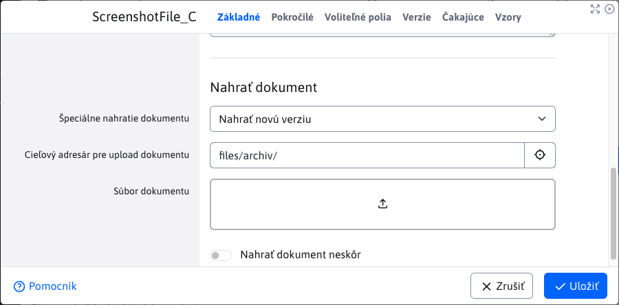

!>**Warning:** this action is not allowed for historical documents and documents pending upload. When selecting the action, none of the given fields will be displayed for these documents.

After successful upload, you can view the original (now historical version) in the **Versions** tab.

The **Versions** tab contains all historical versions of the current document being edited. The nested table **does not support actions** on data. Individual records can be opened as if they were being edited, but you will not be able to save your changes.


**Version numbering**

Note that the actual name of the historical versions has changed. Since when uploading a new version, the uploaded file representing the document **is always named the same** and the file system does not allow 2 files to have the same name in the same location, the historical one is automatically renamed with the suffix ```_v_X``` (X is replaced by a number). That number is incremented with each file that has the same name in the same folder.

**Order of arrangement**

The master document always has a sort order value of -1. When the master document becomes a historical version, it is set to 2 and all older historical versions have this value increased by 1. Using this value, you can tell which document is the oldest (has the **highest** number) and which is the newest, which is the current master document with the value -1. This value is very important for actions like [Revert last change back](#revert-last-change-back).

### Action - Upload a new version for the future

The procedure is practically identical to that in the case of **Action - Upload new version**. The difference is when selecting the **Upload document later** option, when we have the option to enter the date/time when the new version of the document will be uploaded in the **Upload after** field. The new version of the document added in this way will not immediately replace the main document, but will wait for upload. The new version will be uploaded as described in the [publishing-scheduled-versions](#publishing-scheduled-versions) section

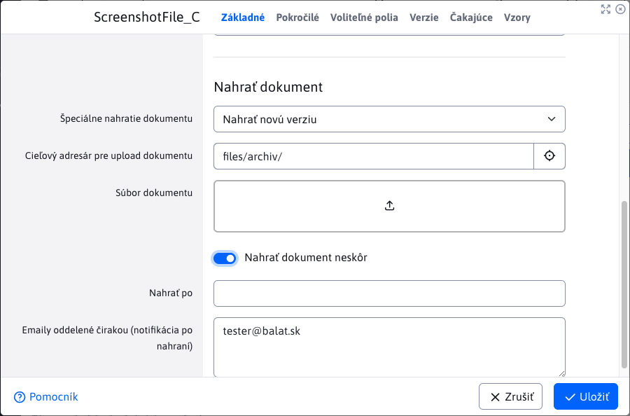

All pending versions of a given document are available directly in its **Pending** tab. Unlike historical versions in the versions tab, the table in the pending tab allows actions on pending versions. You can delete or edit them. Of course, all this also applies to documents of the **Template** type, so you can schedule a new version of the template.

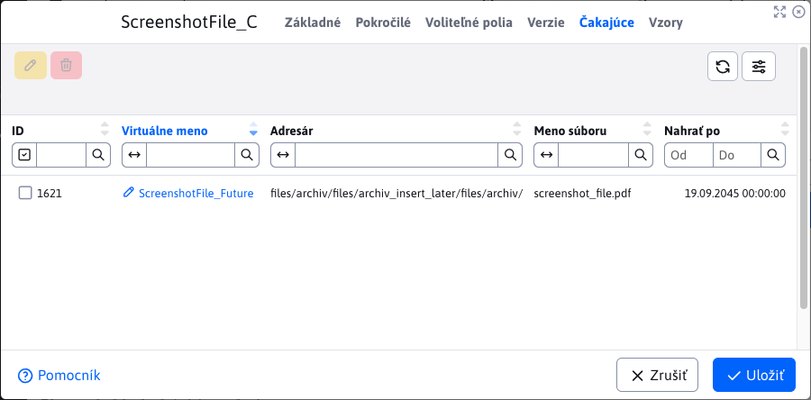

### Action - Replace current document

This action does exactly what the name suggests. It does not upload a new version of the document, but replaces the current main document with another one, i.e. the file representing the document is replaced. The document can have a different name, but the original document name is automatically preserved.

This action works for **Template** documents as well as documents that are waiting to be uploaded. This way, you can, for example, replace a document that is to be uploaded in the future without having to delete the original document and create a new record.

!>**Warning:** You are only allowed to upload a document of the same type as the current document being replaced.

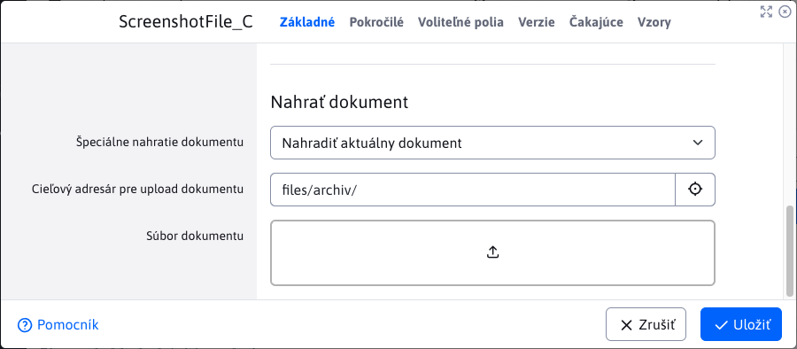

### Action - Add to version history

This action allows you to add a historical version of a document. This can be useful, for example, if you are missing a version from the historical versions and want to add it without affecting the current document. In addition, you need the additional right `cmp_fileArchiv_advanced_settings` to do this action.

!>**Warning:** Only a document with the same type as the main document is allowed to be uploaded.

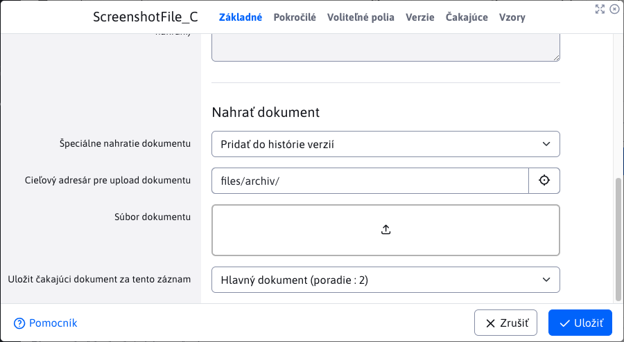

In addition to uploading the required document, you must choose which document it will be inserted after. Either it will be inserted directly after the main document, or after an existing historical document. The options also include in parentheses the order that the document will have after the specific document is inserted. All documents after this order (including the originally given one) will have their order increased by 1. It should be noted that **document order** is an important factor in actions such as [Revert last change back](#revert-last-change-back) and therefore it is necessary to think carefully about which document it will be inserted after.

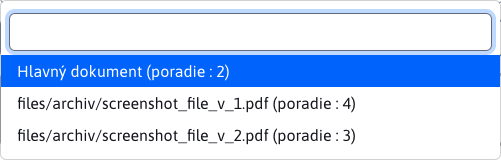

!>**Warning:** this action is not allowed for historical documents and documents pending upload. When selecting the action, none of the given fields will be displayed for these documents.

## Reverting the last change to sleep

Reverting the last change or `rollback` is an action that allows you to revert a historical version back as the main version of a document and also works for documents of type **Template**. You need to have the `cmp_fileArchiv_edit_del_rollback` right to perform this action.

For the `rollback` action to work, the following requirements must be met:

- it must be the main document
- the document must already be uploaded (it must not be waiting to be uploaded)
- must have at least one historical document (otherwise this action would be meaningless)
- the document must not have a **scheduled version** to be uploaded in the future

### Return process

After selecting the main document, you can start the action by pressing the 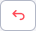. A dialog box will appear where you must confirm this action.

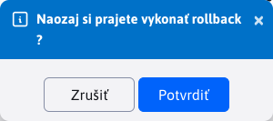

After confirmation, the action will be triggered, where the current main document **will be deleted** and replaced by the historical document with the lowest **Sort Order** value, i.e. the value 2. So we have retroactively replaced the current document with the youngest historical document. All other historical documents (if any remain) will then have their **Sort Order** reduced by the value 1. So the document that had a rank of 3 after the action has its rank reduced to 2, making it the next document that would be used in this action. This way we can go back to the original versions until we have no historical documents left.

## Patterns

We have already explained how templates are set up. One main document can have multiple templates, so they are in the ratio `1:N`. All **main** templates (i.e. main documents, not historical versions) are displayed in the last tab of the **Templates** editor. If you want to see historical versions of templates, view them in the **Versions** tab of the given template.

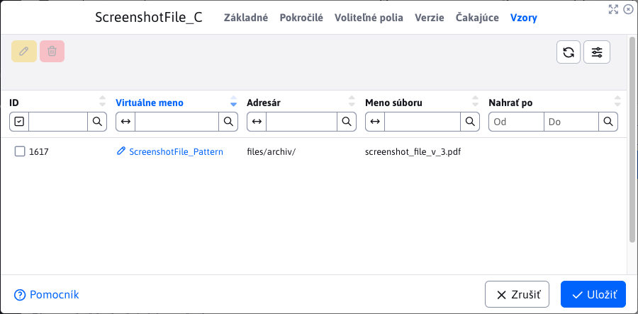

This tab is not displayed for documents that are templates, as a template cannot have its own template. The table in the tab allows you to edit as well as delete the available templates.

Templates are defined by referring to a master document. This reference is in the **Master Document** column. If the master document changes location (value **Address Book**) or is physically renamed (value **Real Name**), **all** templates referring to the given document will automatically have their **Master Document** value adjusted. This applies to master templates as well as their historical versions.

!>**Warning:** if a main document has at least one template referring to it, then this main document cannot itself become a template.

## Lubrication

The conditions and consequences of the delete action vary depending on the type of document we want to delete. In this chapter, we will explain all types. However, they have in common that the deletion also deletes the physical document (or the file that represents it), which was accessible using [Explorer](../fbrowser/README.md). You need to have the `cmp_fileArchiv_edit_del_rollback` right to perform this delete action.

### Deleting a main pending document

If you have a master document that is waiting to be uploaded in the future, you can delete it directly in the master table. This has no other consequences, as a pending document cannot have historical versions or templates.

### Deleting patterns

Deleting is only allowed for master templates. Historical versions cannot be deleted. If you delete a master template, you also delete all historical versions. The master document that the template referenced will not be affected in any way.

!>**Warning:** A master pattern cannot be deleted if it has a pending upload version.

In this case, you either wait until all scheduled versions are uploaded OR in the **Pending** tab of the given template, delete all pending versions. This deletion of pending versions can be done **ONLY** through the table in the tab.

### Deleting a master document

Deleting a master document (which is not a template) will also delete all historical versions and also all templates that reference this document.

!>**Warning:** A master document cannot be deleted if it has a pending upload version.

As with deleting patterns, these scheduled versions can be deleted **ONLY** using the table in the **Pending** tab.

## Search and indexing

Selecting the **Search** option allows the document to be searched for via the **Search** application and indexed in external search engines. By default, this option is enabled for new documents. If the document becomes a **historical version**, this permission is automatically disabled, but can be re-enabled as needed.

### Search engines like Google

If the **Crawl** option is not enabled, a `HTTP` header `X-Robots-Tag` with a value of `noindex, nofollow` will be added for such a document to prevent such a document from being indexed in search engines like Google.