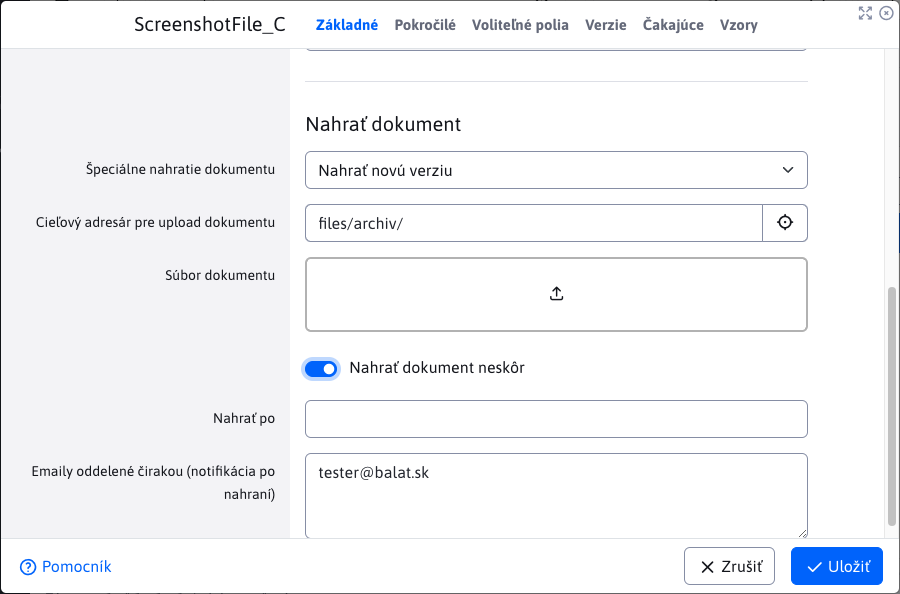

# Document Manager

One-stop document and version management application. It also allows you to set up future publishing of documents and categorize and assign individual documents to products. To work with the application you will need the right Document Manager (`cmp_file_archiv`).

## Documents

In the displayed list, you can see all documents that have been inserted into the manager in the currently selected domain. By default, filtering is set to show only **main documents** in other words, the current versions of the documents.

### Status of documents

The status of documents is shown in the column **Status**, which contains icons representing the different document states they can acquire.

- <i class="ti ti-star" ></i> - **Current version of the document** or in other words **main document** that is currently in use and may (or may not) have one or more **historical versions**. Column value **Reference** is -1.
- <i class="ti ti-star-off" ></i> - **Historical version of the document** which was used in the past and has now been replaced by **main document**. These historical versions are marked in grey in the table for better distinction. Column value **Reference** is greater than 0;
- <i class="ti ti-map-pin" ></i> - **Displays the document** or **they have** file display enabled
- <i class="ti ti-map-pin-off" ></i> - **Not showing document** or **they don't have** file display enabled
- <i class="ti ti-texture" ></i> - **Sample** another master document (which is not a template). If the referenced master document is a form, the template can be, for example, a template form.
- <i class="ti ti-calendar-time" style="color : #ff4b58!important" ></i> - **Document waiting to be uploaded (in the future)** this is a document that was uploaded late. This means that it will be automatically uploaded in the future at the selected date and time. When the document is successfully uploaded, it will no longer **will not** continue to have this condition. Documents with this status are marked in red as they are special.
- <i class="ti ti-calendar-plus" ></i> - **Has a new version of the document waiting to be uploaded (in the future)** document has a new version to replace it in the future as **main document**. The document will be automatically replaced afterwards and this version will become **historical version**.

## Inserting a new document into the manager

In this section, we will first go through the contents of each tab and then explain the procedure and possible problems when inserting a new document into the manager.

### Tab - Basic

The tab contains basic information for inserting a document.

- **Name** - enter the name of the document that will be displayed on the page (as a link to the document). The field is **mandatory**. May contain diacritics, spaces, special characters.
- **Validity from** - setting the date and time of the start of document validity
- **Validity until** - setting the document expiry date and time
- **Destination directory for document upload** - select the directory you want to upload the document to (this will be useful later when filtering the display of documents on the page). Set the predefined destination directory with the configuration variable `fileArchivDefaultDirPath`. The user will also be able to choose a sub-folder.
- **File** - field to upload a file that represents the document. More about the field `UPLAOD` you will read [here](../../../developer/datatables-editor/field-file-upload.md). You set the allowed file extensions using the configuration variable `fileArchivAllowExt`.
- **Upload document later** - if you need to upload a document to the manager at a specific time and date, it is possible to set the document to be uploaded automatically in the future. By selecting the option you will see the hidden fields
  - **Upload after** - selecting the date and time after which to upload the document
  - **Emails separated by a comma (notification after upload)** - enter the comma-separated emails to which you want to send notification of successful/unsuccessful document upload

### Card - Advanced

- **Product** - enter any product name. The field will automatically offer you other already defined products in the manager. You can use the management section [Products](./product-manager.md).
- **Category** - enter any category name. The field will automatically offer you other already defined categories in the manager. You can use the management section [Categories](./category-manager.md).
- **Product code** - enter any product code name
- **View** - setting to display the document on the page (if you do not want to display the document on the page, uncheck this setting)
- **Browse** - allows you to enable file indexing. New files have this option enabled by default. Read more
- **Priority** - using priority you can set the order of documents on the page
- **Main document** - reference to the main document. The field provides paths to the individual master documents that the current document can reference, making it **By**. Only document paths that meet:
  - it is not the same document that is regulated
  - the document must be the main document (cannot be referenced historically)
  - the document must not be waiting to be uploaded (it must already be uploaded)
  - it can't be a pattern
- **Note** - the note appears on the page when you link to the document
- **Save a document even if it already exists** - by default, the manager does not allow the same document to be added multiple times (to avoid duplication). If you want to allow this, you need to check this option.

!>**Warning:** fields **Product** / **Category** / **Product code** They will be useful later when filtering the display of files on the page

### Tab - Optional fields

In the Optional Fields tab, you can set optional attributes (values, texts) in the document according to your needs. The types (text, number, selection field...) and names of the fields can be set as desired, for more information see [Optional fields](../../../frontend/webpages/customfields/README.md).

### How to insert a new document

First you need to fill in the required fields **Name**. **Destination directory for document upload** is also a mandatory value that is pre-filled automatically, but you can change it. You must then insert a file (representing the document) with the extension enabled. Once the file has been successfully uploaded, you can save the new record to the manager.

If you have uploaded a file with the wrong format, validation will not save the record, and will remind you which file extensions are allowed for upload.

In the background, it checks if the file/document being uploaded already exists in the manager.

!>**Warning:** the name of the document is not checked but its **Content**. This means that if the documents are the same, renaming them won't help.

If an existing document is detected, the save will be aborted and an error message will be displayed. A notification containing a list of all documents with the same content will also be displayed. If you still want to save this document, you must enable the option **Save a document even if it already exists** from the advanced tab.

## Publishing scheduled versions

If you selected the option when creating a new master document **Upload document later**, your document will be uploaded after the specified date and time. The same applies to documents of type **Sample**. Yes, you can also schedule a pattern upload for the future.

To automatically upload a document, use the created [Automated task](../../../admin/settings/cronjob/README.md). This task, labelled `sk.iway.iwcm.components.file_archiv.FileArchivatorInsertLater`, the automatic is performed (**only if permitted**) at a time interval that you can adjust. Always checks after the time interval if a document is waiting to be uploaded and its specified value **Upload after** containing the upload date/time has already occurred. If so, it will automatically upload this document.

## Editing the historical version of a document in the manager

To edit the historical version of a document in the manager, you need to have the Edit historical version metadata right (`cmp_fileArchiv_history_metadata_edit`). Historical versions can only be edited in terms of metadata, i.e. the physical file representing the document, its name, etc. cannot be changed. These changes can only be made in the nested table tab **Versions of** of the main document.

!>**Warning:** if you don't have the Edit Historical Version Metadata right, you can open the editor, see the saved values, but you won't be able to save your changes.

## Edit the current version of the document in the manager

The manager allows various actions and modifications over the main documents. Tab composition **Basic** has changed and new cards have been added **Versions of**, **Pending** a **Samples**. We'll talk more about the functionality of each of the added cards later. For this action and all editing actions, you need to have the right `cmp_fileArchiv_edit_del_rollback`.

!>**Warning:** if you want to insert new files when editing, you must have the following rights in addition to the right `cmp_fileArchiv_edit_del_rollback` configuration variable is also enabled `fileArchivCanEdit`.

!>**Warning:** for documents of type **sample** with the card **Samples** does not display, as model documents cannot have a model.

If you have added the document as a scheduled future release, the editor will allow you to change the upload date/time as well as the notification emails. If the document has already been uploaded, these fields will be locked and cannot be changed again.

The most important change in the Basic tab is the addition of a section **Upload document** where you can select a special action to be performed on the document. We will describe these actions in the following chapters and they are actions:
- **Upload new version**
- **Replace the current document**
- **Add to version history**

### Physically rename the document/file

Card basic offers the possibility to physically **rename document** (i.e. the real file representing our document) not its virtual name. When you select this option you will see a new field **New document name without suffix** where you enter a new name for the document.

!>**Warning:** After this change, all static references to this document need to be updated.

### Action - Upload new version

This action creates a new current version of the document. The current version (which we are going to replace) will become the historical version of the document. Just upload the new document, since the target directory is pre-populated (but can be changed). To the option **Upload document later** we will get to in the next section.

!>**Warning:** You are only allowed to upload a document with the same type as the current document you are replacing.

Note that the uploaded document will automatically be physically renamed after saving according to the name of the document currently being replaced. If you want the document to be called something else, you must use the **Physically rename the document** and enter a new name.

!>**Warning:** this action is not allowed for historical documents and documents waiting to be uploaded. When selecting the action, none of the given fields will be displayed for these documents.

After a successful upload, you can view the original (now historical) version in the **Versions of**.

Card **Versions of** contains all historical versions of the current document currently being edited. Nested table **does not support actions** over the data. Individual records can be opened as when editing, but you will not be able to save your changes.

**Version numbering**

Note that the real name of the historical versions has changed. Because when a new version is uploaded, the uploaded file representing the document **always names the same** and the file system does not allow 2 files to have the same name in the same location, so the historical is automatically renamed with the addition of a footer `_v_X` (X is substituted for the number). That number is incremented with each file that has the same name in the same folder.

**Order of arrangement**

The main document always has an ordering value of -1. When the main document becomes the historical version, it is set to 2 and all older historical versions are incremented by 1. With this value you can tell which document is the oldest (has **Largest** number) and which is the most recent, which is the current master document with a value of -1. This value is very important for actions of type [Reverting the last change to sleep](#return-the-last-shift-to-sleep).

### Action - Upload a new version for the future

The procedure is practically identical to that of **Action - Upload new version**. The difference when selecting the option **Upload document later** where we have the option to enter in the field **Upload after** the date/time when the new version of the document will be uploaded. A new version of a document added in this way will not immediately replace the main document, but will wait to be uploaded. The new version will be uploaded as described in section [publishing-planned-versions](#publishing-scheduled-versions)

All pending versions of a given document are available directly in its tab **Pending**. Unlike the historical versions in the versions tab, the table in the pending tab allow actions over pending versions. You can delete or edit them. Of course, all this also applies to documents of type **Sample**, so you can schedule a new version of the pattern.

### Action - Replace current document

This event does exactly what the name suggests. It does not load a new version of the document, but swaps the current main document for another, i.e. the file representing the document is swapped. The document may have a different name, but the name of the original document is automatically preserved.

This action also works for documents of type **Sample** as well as for documents that are waiting to be uploaded. In this way, you can, for example, replace a document to be uploaded in the future without having to delete the original document and create a new record.

!>**Warning:** You are only allowed to upload a document with the same type as the current document you are replacing.

### Action - Add to version history

The action allows you to complete the historical version of the document. It can be used, for example, if you are missing a version among the historical versions and you want to complete it without affecting the current document. Additionally, you need another right to this action `cmp_fileArchiv_advanced_settings`.

!>**Warning:** You are only allowed to upload a document with the same type as the main document.

In addition to uploading the required document, you must select the document to be inserted. Either it is inserted directly after the main document or after an existing historical document. The options also include, in brackets, the order that the document will have after the specific document is inserted. All documents after this order (including the one originally given) will be incremented in order by 1. Note that **the order of the document** is an important factor in actions of the type [Reverting the last change to sleep](#return-the-last-shift-to-sleep) and therefore it is important to think carefully about the document behind which this is inserted.

!>**Warning:** this action is not allowed for historical documents and documents waiting to be uploaded. When selecting the action, none of the given fields will be displayed for these documents.

## Reverting the last change to sleep

Reverting the last change to sleep or `rollback` is an action that allows you to roll back the historical version as the main version of the document and works also for documents of type **Sample**. For this action you need to have the right `cmp_fileArchiv_edit_del_rollback`.

For the operation of the event `rollback` the following requirements must be met:
- it must be a master document
- the document must already be uploaded (it must not be waiting to be uploaded)
- must have at least one historical document (otherwise the event would be pointless)
- the document must not have **scheduled version** to be uploaded in the future

### Refund process

After selecting the main document, click the button to start the action . You will also see a dialog box where you need to confirm this action.

After confirmation, the action is triggered when the current master document **will be deleted** and replace it with the historical document with the least value **Order of arrangement**, i.e. by a value of 2. So we retroactively replaced the current document with the youngest historical document. All other historical documents (if any) are then reduced **Order of arrangement** by the value of 1. So a document that had a rank of 3 was downgraded to a rank of 2 after the action, making it the next document that would be used for this action. In this way we can go back to the original versions until we have no historical document left.

## Samples

We have already explained how the patterns are set. One main document can have multiple patterns, so they are in the ratio `1:N`. All **main** patterns (i.e. master documents, not historical versions) are displayed in the last tab of the editor **Samples**. If you want to see the historical versions of the designs, see them in the **Versions of** of a given pattern.

This tab does not appear for documents that are patterns, since a pattern cannot have its own pattern. The table in the tab allows editing as well as deleting available patterns.

Patterns are defined by referring to the main document. This reference is in the column **Main document**. If the master document changes the location (value **Directory**) or physically renamed (value **Real name**) yes **to all** the pattern referencing the document will automatically modify the value **Main document**. And this applies to the main designs but also to their historical versions.

!>**Warning:** if the master document has at least one referring pattern, the master document cannot become a pattern itself.

## Lubrication

The conditions and consequences of the delete action vary depending on what type of document you want to delete. In this chapter, we'll explain each type. What they have in common, however, is that the delete action also deletes the physical document (or the file that represents it) that was accessed by [Explorer](../fbrowser/README.md). For this deletion action you need to have the right `cmp_fileArchiv_edit_del_rollback`.

### Deleting a main pending document

If you have a master document that is waiting to be uploaded in the future, you can delete it directly in the barrel table. This has no other consequences, as the pending document can have neither historical versions nor patterns.

### Lubrication of patterns

Deletion is only allowed for major patterns. Historical versions cannot be deleted. If you delete a master pattern, you also delete all historical versions. The main document that the pattern referenced will not be affected.

!>**Warning:** the main pattern cannot be deleted if it has a pending version to upload.

In this case, either wait until all scheduled versions are uploaded OR in the **Pending** of the pattern, you delete all pending versions. This deletion of pending versions can be done **IBA** through the table in the tab.

### Deleting a master document

Deleting the main document (which is not a pattern) will also delete all historical versions as well as all patterns that reference that document.

!>**Warning:** the main document cannot be deleted if it has a pending version to upload.

As with deleting patterns, these scheduled versions can be deleted **IBA** using the table in the tab **Pending**.

## Searching and indexing

By selecting the option **Browse** enable document search via the app **Search** and indexing in external search engines. By default, this option is enabled for new documents. If a document becomes **historical version**, this permission is automatically deactivated, but can be re-enabled as required.

### Google search engines

If the option **Browse** is not allowed, for such a document, the `HTTP` Header `X-Robots-Tag` with value `noindex, nofollow` to prevent such a document from being indexed by search engines such as Google.
